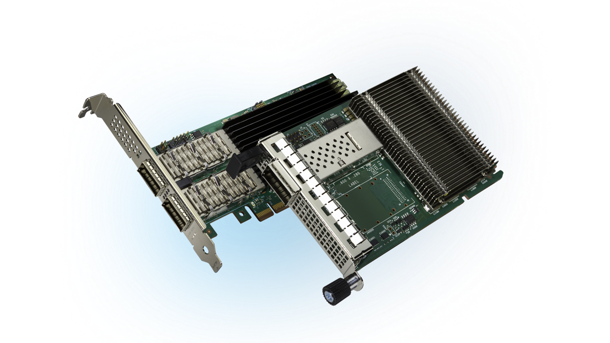
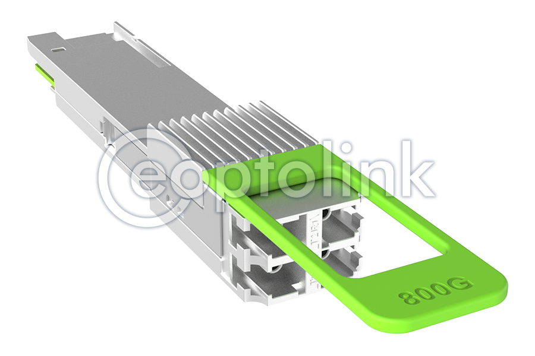
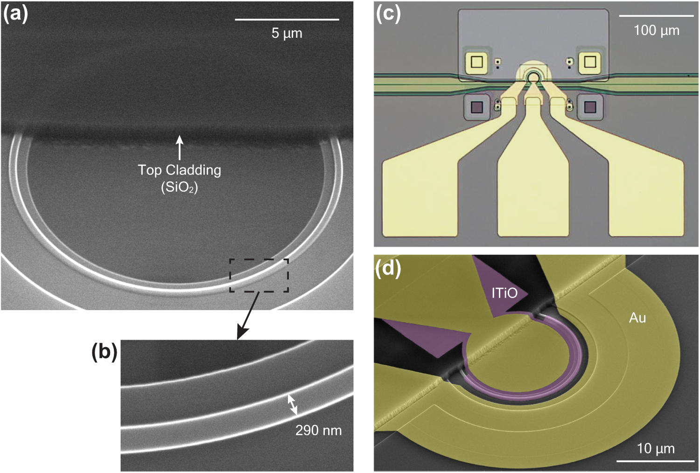
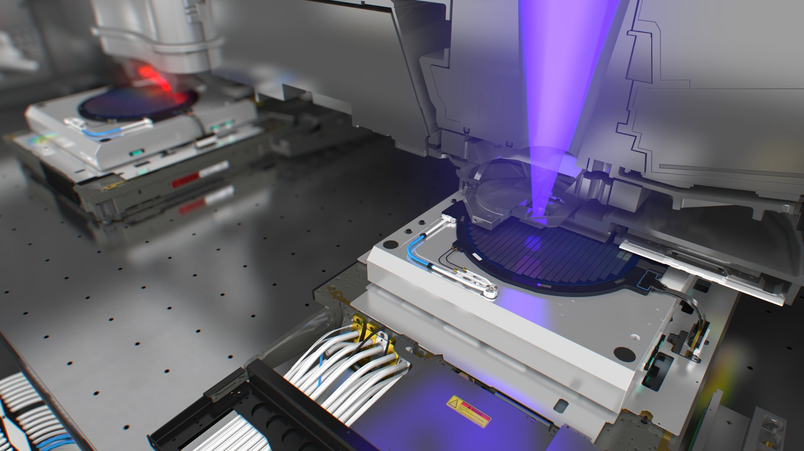
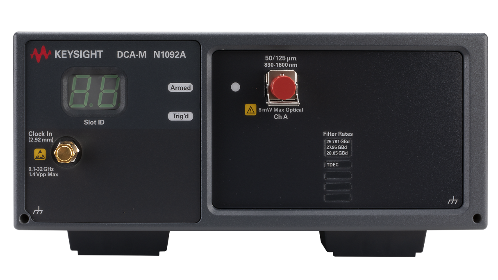
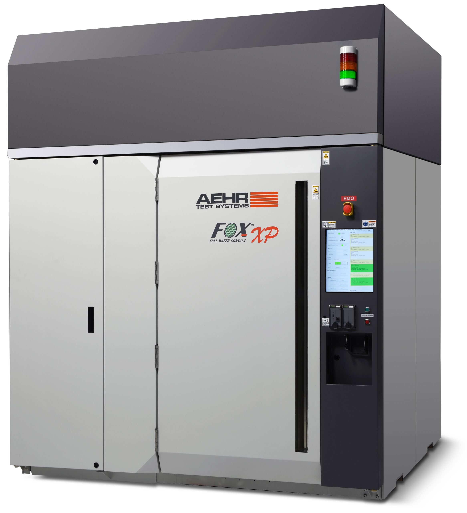
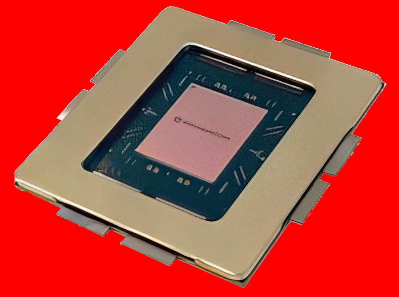
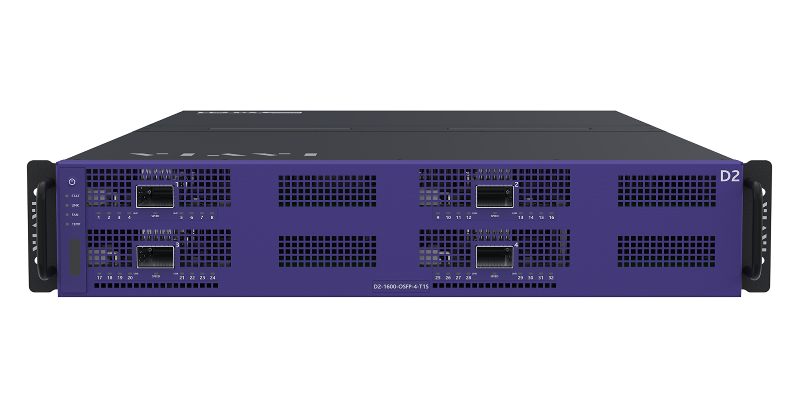
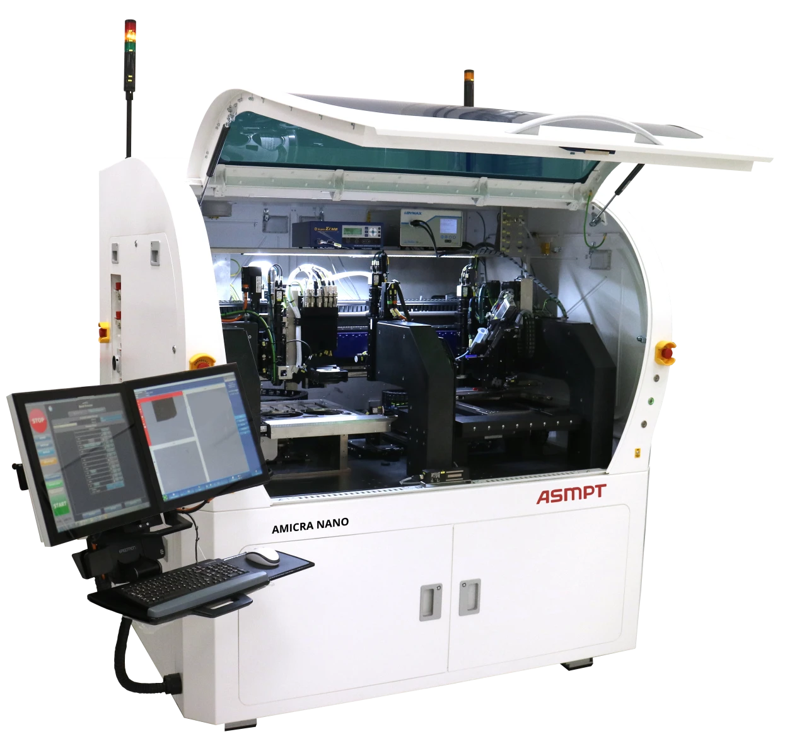

# 光模块设备科普：从沙子到 AI 数据中心

> **artifact**: `teach-in` | **qualifier**: `optical-module` | **as-of**: 2026-06-01
> **目标读者**：零半导体背景的买方研究员 | **阅读时间**：30-40 分钟

---

## 为什么需要这份科普

光模块设备这个赛道有三重门槛：

1. 名词太多——wafer、die、bonding、coupling、PAM4、CPO，每个词背后都有一个工程世界
2. 尺度太极端——从足球场大的数据中心到头发丝七十分之一精度的贴片，直觉完全失效
3. 链太长——从沙子到光模块出货，经过十几个工序，每个工序对应不同的设备和公司

这份科普的目标：**让一个完全没接触过半导体的人，30 分钟内能看懂这条链的每一站在干什么、谁在赚钱、为什么难。**

读完你不需要是工程师，但你应该能对着光模块设备的竞争格局问出像样的下一层问题——而不是还在问"die bonding 是干嘛的"。

---

## Layer 0：为什么要用光

### 不是"光很先进所以用光"

AI 时代数据中心需要海量数据传输——一张英伟达 GPU 的计算结果要传给另一张 GPU，几百上千张 GPU 之间要互传。

用电信号在铜线上传，物理定律不给面子：

```
铜线（PCB 走线）：
  1Gbps  → 可以传 100 米
  10Gbps → 可以传 10 米
  100Gbps → 可以传 1 米
  200Gbps → 可以传 30 厘米
  400Gbps → 不到 10 厘米就开始严重失真

光纤：
  100Gbps → 可以传 40 公里
  400Gbps → 可以传 10 公里  
  800Gbps → 可以传 2 公里
  1.6Tbps → 可以传 500 米
```

**核心公式**：带宽 × 距离 = 常数。带宽越高，铜线能跑的距离越短。到了 400Gbps 以上，铜线连一台交换机内部都跑不完——信号就烂了。

所以不是"光很先进所以用光"，而是**电信号在高速下跑不了一个机柜的距离，不得不用光**。

### 光模块 = 光电翻译机

光模块做的事极其简单：**把电信号变成光 → 通过光纤传到目的地 → 再把光变回电信号。**

```
GPU A → 电信号 → [光模块：电→光] → 光纤 → [光模块：光→电] → 电信号 → GPU B
```

难点在于：**高速、低功耗、低误码、可量产**这四件事要同时成立。缺一不可。

### Source

- 铜线带宽-距离极限来自 IEEE 802.3 以太网标准物理层规范，800G/1.6T 基于 112Gbps PAM4 每通道电接口 [IEEE 802.3df](https://www.ieee802.org/3/df/)
- 光纤带宽-距离数据：单模光纤在 1310nm 窗口衰减约 0.35dB/km，800G 光模块典型链路预算支持 2km-10km [LightCounting 2025 Optical Transceiver Report](https://www.lightcounting.com/)

---

## Layer 1：数据中心长什么样，光模块装在哪

### 从大到小逐层看

这是绝大多数人最缺的直觉——数据中心的物理空间到底是怎样的。

```
🌐 一个超大规模数据中心（Hyperscale DC）
│
├── 占地 20,000-50,000 平方米（约 3-7 个足球场）
├── 总功耗 100-300 MW（够 10 万户家庭用电）
├── 建设成本 $1-3B（一栋楼 100 亿人民币级别）
│
├── 📦 机柜大厅（几十个）
│   ├── 每排 20-40 个机柜
│   ├── 冷热通道隔离（热风从后面排出，冷风从前面吸入）
│   │
│   └── 🗄️ 单个 42U 机柜（2 米高，60cm 宽，1 米深）
│       ├── U = 4.45cm 标准单位，42U = 可装 42 层设备
│       │
│       ├── 顶部：1U-2U 的 Top-of-Rack 交换机（ToR Switch）
│       │   ├── 前面板有 32-64 个 QSFP-DD 端口
│       │   ├── 每个端口插一个光模块
│       │   └── 光模块拉出光纤，连到下面的服务器
│       │
│       ├── 中下部：36-40 台 1U-2U 服务器
│       │   ├── 每台服务器有 1-4 张 GPU（如 H100/B200）
│       │   ├── 每张 GPU 通过网卡（NIC）对外通信
│       │   └── 网卡面板上有 1-2 个 QSFP-DD 端口，插光模块
│       │
│       └── 底部：电源分配单元（PDU）
│
└── 🔌 光纤走线架（连接不同机柜、不同排、不同机房）
```


*Intel Ethernet NIC 适配器，QSFP-DD 端口用于插入光模块。来源：[Intel E810/E835](https://www.intel.com/content/www/us/en/products/details/ethernet/800-gigabit.html)*

### 光模块插在哪——两个位置

```
位置 1：服务器网卡（NIC）
┌─────────────────────────────┐
│  NVIDIA ConnectX-8 网卡      │  ← 插在服务器的 PCIe 插槽上
│  ┌─────────┐ ┌─────────┐   │
│  │ 光模块 #1 │ │ 光模块 #2 │   │  ← 800G QSFP-DD，巴掌大
│  └────┬────┘ └────┬────┘   │
│       │           │         │
│       └───光纤───┘         │  ← 连到交换机
└─────────────────────────────┘

位置 2：交换机（Switch）
┌─────────────────────────────┐
│  Arista / Cisco / 华为 交换机 │
│  ┌──┐┌──┐┌──┐┌──┐ ... ×64   │  ← 前面板密密麻麻的光模块端口
│  └──┘└──┘└──┘└──┘           │    每个端口都是一个光模块
│     64 根光纤拉出去           │
└─────────────────────────────┘
```

### QSFP-DD、OSFP——这些是端口标准，不是光模块本身

就像 USB-C 是端口形状标准，QSFP-DD 和 OSFP 是光模块的物理接口标准。

| 接口标准 | 大白话 | 用于什么速率 | 尺寸 |
|---|---|---|---|
| QSFP28 | 老款标准 | 100G | 小 |
| QSFP56 | 中期标准 | 200G | 小 |
| **QSFP-DD** | **当前主流** | **400G/800G** | 和 QSFP 一样大但多了一排触点 |
| **OSFP** | 稍微大一点 | **800G/1.6T** | 比 QSFP-DD 大 20%，散热更好 |
| QSFP-DD800 | 下一代 | 800G/1.6T | QSFP-DD 的高速版 |

> 光模块外形都一样——巴掌大的金属盒子（~10cm×2cm×1cm）。区别在里面。


*800G QSFP-DD 光模块——巴掌大的金属盒子。来源：[Eoptolink](https://www.eoptolink.com/)*

### 一台 AI 集群需要多少光模块

以英伟达 GB300 NVL72 机柜为例：

```

1 个 NVL72 机柜 = 72 块 B300 GPU
72 块 GPU 需要互联 → 每块 GPU 800Gbps 出口带宽
每块 GPU 通过 1 个 800G 光模块或 2 个 400G 光模块对外通信
→ 1 个机柜 ≈ 72-144 个光模块（不含交换机侧）
→ 一个 10,000 GPU 的训练集群 ≈ 20,000+ 个光模块

并且：
  - 800G → 1.6T 升级：按速率翻倍，但模块数不一定减半
    (因为 GPU 数量也在涨，互联拓扑更复杂)
```

### Source

- 数据中心物理架构参考：NVIDIA DGX SuperPOD Reference Architecture [NVIDIA DGX SuperPOD](https://www.nvidia.com/en-us/data-center/dgx-superpod/)
- QSFP-DD 规范：QSFP-DD MSA (Multi-Source Agreement) [QSFP-DD MSA](https://www.qsfp-dd.com/)
- OSFP 规范：OSFP MSA [OSFP MSA](https://osfpmsa.org/)
- GB300 NVL72 网络架构：NVIDIA GTC 2025 keynote [NVIDIA NVL72](https://www.nvidia.com/en-us/data-center/gb300-nvl72/)
- 光模块数量/AI 集群规模关系：LightCounting "AI-Driven Optical Transceiver Forecast" 2025 [LightCounting](https://www.lightcounting.com/)

---

## Layer 2：光模块里面长什么样

### 拆开外壳

把巴掌大的 QSFP-DD 光模块外壳打开，里面是这样：

```
┌────────────────────────────────────────────┐
│  金属外壳（散热 + 电磁屏蔽）                  │
│  ┌──────────────────────────────────────┐  │
│  │  PCB（印刷电路板，~5cm×2cm）          │  │
│  │  ┌─────────────────┐                │  │
│  │  │   DSP 芯片       │ ← 最大最贵的芯片  │  │
│  │  │  (Broadcom/      │   信号处理+纠错   │  │
│  │  │   Marvell/Credo) │   占 BOM 30-40%  │  │
│  │  └─────────────────┘                │  │
│  │  ┌────────┐  ┌────────┐            │  │
│  │  │ Driver │  │  TIA   │  ← 驱动+放大│  │
│  │  │ (发射) │  │ (接收) │            │  │
│  │  └───┬────┘  └───┬────┘            │  │
│  │      │            │                 │  │
│  │  ┌───┴────────────┴───┐            │  │
│  │  │  TOSA + ROSA       │ ← 光器件     │  │
│  │  │  ┌─激光器 chip     │   核心光电转换 │  │
│  │  │  └─探测器 chip     │            │  │
│  │  └─────────┬──────────┘            │  │
│  │            │                        │  │
│  └────────────┼────────────────────────┘  │
│               │                            │
│          FAU（光纤阵列）─────────────────┐ │
│          光纤接口（MPO/LC）              │ │
└────────────────────────────────────────────┘
```

### 每个部件在干嘛

| 部件 | 全称 | 干嘛的 | 尺寸感 | 谁做 |
|---|---|---|---|---|
| DSP | Digital Signal Processor | 信号处理器：把进来的电信号处理、纠错、补偿，再送给激光器。**光模块里最贵的芯片，占 BOM 30-40%** | 指甲盖大小 | Broadcom (80%+ 份额)、Marvell、Credo |
| Driver | Laser Driver | 驱动芯片：给激光器提供电流，控制光的强弱 | 米粒大小 | Macom、Semtech、Maxlinear |
| TOSA | Transmitter Optical Sub-Assembly | 光发射组件：里面装着激光器 chip，电信号→光信号 | 小指指甲大小 | Coherent、Lumentum、三菱、住友、源杰科技 |
| ROSA | Receiver Optical Sub-Assembly | 光接收组件：里面装着探测器 chip，光信号→电信号 | 同上 | 同上 |
| TIA | Trans-Impedance Amplifier | 跨阻放大器：探测器收到的光信号极微弱，需要放大才能用 | 米粒大小 | Macom、Semtech |
| FAU | Fiber Array Unit | 光纤阵列单元：把多根光纤（8 根或 16 根）精确排列固定 | 火柴杆粗细 | 非上市小型光学公司 |
| PCB | Printed Circuit Board | 电路板：把以上所有东西连起来 | 5cm×2cm | 鹏鼎控股、沪电、深南 |

### 尺寸对比（建立直觉）

```
光模块外壳     ≈ 巴掌大（10cm × 2cm）
DSP 芯片       ≈ 指甲盖（8mm × 8mm）
Driver/TIA     ≈ 米粒（2mm × 2mm）  
激光器 chip    ≈ 芝麻（0.3mm × 0.2mm）
金线（bonding）≈ 头发丝的 1/3 粗（直径 25μm）
贴片精度       ≈ 头发丝的 1/70（±1μm）
耦合精度       ≈ 一个新冠病毒直径（±0.05μm）
```

### 每一块对应的工序和设备

| 部件 | 装在哪道工序 | 用的什么设备 | 精度要求 |
|---|---|---|---|
| DSP / Driver / TIA | 贴片（SMT） | SMT 贴片机（日常电子厂设备，精度够用） | ±50μm |
| 激光器 chip | **固晶 (Die Bonding)** ← 核心 | 高精度 die bonder | **±1-3μm** |
| 探测器 chip | **固晶 (Die Bonding)** ← 核心 | 高精度 die bonder | **±1-3μm** |
| 金线连接 chip↔PCB | 引线键合 (Wire Bonding) | Wire bonder | ~±2μm |
| 光纤对准芯片光口 | **光学耦合 (Coupling)** ← 核心 | Active aligner | **±0.05μm** |
| 整板通电测试 | 老化/测试 | Burn-in chamber + BERT | — |

> **核心洞察**：DSP 最贵但不在这里的设备讨论范畴——那是芯片设计公司的游戏。激光器和探测器的贴装（die bonding）和耦合（coupling）才是设备公司的战场，因为精度要求到了微米/亚微米级。

### Source

- 光模块内部结构：OIF (Optical Internetworking Forum) 800G Coherent Implementation Agreement [OIF 800G IA](https://www.oiforum.com/)
- DSP 市场份额：Broadcom 2025 Q1 earnings call "AI optical DSP market share >80%" [Broadcom IR](https://investors.broadcom.com/)
- 光模块 BOM 拆分：LightCounting "800G/1.6T Transceiver Cost Model" 2025 [LightCounting](https://www.lightcounting.com/)
- 典型激光器芯片尺寸：Lumentum 100G EML laser die datasheet [Lumentum](https://www.lumentum.com/)

---

---

## Layer 2.5：光模块用什么材料——半导体材料的"分工表"

### 为什么材料很重要

光模块的每一个光学功能——发光、收光、调光、导光——都必须用特定的半导体材料。**没有一种材料能包揽所有功能。** 

- 硅（Si）是地球上最便宜、最成熟的半导体，但它**不发光**——这是物理定律决定的（间接带隙）
- 发光的材料（InP、GaAs）贵、难加工、难大规模生产

这就是光器件行业的根本矛盾——也是硅光子为什么这么火但这么难。

### 材料 x 功能矩阵

| 材料 | 中文名 | 能做什么 | 不能做什么 | 材料供应商（上游） | 器件/芯片厂（中游） | 设备/模块厂（下游） |
|---|---|---|---|---|---|---|
| **InP（磷化铟）** | Indium Phosphide | **发光**+收光+调制 | 贵，晶圆最大 4 英寸 | **海外**：AXT、Sumitomo、JX Metals、IQE；**A 股**：**云南锗业(002428)** 年产 15 万片衬底，**有研新材(600206)** 6 英寸研发中 | **海外**：Lumentum、Coherent、三菱、住友；**A 股**：**源杰科技(688498)** 激光器芯片，**三安光电(600703)** 外延片 | 中际旭创、新易盛、光迅（做模块） |
| **GaAs（砷化镓）** | Gallium Arsenide | 发光（VCSEL）、高速电子 | 波长 ~850nm，不长距 | 稳懋、IQE、Freiberger | Lumentum、Coherent、Trumpf | 中际旭创（SR 模块用） |
| **Si（硅）** | Silicon | 导光（波导）+调制+探测 | **不发光！** | 信越化学、SUMCO、环球晶圆 | 台积电、GlobalFoundries、Intel | Intel、Cisco、Marvell |
| **SiPh（硅光子）** | Silicon Photonics | 硅片上做波导/调制器/探测器 | 激光器必须外挂 InP | 台积电（COUPE 平台）、GF | Intel、Cisco | 中际旭创、新易盛（硅光模块） |
| **LiNbO₃（铌酸锂）** | Lithium Niobate | 超高速调制 | 不能发光，加工难 | NGK、Partow Technologies | HyperLight、光库科技 | 光模块厂（试产阶段） |
| **SiO₂（二氧化硅）** | Silica / 石英 | 光纤本身 | — | 康宁、住友、古河、长飞光纤 | — | 数据中心布线用 |

### 用大白话讲清楚每种材料

#### 磷化铟 (InP)：光模块里的"心脏材料"

```
激光器的基本原理：给半导体通电 → 电子从高能级跳到低能级 → 释放光子（光的最小单位）
                     ↑
                只有"直接带隙"半导体才能高效发光
                InP 和 GaAs 是直接带隙，硅不是
```

InP 做激光器的优势：
- 发光波长刚好在光纤的低损耗窗口（1310nm / 1550nm）
- 可集成了调制功能（EML = Electro-absorption Modulated Laser）
- 是当前 800G/1.6T 光模块激光器的主流方案

InP 的劣势：
- 晶圆最大只到 4 英寸（硅能做到 12 英寸）→ 单片 wafer 上的芯片数量少 → 成本高
- 材料脆、难加工
- 全球产能集中在少数几家（Lumentum、Coherent、三菱、住友）

#### 硅 (Si)：光模块里的"骨架材料"

硅的定位很尴尬——它不能发光，但它太便宜、太成熟了。

**硅光子的思路**：用成熟的 CMOS 工艺在硅片上刻出光波导（光走的"通道"）、调制器、探测器——就像做芯片一样做光器件。唯独激光器还得外挂 InP 的。

```
硅光芯片截面示意：

   InP 激光器 (外挂贴上去的)
        ↓ 光
  ┌─────┴─────┐
  │ 硅波导     │  ← CMOS 工艺刻出来的
  │ 硅调制器   │  ← 同上
  │ 锗探测器   │  ← 锗对 1310nm 光敏感
  └───────────┘
  ↑ 整块在台积电/GF 的 12 英寸 wafer 上做
```

硅光子的核心壁垒：**异质集成**——把不发光的硅波导和发光的 InP 激光器精确对准并贴在一起。


*硅光子芯片截面 SEM 照片——硅波导用 CMOS 工艺刻出，光在硅里传输。来源：[Intel Silicon Photonics](https://www.intel.com/content/www/us/en/silicon-photonics/overview.html)*
这一步不需要焊料——Besi 的 hybrid bonding 就是为这个准备的（±100nm 精度，铜柱对铜柱直接键合）。

#### 砷化镓 (GaAs)：VCSEL 的专属材料

GaAs 主要做 VCSEL（Vertical-Cavity Surface-Emitting Laser，垂直腔面发射激光器）：

- VCSEL 的光从芯片**表面**射出（不像 InP 激光器从**侧面**射出）
- 便宜、功耗低、适合短距离传输（<100m）
- 主要用在数据中心内部的 SR（Short Reach）800G 光模块
- iPhone 人脸识别的点阵投影器也是 GaAs VCSEL

> VCSEL 的贴片精度要求相对较低（±10μm 级别），不是设备玩家的主要战场。

#### 薄膜铌酸锂 (TFLN)：超高速调制的未来

这是目前最热的方向之一：

- 传统 InP 调制器快到 200Gbps 单通道就吃力了
- 薄膜铌酸锂调制器可以轻松做到 400Gbps+ 单通道
- 但加工极难（铌酸锂不像硅那样好刻蚀）
- HyperLight（美国 startup）、光库科技（A 股）是主要玩家

### 材料选择如何影响设备需求

```
短距 SR (≤100m)：
  激光器 = GaAs VCSEL (便宜, 850nm)
  贴片精度 ±10μm → 不算瓶颈
  ⚡ 对设备玩家不友好——精度要求低，国产就能做

中长距 DR/FR (500m-2km)：
  激光器 = InP EML / 硅光外挂 InP
  贴片精度 ±3-5μm → 开始有壁垒
  ⚡ 猎奇中端机器的甜蜜点

长距/CPO (10km+ / 下一代)：
  激光器 = InP 或硅光异质集成
  贴片精度 ±1μm → 只有 MRSI/Besi 能做
  耦合精度 ±0.05μm → 只有 ficonTEC 能做到量产
  ⚡ 高端设备的专属领地
```

### 材料 vs 工序 vs 设备

| 光模块类型 | 激光器材料 | 贴片难度 | 耦合难度 | 主要设备受益方 |
|---|---|---|---|---|
| 400G SR8 (VCSEL) | GaAs | 低 | 低 | 国产线 |
| 800G DR8 (EML) | InP | 中 | 中高 | 猎奇/博众/镭神 |
| 800G DR8 (硅光) | InP 外挂 + 硅波导 | **高** | **高** | MRSI/ficonTEC |
| 1.6T DR8/FR8 | InP EML / 硅光 | **高** | **很高** | MRSI/ficonTEC/镭神 |
| CPO (硅光引擎) | InP 异质集成硅 | **极高** | **极高** | Besi/MRSI/ficonTEC |

> **核心洞察**：速率越高 → 越倾向硅光方案 → 异质集成精度要求越高 → 贴片和耦合的设备壁垒越深。所以光模块的速率升级不只是"多了几个通道"，而是一个持续把精度门槛往上推的过程——低端玩家逐代被筛掉。

### Source

- InP 光器件产业链：Yole Group "InP Photonics Market Report 2025" [Yole InP Photonics](https://www.yolegroup.com/)
- 硅光子技术原理：AIM Photonics "Silicon Photonics Design Guide" [AIM Photonics](https://www.aimphotonics.com/)
- 硅光子异质集成：Intel "Silicon Photonics: Beyond 100G" [Intel SiPh](https://www.intel.com/content/www/us/en/silicon-photonics/overview.html)
- TSMC COUPE 硅光子平台：TSMC 2025 Technology Symposium [TSMC COUPE](https://pr.tsmc.com/english/news/3067)
- VCSEL 技术：Lumentum "VCSEL Technology for Datacom" [Lumentum VCSEL](https://www.lumentum.com/en/optical-communications/products/datacom-vcsel)
- 薄膜铌酸锂：HyperLight "TFLN Technology Overview" [HyperLight](https://www.hyperlightcorp.com/)
- 材料对比：PIC Magazine "InP vs Silicon Photonics: The Great Debate" [PIC Magazine](https://picmagazine.net/)

### 先建立尺度直觉

在讲制造流程之前，先理解涉及的最小尺度和最大尺度的对比：

```
┌──────────────────────────────────────────────────────────┐
│ 尺度阶梯（从大到小，每级缩小 10-1000 倍）                  │
│                                                          │
│  数据中心大楼    ≈ 100m ───────────────────── 足球场      │
│  机柜            ≈ 2m   ───────────────────── 衣柜        │
│  Wafer (晶圆)    ≈ 30cm ──────────────────── pizza 大小   │
│  光模块          ≈ 10cm ──────────────────── 巴掌大       │
│  PCB            ≈ 5cm  ──────────────────── 打火机长      │
│  DSP 芯片        ≈ 8mm  ──────────────────── 指甲盖       │
│  激光器 die      ≈ 0.3mm ─────────────────── 一粒芝麻      │
│  单模光纤芯径     ≈ 9μm ───────────────────── 头发丝的 1/8 │
│  ──────────────────────────────────────── 肉眼可见极限 ── │
│  贴片精度 ±1μm   ≈ 头发丝的 1/70 ──────── MRSI-LEAP 水平  │
│  耦合精度 ±0.05μm ≈ 新冠病毒直径 ──────── ficonTEC 水平    │
└──────────────────────────────────────────────────────────┘
```

> 从 pizza 大的 wafer 到头发丝 1/70 精度的贴片——全程不能有灰尘、不能有震动、不能有温度波动。这不是"精密制造"，这是"在芝麻上绣花，绣错了整颗报废。"

### Wafer 和 Die 是什么

**Wafer（晶圆）**：一张 pizza 大小（300mm 直径）的纯硅圆片，经过光刻/蚀刻/沉积等几百道工序后，上面"刻"了成千上万颗芯片。

```
        ┌──────────────────┐
        │    ╭──────╮      │   300mm 直径
        │   ╱        ╲     │   上面有几千颗
        │  │  几千颗  │    │   完全相同的芯片
        │  │  芯片    │    │
        │   ╲        ╱     │   每颗芯片称为
        │    ╰──────╯      │   一个 "die"（裸芯片）
        └──────────────────┘
```

**Die（裸芯片）**：从 wafer 上切下来的单颗芯片。激光器 die 只有 0.2mm×0.3mm——一粒芝麻大小。Die bonding（固晶）做的就是：把这粒芝麻从 wafer 上取下来，精确放到电路板上指定的位置。

**Fab（晶圆厂）**：制造 wafer 的超级工厂。台积电（TSMC）就是全球最大的 fab。光模块里最值钱的 DSP 芯片就是在台积电的 5nm/7nm 产线上造的。一台 EUV 光刻机要 $200M 以上。Fab 是整个链条的最上游，成本最高、壁垒最高——但不是本科普的范畴。


*300mm 硅晶圆（pizza 大小），上面刻了几千颗芯片。来源：[ASML](https://www.asml.com/)*

### 完整制造流程

从沙子到最终出货，光模块经过的主要工序：

```
沙子 (SiO₂)
        ↓ 提纯→拉单晶→切片→抛光
  硅晶圆 (Wafer)        ← 这个步骤在 fab 里，不在这里展开
        ↓ 光刻/蚀刻/沉积等几百道工序
  做好的 Wafer (上面有几千颗激光器/探测器芯片)
        ↓
  【1. 划片】用金刚石刀或激光把 wafer 切成一颗一颗的 die
        ↓
        ├─ 激光器 die (0.2mm × 0.3mm, 一粒芝麻)
        └─ 探测器 die
              ↓
  【2. 固晶/贴片 (Die Bonding)】← 本文核心工序之一
        │  把 die 从 wafer 上吸起来
        │  精确放到 PCB 基板上指定的焊盘位置
        │  用共晶焊（金锡合金, ~280°C）或环氧胶固定
        │
        │  🏭 精度要求：800G→±5μm; 1.6T→±3μm; CPO→±1μm
        │  🔧 设备：Die Bonder
        │  🌍 全球玩家：MRSI-LEAP (±1μm 天花板)、ASMPT MEGA、Besi、Finetech
        │  🇨🇳 中国玩家：猎奇智能 (21% 台数份额)、微见智能、博众精工
              ↓

  【3. 引线键合 (Wire Bonding)】
        │  用比头发丝还细的金线（直径 ~25μm）
        │  把芯片的焊盘和 PCB 的焊盘一根一根连起来
        │  超声振动 + 压力 → 金线和铝焊盘形成合金 → 焊死


        │
        │  🔧 设备：Wire Bonder
        │  🌍 全球玩家：Kulicke & Soffa (K&S)、ASMPT、Shinkawa
        │  💡 壁垒中等，不是本文重点
              ↓
  【4. 光学耦合 (Coupling)】← 本文核心工序之二
        │  "把光纤对准芯片的光口"
        │  芯片通电发光 → 光纤靠近光口 → 六轴平台微调
        │  (X/Y/Z + 俯仰/偏摆/旋转) → 实时监测光功率
        │  → 找到功率峰值 → UV 胶固化焊死
        │
        │  🏭 精度要求：±0.05μm（亚微米级）
        │  🔧 设备：Active Aligner / Coupling Station
        │  🌍 全球玩家：ficonTEC（罗博特科并表）、MRSI-A-L
        │  🇨🇳 中国玩家：镭神技术 (27% 台数份额，全球 #1)、猎奇智能 (18%)
              ↓

  【5. 封装/封帽 (Sealing)】
        │  把 TOSA/ROSA 外壳封上
        │  激光焊接或 seam sealing
        │  保证气密性（不能让水汽进去，激光器怕湿）
        │
        │  🔧 设备：Laser Welder / Seam Sealer
        │  💡 技术成熟，不是瓶颈
              ↓
  【6. 老化测试 (Burn-in)】← 本文核心工序之三
        │  给光模块通电
        │  放在高低温箱里（-40°C ~ +85°C）
        │  连续跑 24-96 小时
        │  边跑边测光功率/误码率
        │  筛掉那些"刚出厂是好的，用几天就坏"的早期失效件
        │
        │  🏭 1.6T 时代重要性上升：失效边界更窄、返修成本更高
        │  🔧 设备：Burn-in Chamber + 并行测试平台
        │  🌍 全球玩家：Keysight、Chroma (致茂电子)、AEHR
        │  🇨🇳 中国玩家：联讯仪器 (9.9% 份额，前五唯一中国公司)
              ↓
  【7. 模块终测 (Final Test)】
        │  测误码率 (BER)、眼图 (Eye Diagram)、光功率、光谱
        │  测协议合规 (CMIS)、高低温性能
        │  合格 → 激光打标 → 出货
        │
        │  🔧 设备：BERT (误码仪) + DCA (采样示波器) + 光功率计
        │  🌍 全球玩家：Keysight、VIAVI、Anritsu (合计 >80% 份额)
        │  🇨🇳 中国玩家：联讯仪器 (国产 #1)
              ↓
        📦 出货给客户
   (Google/Meta/Microsoft/Amazon/Oracle/英伟达/各大电信运营商)
```


*Keysight 高速光模块测试平台——覆盖 800G/1.6T PAM4 眼图、BER、协议测试。来源：[Keysight 1.6T Manufacturing Test](https://www.keysight.com/mx/en/use-cases/optimize-1-6t-optical-transceiver-manufacturing-tests.html)*


*AEHR 晶圆级 Burn-in 老化测试系统——全球半导体晶圆级老化测试龙头。来源：[AEHR](https://www.aehr.com/)*

### 每一步的良率瓶颈

回到 teach-in 的核心三问：

| 工序 | 最容易卡良率？ | 最需要自动化？ | 最依赖 know-how？ | 为什么 |
|---|---|---|---|---|
| 固晶 (Die Bonding) | ⭐⭐⭐ | ⭐⭐⭐ | ⭐⭐ | 贴歪 3μm 后面全废；±1μm 精度靠机器不是靠人 |
| 引线键合 (Wire Bonding) | ⭐ | ⭐⭐ | ⭐⭐ | 金线细如发丝，力大线断、力小焊不上 |
| **光学耦合 (Coupling)** | **⭐⭐⭐⭐⭐** | ⭐⭐⭐ | **⭐⭐⭐⭐⭐** | **六个自由度同时找最优，算法是核心，最吃经验** |
| 封装 (Sealing) | ⭐ | ⭐⭐ | ⭐ | 技术成熟 |
| 老化 (Burn-in) | ⭐⭐⭐ | ⭐⭐ | ⭐⭐ | 不亲自跑 24 小时不知道会不会死 |
| 终测 (Final Test) | ⭐⭐⭐ | ⭐⭐ | ⭐⭐⭐ | 测试覆盖度不够 = 漏检 = 客户退货 |

### Source

- Fab/晶圆制造基础：台积电 2024 年报 "Manufacturing Process Overview" [TSMC 2024 Annual Report](https://investor.tsmc.com/)
- Die bonding 精度要求：猎奇智能招股说明书行业分析章节（弗若斯特沙利文），2025-12 [猎奇智能招股书](https://data.eastmoney.com/notices/detail/A25297/AN202512261808657383.html)
- 光学耦合技术细节：ficonTEC Photonic Device Assembly 官方页面 [ficonTEC](https://www.ficontec.com/photonic-device-assembly/)
- 老化/Burn-in 测试：联讯仪器 MTP8104 规格书 [联讯仪器 MTP8104](https://cn.semight.com/uploads/PDF/Semight_MTP8104_Specification_V1.2_CN.pdf)
- 光模块测试复杂度：Keysight "How to Optimize 1.6T Optical Transceiver Manufacturing Tests" [Keysight 1.6T Test](https://www.keysight.com/mx/en/use-cases/optimize-1-6t-optical-transceiver-manufacturing-tests.html)
- Wire bonding 原理：Kulicke & Soffa "Introduction to Wire Bonding" [K&S Wire Bonding](https://www.kns.com/Technology/Wire-Bonding/)

---

## Layer 4：为什么有 800G/1.6T/3.2T，为什么需要 CPO

### 先懂一个概念：光模块的"网速"

光模块的速率（800G/1.6T）指的是**每秒能传输多少比特**。800G = 每秒 8000 亿个 0/1。

速率 = 通道数 × 单通道速率。比如 800G 有两种实现方式：

```
方案 A（主流）：8 个通道 × 100Gbps = 800G
方案 B：4 个通道 × 200Gbps = 800G

1.6T = 8 通道 × 200Gbps 或 16 通道 × 100Gbps
3.2T = 8 通道 × 400Gbps 或 16 通道 × 200Gbps
```

每次速率翻倍，要么通道数翻倍（需要更多光纤/更多耦合），要么单通道速率翻倍（信号更难处理/测试更难）。

### 为什么 800G 到 1.6T 测试设备价值量暴涨

这要从信号的"编码方式"说起：

```
传统 NRZ (Non-Return-to-Zero)：只有 0 和 1 两个电平
  ┌─┐  ┌─┐     ← "1"
──┘  └──┘  └─── ← "0"
  眼睛大、容错高、好测

现代 PAM4 (Pulse Amplitude Modulation 4)：有 0/1/2/3 四个电平
  ┌─┐
  │ ├─┐       ← "3"
  │ │ ├─┐     ← "2"  
  │ │ │ ├─┐   ← "1"
──┘─┴─┴─┴─┴── ← "0"
  同样的频率传两倍数据！
  但电压间距缩小到 1/3 → 噪声容忍度暴跌
  三只"眼睛"，每只都很小 → 测试设备必须更精密
```

**关键结论**：从 800G 到 1.6T，不是简单的"量多了"，而是信号本身更难测了。PAM4 的 BER（误码率）要求和眼图要求对测试设备提出了跳变式的需求。这是 Keysight/VIAVI/联讯仪器价值的根源。

### 什么是眼图——这是客户验货就看的东西

把所有比特的电压波形叠在一起，看到的图案像一只眼睛：

```
NRZ 眼图（美好）          PAM4 眼图（难搞）
    ┌──────┐                 ┌──┬──┬──┐
    │██████│                 │██│██│██│
    │██████│ ← 一只大眼睛     │██│██│██│ ← 三只小眼睛
    │██████│   张开 = 好      │██│██│██│   每只都很窄
    └──────┘                 └──┴──┴──┘
    眼睛张开越大 → 0/1 区分越容易 → 误码率越低
    眼睛闭上 = 信号烂了 = 模块报废
```

> 光模块厂出货前，客户（Google/Meta/英伟达）要求的核心验收标准就是：在一定条件下（温度/电压/老化后），眼睛还能张开多大。

### 先定义两个新词

前面 Layer 2 讲了光模块内部有什么。CPO 这个新概念里会出现两个没见过的词：

- **交换芯片（Switch Chip）**：交换机里最大最核心的那颗芯片。它的工作是把进来的数据包判断"该走哪个端口出去"，然后转发。交换芯片就是交换机的大脑。Broadcom 和 Cisco 是主要玩家。

- **光引擎（Optical Engine）**：把 Layer 2 里面那个 TOSA（激光器+调制器）+ ROSA（探测器）+ Driver + TIA 打包在一起的一个集合——相当于光模块里负责"电↔光"的那一坨核心器件，剥掉外壳、剥掉 PCB、剥掉 DSP。**光引擎 = 光模块的光电转换核心。**

记住这两个词就好：CPO 做的事，就是把"光引擎"从面板上的盒子里掏出来，贴到"交换芯片"旁边。

### Ed比铜线：为什么 Pluggable 到头了需要 CPO

这是整个光模块设备赛道最根本的结构性驱动力。

```
传统 Pluggable（可插拔）：
┌──────────────┐        30cm PCB 走线         ┌──────────┐
│  交换芯片    │  ──────────────────────────→ │ 光模块   │→ 光纤
│  (大芯片)    │    信号经过这段 PCB 走线       │ (面板上)  │
└──────────────┘    已经严重衰减失真！          └──────────┘

CPO (Co-Packaged Optics，共封装光学)：
┌──────────────────┐
│ 交换芯片 + 光引擎 │ → 光纤
│ (同一个基板上!)   │   5mm，不是 30cm
└──────────────────┘   信号几乎不衰减
```

**CPO 不是"更先进的光模块"**，而是把光引擎的**物理位置**从交换机面板挪到了交换芯片旁边。


*Broadcom Tomahawk 5 (Bailly)——CPO 交换机芯片，光引擎与交换芯片在同一基板上。来源：[Broadcom Bailly CPO](https://www.broadcom.com/products/ethernet-connectivity/switching/strataxgs/bailly)*
为什么要挪？因为：

```
信号速率           Pluggable PCB 能走的距离
100Gbps PAM4       ~30cm（够用）
200Gbps PAM4       ~10cm（勉强够用）
400Gbps PAM4       ~3cm（不够用了！必须 CPO）
```

1.6T 已经是 Pluggable 的极限。3.2T 必须走 CPO。

### CPO 对设备的影响——谁是赢家谁是输家

| 设备段 | Pluggable 时代 | CPO 时代 | 变化 |
|---|---|---|---|
| 固晶 (Die Bonding) | 贴单颗 die 到模块 PCB | 贴多颗 die 到交换芯片基板 | **精度要求更高，价值量可能涨** |
| 耦合 (Coupling) | 一个模块对 1-2 根光纤 | 一个 CPO 引擎对 16-64 根光纤 | **价值量爆炸！多端口并行耦合** |
| 模块级老化/测试 | 先老化再出货 | CPO 引擎在 wafer 级就测完了 | **价值量可能下降（不需要模块级测试了）** |
| 晶圆级测试 | 不需要 | 必须在 wafer 上就测好 | **全新设备品类** |

> **核心投资的 takeaway**：CPO 演进中，耦合设备（ficonTEC、MRSI-A-L、镭神）是最确定的受益者，因为端口数量级跳升。贴片设备次之。模块级测试设备（传统 Keysight/VIAVI 模块测试）面临结构性风险。

### 什么是硅光子 (Silicon Photonics)

```
传统光器件：
  激光器 chip 是 InP（磷化铟）材料 → 分立器件 → 一个一个单独做
  → 贵、产量低、一致性差

硅光子：
  用 CMOS 工艺在硅片上直接刻出光波导 → 像做芯片一样做光器件
  → 便宜（规模效应）、产量高、一致性好
  → 但硅本身不发光（间接带隙），激光器还得外挂 InP 光源
```

硅光子的核心难点在**异质集成**——要把不发光的硅波导和发光的 InP 激光器精确对准并贴在一起。这一步的精度要求可能比传统模块的 die bonding 更高。

### 代际升级对照表

| 维度 | 400G | 800G | 1.6T | 3.2T |
|---|---|---|---|---|
| 商用年份 | 2020-22 | 2023-25 | 2025-27 | 2027-29 |
| 主流调制 | PAM4 × 4λ | PAM4 × 8λ | PAM4 × 8λ | PAM4 × 8λ / CPO |
| 单通道速率 | 50Gbps | 100Gbps | 200Gbps | 400Gbps |
| 光口数 | 4-8 | 8 | 8-16 | 16-32 |
| 贴片精度 | ±5μm | ±5μm | **±3μm** | **±1μm** |
| 耦合精度 | ±1μm | ±0.5μm | **±0.1μm** | **±0.05μm** |
| 新增测试项 | — | PAM4 TDECQ | BER/FEC margin | CPO wafer 级测试 |
| 封装形式 | QSFP-DD | QSFP-DD/OSFP | OSFP | **CPO** |
| 关键设备变化 | — | 测试变复杂 | 耦合并行化 | **晶圆级测试 + 贴片精度跳变** |

### Source

- PAM4 技术标准：IEEE 802.3 以太网标准，PAM4 章节 [IEEE 802.3bs](https://www.ieee802.org/3/bs/)
- CPO 架构：OIF CPO Implementation Agreement, 2024 [OIF CPO](https://www.oiforum.com/technical-work/current-oif-projects/)
- Broadcom CPO 交换机（Tomahawk 5 Bailly）：Broadcom 2024 product announcement [Broadcom Bailly CPO](https://www.broadcom.com/products/ethernet-connectivity/switching/strataxgs/bailly)
- TSMC COUPE 硅光子平台：TSMC Technology Symposium 2024 [TSMC COUPE](https://pr.tsmc.com/english/news/3067)
- 硅光子技术综述：AIM Photonics "Silicon Photonics: An Introduction" [AIM Photonics](https://www.aimphotonics.com/)
- 代际升级数据：LightCounting "Optical Transceiver Technology Roadmap 2025" [LightCounting](https://www.lightcounting.com/)

---

## Layer 5：设备价值链全景

### 一张表看全链——谁在哪一站赚钱

| 工序 | 干嘛的 | 精度 | 壁垒 | 全球玩家 | 中国玩家 | 设备价值量占比 |
|---|---|---|---|---|---|---|
| 固晶/贴片 | 芯片贴到基板 | ±1-5μm | 高 | MRSI/ASMPT/Besi/Finetech | 猎奇/博众/微见 | 18.9% |
| 引线键合 | 金线连芯片 | ~2μm | 中 | K&S/ASMPT/Shinkawa | — | ~1% |
| 光学耦合 | 光纤对光口 | ±0.05μm | **最高** | ficonTEC/MRSI-A-L | 镭神(27%#1)/猎奇/科瑞 | **23.3%** |
| 封装/封帽 | 密封外壳 | ~50μm | 低 | 分散 | 分散 | ~10% |
| 老化/Burn-in | 筛早期失效 | — | 中高 | Keysight/Chroma/AEHR | 联讯(9.9%)/猎奇/普源精电 | **31.4%** |


*VIAVI 高速网络测试平台——覆盖 800G/1.6T/3.2T 验证和 physical layer 测试。来源：[VIAVI High-Speed Networks](https://www.viavisolutions.com/en-us/products/high-speed-networks)*
| 模块终测 | 误码率/眼图 | — | 中高 | Keysight/VIAVI/Anritsu (>80%) | 联讯(国产#1) | 上述含在内 |
| 自动化/整线 | 单机串产线 | — | 中低 | 罗博特科/博众 | 罗博特科/博众 | ~15% |


*ASMPT AMICRA NANO——面向 CPO 的高精度 die / flip-chip bonding 设备，±1.5μm 精度。来源：[ASMPT](https://www.asmpt.com/en/innovation/co-packaged-optics/)*

> 价值量占比数据来源：弗若斯特沙利文（转引自猎奇智能招股说明书），2024 年。贴片/耦合/老化测试/其他 = 18.9%/23.3%/31.4%/26.4%。[猎奇智能招股书](https://data.eastmoney.com/notices/detail/A25297/AN202512261808657383.html)

### 设备价值量水位——代际升级后谁会涨

三列 = 三个设备段，每列的柱子 = 三代（左：800G Pluggable，中：1.6T Pluggable，右：CPO）。

```
        贴片 18.9%              耦合 23.3%            老化/测试 31.4%
    ┌────────────────┐    ┌────────────────┐    ┌────────────────┐
    │                │    │                │    │                │
    │                │    │    ████████    │    │                │
    │                │    │    ████████    │    │    ████████    │
    │    ████████    │    │    ████████    │    │    ████████    │
    │    ████████    │    │    ████████    │    │    ████████    │   ← 上面这截 = 代际升级增量
    │    ████████    │    │    ████████    │    │    ████████    │
    ├────────────────┤    ├────────────────┤    ├────────────────┤
    │    ████████    │    │    ████████    │    │    ████████    │
    │    ████████    │    │    ████████    │    │    ████████    │   ← 下面这截 = 800G 基础盘
    │    ████████    │    │    ████████    │    │    ████████    │
    └────────────────┘    └────────────────┘    └────────────────┘
      涨，但不猛              涨最多！           分化：晶圆测↑ 模块测↓
```

| 设备段 | 800G → 1.6T → CPO | 为什么 | 谁受益 | 谁受损 |
|---|---|---|---|---|
| 固晶/贴片 | **小幅↑** | 精度要求翻倍（±5→±1μm），ASP 涨；但台数增幅有限 | MRSI、Besi（超高端） | 猎奇中端 |
| 光学耦合 | **暴涨↑↑** | CPO 一个引擎要耦合 16-64 根光纤（vs Pluggable 1-2 根） | ficonTEC、MRSI-A-L、镭神 | — |
| 老化/测试 | **分化** ↑+↓ | 晶圆级 Burn-in 是全新品类（涨）；传统模块级老化需求下降 | Keysight/AEHR（晶圆级） | 传统模块 Burn-in 设备 |

### 核心竞争壁垒总结

回到 teach-in 的判断框架：最有壁垒的不是"泛自动化"，而是三类能力叠加的地方。

| 公司 | 精度硬 | 与测试/良率联动 | 客户验证锁入 | 总壁垒 |
|---|---|---|---|---|
| MRSI (Mycronic) | ⭐⭐⭐ (±1μm) | ⭐⭐ (固晶+耦光成套) | ⭐⭐⭐ (40 年历史) | **极高** |
| ficonTEC (罗博特科) | ⭐⭐⭐ (±0.05μm) | ⭐⭐⭐ (耦光+测试闭环) | ⭐⭐⭐ (博通/英伟达独家) | **极高** |
| 镭神技术 | ⭐⭐ | ⭐⭐ | ⭐⭐ | 高 |
| 猎奇智能 | ⭐ (中端) | ⭐⭐ | ⭐⭐⭐ (中际旭创 53%) | 中高 |
| 联讯仪器 | ⭐⭐ | ⭐⭐⭐ (测试平台) | ⭐⭐ | 中高 |
| Keysight/VIAVI | ⭐⭐⭐ | ⭐⭐⭐ | ⭐⭐⭐ | **极高** |

### Source

- 价值量占比：弗若斯特沙利文（转引自猎奇智能招股书）[猎奇智能招股书](https://data.eastmoney.com/notices/detail/A25297/AN202512261808657383.html)
- 耦合竞争格局：同一来源 + [镭神技术 C 轮融资](https://www.donews.com/news/detail/4/5461286.html)
- MRSI 技术细节：[Mycronic CIOE 2025](https://www.mycronic.com/fr/product-areas/die-bonding/news--events/news/mrsi-at-cioe-2025-showcasing-the-mrsi-leap-die-bonder/), [C-FOL 2026-04](https://c-fol.net/news/238_202604/20260403113532.html)
- MRSI vs 猎奇专利诉讼：[猎奇智能招股书 p.20, 未决诉讼风险](https://data.eastmoney.com/notices/detail/A25297/AN202512261808657383.html)

---

## Layer 6：总结——什么是真正重要的

### 三句话

1. **AI 需要的不是"更多光模块"，而是"每 GPU 带宽必须跟上 GPU 算力增长"**。GPU 算力每代翻倍 → 网络带宽也必须翻倍 → 光模块速率翻倍 → 制造精度跳变 → 旧设备不够用。

2. **设备公司赚的不是"光模块多了"的线性钱，而是"一代设备只够做一代光模块"的跳变钱**。800G 光模块能用 ±5μm 的贴片机做，1.6T 不行——必须换 ±3μm 甚至 ±1μm 的新机器。代际升级 = 设备换机周期 = 设备公司的超级周期。

3. **能同时做固晶+耦合的，格局最好**。固晶和耦合是光模块制造唯二两个精度到微米/亚微米级的工序。两个都做且都做到顶尖精度的，全球只有 MRSI 最接近（LEAP 固晶 + A-L 耦合）。ficonTEC 耦合一骑绝尘但固晶不主攻。ASMPT 固晶强但耦合不突出。镭神专注耦合。猎奇做中端贴片+耦合。**CPO 时代固晶和耦合必须无缝衔接**——这个趋势对 MRSI 和 ficonTEC 最有利。

### 最容易犯的错误

| X 不要这么想 | ✓ 要这么想 |
|---|---|
| "AI 热所以光模块设备都受益" | 贴片+耦合+测试三段的受益程度完全不同，老化测试甚至可能受损（CPO wafer 级替代） |
| "猎奇全球 #1" | 按台数是 #1（中端出货多），按金额不是。1.6T 以上高端市场仍是海外主导 |
| "MRSI 是龙头" | 固晶不是龙头（台数不如猎奇，金额不如 Besi），但固晶+耦合成套的协同全球独一份 |
| "CPO 会使光模块消失" | CPO 消灭的是 Pluggable 光模块的盒子和面板端口。光引擎本身的贴片和耦合需求依然在——而且更多 |
| "会做自动化就能吃这块蛋糕" | 精度到微米级的自动化 = 半导体设备水平。普通 3C 自动化做不到 ±1μm 贴片精度 |
| "DSP 是最值钱的" | 对，但不在这条设备链上——DSP 是 Broadcom 的芯片生意，设备玩家吃的是光器件段的精度溢价 |

### 下一层可以追的问题

1. MRSI-LEAP 的 1.6T win rate 到底是多少？哪些 1.6T 光模块厂已经量产采用？
2. 镭神技术的耦合设备精度和 ficonTEC 差距到底多大？华为哈勃的投资动机是什么？
3. 猎奇 IPO 的 MRSI/ASMPT 专利诉讼结果——如果败诉，21% 台数份额能保多少？
4. CPO 从 5% 渗透率到 15%→30% 的时间线到底多快？这个 slope 直接决定设备公司的订单斜率
5. 联讯仪器什么时候 IPO？这是 A 股测试仪表链里最值得看的一张牌

### Routing Handoff

建立了物理直觉后，下一步：

| 想做什么 | 用哪个 skill |
|---|---|
| 判断这个行业值不值得投、产业链利润分配 | `/industry-landscape` |
| 深挖固晶/耦合/老化某个设备段的机制和竞争 | `/mechanism-insight <固晶/耦合/PCB测试>` |
| 筛选公司优先级、排研究顺序 | `/candidate-screener` |
| 快速扫 Mycronic 这家公司 | `/stock-quickread MYCR SS` |
| 拆 Mycronic 的 revenue/margin driver | `/driver-map` |

---

## Resources

- [猎奇智能招股说明书（申报稿）](https://data.eastmoney.com/notices/detail/A25297/AN202512261808657383.html) — 弗若斯特沙利文行业数据、市场份额、专利诉讼
- [Mycronic MRSI Die Bonding 产品页](https://www.mycronic.com/product-areas/die-bonding/)
- [Mycronic CIOE 2025：LEAP 设计用于加速 1.6T](https://www.mycronic.com/fr/product-areas/die-bonding/news--events/news/mrsi-at-cioe-2025-showcasing-the-mrsi-leap-die-bonder/)
- [MRSI-LEAP 官方新闻稿 2025-01](https://www.mycronic.com/product-areas/die-bonding/news--events/press-releases/mrsi-mycronic-announces-advanced-high-speed-1m-die-bonder-mrsi-leap-for-ultra-high-volume-manufacturing-of-ai-optical-module-applications)
- [MRSI-A-L 发布 SEMI 2024](https://www.semi.org/en/news-resources/press/mrsi-introduces-mrsi-a-l-active-aligner)
- [C-FOL 2026-04：MRSI 双展联动，1.6T 批量订单](https://c-fol.net/news/238_202604/20260403113532.html)
- [ficonTEC Photonic Device Assembly](https://www.ficontec.com/photonic-device-assembly/)
- [ASMPT Co-Packaged Optics](https://www.asmpt.com/en/innovation/co-packaged-optics/)
- [Besi Hybrid Bonding](https://www.besi.com/)
- [联讯仪器高速光模块测试机](https://cn.semight.com/high-speed-transceiver-ate)
- [联讯仪器 MTP8104 规格书](https://cn.semight.com/uploads/PDF/Semight_MTP8104_Specification_V1.2_CN.pdf)
- [联讯仪器 DCA1065 1.6T 采样示波器](https://cn.semight.com/Sampling-Oscilloscope/65GHz-equivalent-time-sampling-oscilloscope-DCA1065)
- [镭神技术 C 轮融资](https://www.donews.com/news/detail/4/5461286.html)
- [Keysight 1.6T Manufacturing Test](https://www.keysight.com/mx/en/use-cases/optimize-1-6t-optical-transceiver-manufacturing-tests.html)
- [VIAVI High-Speed Networks](https://www.viavisolutions.com/en-us/products/high-speed-networks)
- [VIAVI OFC 2026：1.6T Going Mainstream & 3.2T Emergence](https://blog.viavisolutions.com/2026/04/23/ofc-2026-1-6t-going-mainstream-the-emergence-of-3-2t/)
- [IEEE 802.3 以太网标准](https://www.ieee802.org/3/)
- [QSFP-DD MSA](https://www.qsfp-dd.com/)
- [OIF CPO Implementation Agreement](https://www.oiforum.com/technical-work/current-oif-projects/)
- [LightCounting Market Research](https://www.lightcounting.com/)
- [博众精工 2025 年半年报](https://dataclouds.cninfo.com.cn/shgonggao/2025/2025-08-27/e93b336b826d11f09cadfa163e957f7a.pdf)
- [罗博特科 2025 年年报](https://disc.static.szse.cn/disc/disk03/finalpage/2026-03-31/8ef27e36-d90d-4ec2-8530-8a714b180238.PDF)
