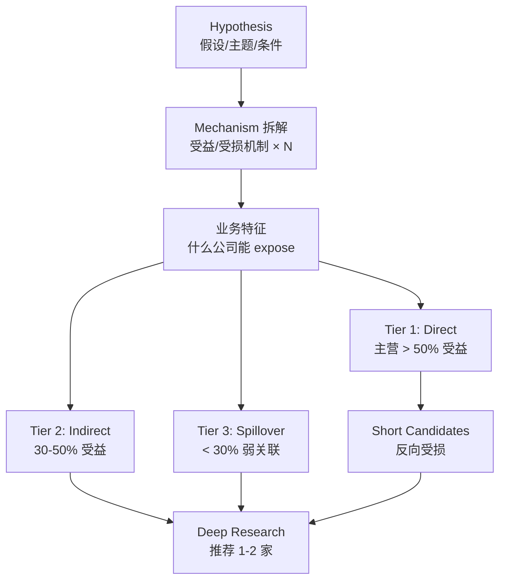

# Candidate Screener

Turn a theme, event, or screen into a sourced long/short candidate funnel with tiered exposure and priced-in assessment.

## Research Runtime Capsule

- Hook-enforced legality, source boundary, structure floor, and table rendering rules live in workspace hooks and are not restated here.
- Shared runtime/source baseline lives in `skills/_shared/research-policy-baseline.md` and the installed workspace `CLAUDE.md`.
- Use this skill for hypothesis engineering, candidate funneling, and priced-in triage; unresolved facts stay as gap, hypothesis, or follow-up.
- Market-snapshot fields default to `topic-local evidence cache / financial-data` then trusted third-party then web fallback. A-share / HK / US screening that needs market_quote, valuation_snapshot, or market_screen may call `trusted-market-bridge` first; bridge misses fall back to web. Borrow, bid-ask, accounting basis, and share-class truth stay at `[需查证]` without high-quality source.
- Sub-agent outputs must be evidence_cards_only; main agent synthesizes, deduplicates, tiers, and ranks.

**三表数据前置（按需调用）：** priced-in 评估和估值锚需要 market_data——主 agent 先从 actuals-resolved.json 取市场数据；如需为未覆盖 ticker 拉数据，委托 subagent 执行 /financial-data --lite <ticker>。

把 hypothesis 转化成具体的可投资 candidate basket。LS 默认 long + short 双向。**核心价值不是列 ticker**——Bloomberg screener 比 AI 更准。AI 的差异化价值在于：

1. 把 vague hypothesis 拆解成具体 mechanism（hypothesis 工程化）
2. 强制双向（long / short basket，sell-side 不会做）
3. 强制每个 candidate 给 hypothesis-relevant 的受益机制 + source
4. 强制评估 priced-in 程度（避免推荐已被 reprice 的概念股）
5. 强制识别 hypothesis 本身的弱点（自我 challenge）
6. 推荐 1-2 家进入 deep research（漏斗收口）

如果输出只是 ticker list 没有上述任何一项，本 skill 就失败了。

## 心法

研究员产生新 hypothesis 是有 alpha 的——但找具体 candidates 这一步常常退化成"列已知概念股 + 抄卖方报告"。这是浪费 hypothesis 的过程。

本 skill 的工作逻辑是 **brainstorm + 验证**：
- AI 推理：从 hypothesis 推导**应该 expose 到什么 mechanism** → 应该有什么**业务特征** → 哪些**公司类型** → 具体 **names**
- 研究员验证：每个 name 的业务关联必须有 source；估值 / 流动性 / priced-in 必须有 quantitative anchor
- 最终 funnel：从 brainstorm 出的 N 个 candidates 收敛到 1-2 个值得做 deep research 的

**举个例子**：如果你问"AI 数据中心电力受益股"——

- ❌ 坏的输出：列一堆你听过的名字——NVDA、MSFT、VRT、GE Vernova、西门子能源。这是概念股堆砌。
- ✅ 好的输出：先拆 mechanism——建设期（EPC/设备）、运营期（电力供应商/输配电）、长期转型（SMR/储能）。然后按 mechanism 去找真正 exposure 的公司——有些你未必听过，比如某家核电运营商 35% 的容量签了 hyperscaler PPA，这才是差异化 alpha。

**最重要的纪律**：AI 不假装是 universe screener。本 skill 的输出是 **inferential brainstorm**，是研究员的 starting point，不是 final list。研究员必须 cross-check Bloomberg / 行业数据，并主动问"我可能漏了什么"。

## 触发场景

### Mode A 触发（Thematic / Event-driven）
- "推荐受益于 [事件] 的股票"
- "[主题] 怎么参与"
- "[现象] 哪些 names 受益 / 受损"
- "找类似 [X 公司] 在 [Y 市场] 的标的"
- "[政策事件] 的 long / short basket"
- "如果 [假设场景] 发生，谁最敏感"

### Mode B 触发（Quant / Conditional）
- "找 [财务条件] 的标的"
- "screening: [估值条件 + 业务条件]"
- "[行业] 中 ROIC > X% / capex 强度 < Y / FCF yield > Z 的"
- "类似 [X] 但估值 < [Y]"

### Mixed Mode 触发（最常见）
- "受益于某主题 demand 的股票，PE < 30"
- "某行业中 capex/CFO < 0.5 + 高质量资源年限 > 8 年"
- "某软件子行业中 ARR 增速 > 30% + Rule of 40 > 50 + 不依赖单一平台 API"

混合是常态——不要强行划分 mode。但内部推理要清楚哪些条件是 thematic 派生（mechanism 推导），哪些是 quant 过滤（pattern matching）。

## 输入澄清要求（必填 6 维度）

如果用户给的 hypothesis 缺以下任一关键维度，**主动澄清而不是硬猜**。澄清耗时但避免输出走偏：

| 维度 | 含义 | 默认假设（用户没说时） |
|---|---|---|
| **时间窗口** | 3M / 12M / 24M+，决定 catalyst 急迫性 | 12M（中期） |
| **受益机制范围** | Direct（pure-play）/ Indirect（供应链）/ Spillover（associated）/ All | All（但分 Tier 输出） |
| **方向** | Long / Short / Both | Both（LS 默认双向） |
| **市场偏好** | US / 大中华（A股+港股+ADR）/ 日韩 / 全球 / 不限 | 用户主要覆盖市场（默认偏大中华 + 全球工业 / 科技主题） |
| **流动性 / size 约束** | 最小日均成交量 / 最小市值 | 大中华 ≥ 100M USD ADV / 美股 ≥ 50M USD ADV |
| **风格偏好** | Value / Growth / 不限 | 不限 |

如果用户说"AI 受益股"——这远不够。至少澄清"时间窗口（capex 周期不同）"、"机制（GPU manufacturer / cloud / AI app / 电力 / 供应链）"、"方向（long only 还是含 short）"。

**关键判断**：如果 hypothesis 本身在你听来都模糊（如"科技股推荐"），主动 push back 而不是给"FAANG + 几个 hot names"。

## Mode A: Thematic / Event-driven

### A.1 推理路径（必须显式）

按 4 步推理，每步输出给用户看（让用户校准）：

**Step 1: 拆解 hypothesis → 受益 mechanism**

例（hypothesis: "AI 数据中心电力 demand 受益股"）：
> Mechanism 拆解：
> 1. 数据中心新建 → 设备 / EPC / 选址用地受益（建设期 1-3 年 capex 周期）
> 2. 数据中心运营 → 电力供应商 / 输配电设备受益（运营期 10-30 年）
> 3. 电力 supply 紧张 → 现存核电 / 燃气电厂 PPA 涨价（短期 1-3 年）
> 4. 长期电力转型 → SMR / 储能 / 可再生 capex（5-15 年）
> 反向 mechanism（受损）：
> 1. 利率敏感的 utility（成本上升）
> 2. 电力大用户工业股（电费上行）

**Step 2: Mechanism → 业务特征**

每个 mechanism 翻译成"什么样的公司能 expose"：
> Mechanism 1（建设期）→ 业务特征：数据中心 EPC、HVAC、配电设备、地产开发
> Mechanism 3（PPA 涨价）→ 业务特征：现存核电运营、被低估的火电 IPP、长期 PPA 锁价 < spot 的资产

**Step 3: 业务特征 → 具体 candidates**

按 Tier 分组（见 §A.2）。每个 candidate 给：ticker / 市场 / 业务关联 + source / priced-in 评估。

**Step 4: 候选漏斗 → 推荐 1-2 家深入**

基于（机制清晰度 + priced-in 程度 + 流动性 + 临近 catalyst）四维 score，推荐 1-2 家进入 stock-quickread / peer-deep-dive。

### A.2 输出结构

```
## Hypothesis (restated by AI)

[一句话重新表述用户给的 hypothesis，确认理解正确]
[列出澄清的 6 维度参数]

#### 筛选漏斗

[插入 Mermaid flowchart — hypothesis → mechanism → 业务特征 → Tier 1/2/3/Short → Deep Research。示例见下方。]

---

## 1. Mechanism Analysis

[Step 1-2 的输出：拆解 mechanism + 翻译业务特征]

---

## 2. Tier 1 — Direct Exposure (Pure-play / 主营 > 50% 受益)

| Ticker | Market | 业务 / 受益机制 | 受益强度 | Liquidity (ADV) | 估值锚 | Priced-in | Ev |
|---|---|---|---|---|---|---|---|
| AAA US | NYSE | 100% 数据中心运营核电；35% 容量已签 hyperscaler PPA $80/MWh | High | $150M | EV/EBITDA 12x (vs 5Y mean 8x) | 部分 | [S1](./_cache/sources/ppa-disclosure.md) [S2](https://example.com/aaa-valuation) |
| BBB | A 股 | 60% 收入来自数据中心 HVAC | High | $80M | PE 25x (vs 同业 18x) | Mostly | S3@FY25 |

**Tier 1 判断**：受益机制 direct 且 quantifiable；普遍 priced-in 较多；alpha 来自基本面 vs 估值的 spread

## 3. Tier 2 — Indirect / Supply Chain (Tier-N supplier / 30-50% 收入受益)

| Ticker | ... | ... | Medium | ... | ... | Less | ... |
| CCC | NYSE | Tier-1 配电设备给数据中心，但 60% 收入仍是工业 | Medium | $200M | EV/EBITDA 10x (vs 5Y 8x) | Partial | [S3](./_cache/sources/ccc-segment-note.md) |

**Tier 2 判断**：受益机制 indirect；priced-in 通常较少（市场没把它当 AI 概念股）；但需 verify 受益的实际 magnitude

## 4. Tier 3 — Spillover / Theme Association (< 30% 收入受益 / 弱关联)

| Ticker | ... | ... | Low | ... | ... | Variable | ... |

**Tier 3 判断**：弱关联但市场可能 trade it as theme stock；high beta to theme but low fundamental link；short candidate 高发区

## 5. Short Candidates

[同样的表格结构，方向反过来]

| Ticker | Market | 受损机制 | 受损强度 | Liquidity | 估值 | Already-shorting? | Ev |
|---|---|---|---|---|---|---|---|

**Short Candidate 关键判断**：
- Priced-in 评估更重要——明显的 short 多数已 priced（high SI、负面 sentiment）
- 受益于 thematic-priced-up 但基本面不变的 candidates 是优质 short
- 列 short borrow availability + rate（如可获取）

## 6. Recommended for Deep Research (1-2 家)

按 (机制清晰度 × 50%) + (priced-in 反向 × 30%) + (流动性 × 10%) + (catalyst 临近 × 10%) 综合 score：

- **AAA US** (Tier 1, score 8/10): 机制最清晰 + 临近 Q3 PPA 公告 catalyst + 估值仅 partial priced-in → 触发 `stock-quickread`
- **CCC** (Tier 2, score 7/10): 受益 magnitude 待 verify 但 priced-in 几乎为 0 → 触发 `stock-quickread` 验证 segment exposure

## 7. Hypothesis 漏洞自检

> 这是在问：**你的 thesis 哪里最可能翻车？** 不是挑小毛病——是找致命伤。至少 3 条。

[必填，至少 3 条——这是 LS 研究员防止 over-confidence 的关键]
1. **Hypothesis 弱点**：AI 数据中心电力 demand 假设依赖 hyperscaler capex 持续——历史 base rate：tech capex 周期通常 2-3 年，2024-2026 已是 capex 高峰期，受益股 priced 充分
2. **Tier 风险**：Tier 1 已普遍 priced，alpha 主要来自 Tier 2-3 的 mispricing，但 Tier 2-3 的 mechanism 验证更难
3. **反向风险**：如果 inference cost 下降快于预期（→ datacenter capex 不需要 ramp 这么快），整个 hypothesis 大幅 weakening

## 8. AI 候选 ≠ 全市场（caveat）

> AI 不认识小票和刚上市的公司。这个列表一定有漏——你应该自己补。

本输出基于 AI 已知的 mid/large cap 主流 universe（约 1000-2000 names）。可能漏：
- Small cap / micro cap（< $1B 市值）
- 最近 12 个月 IPO / spin-off / 重组的公司
- 主要在新兴市场上市的标的
- 你应该 cross-check：[1] Bloomberg theme screen [2] 行业研究机构（Wood Mac / Gartner / IDC） [3] 主动问"我漏了哪些 names"

[然后 chat 直接 prompt 用户：是否要补充某些 names？]
```

> Mermaid 漏斗示例（放在 fence 外做参考，agent 输出时替换 §Hypothesis 的 placeholder）：



---

## Mode B: Quant / Conditional Screening

### B.1 推理路径

Mode B 的核心是 pattern matching，但 AI 仍需要做 inferential 工作（不是真 quant screen）：

**Step 1: 翻译条件 → 业务特征**

例（条件: "EV/EBITDA < 8x + FCF yield > 8% + capex/D&A < 0.7"）：
> 翻译：
> - EV/EBITDA < 8x → 价值股 / 周期股 / 困境股
> - FCF yield > 8% → mature 业务、capital return 重于 reinvestment
> - capex/D&A < 0.7 → 收割期资本周期，不再大投资
> 综合 profile：mature cyclical 收割期公司

**Step 2: Pattern matching**

在 AI universe 里识别匹配 profile 的 names。**关键**：必须区分以下三种来源：
- AI 通过具体数字 verified 匹配
- AI 推测匹配但需 verify
- AI 不确定（潜在 candidate 但 score 偏弱）

**Step 3: 数据验证**

对每个匹配 candidate 给具体数字（带 source）。AI 数据可能 stale，主动 web_search 最新季度数据。

### B.2 输出结构

```
## Screening Criteria (restated)

[列出用户的具体条件 + 澄清的维度]

---

## 1. Conditions Translation

[Step 1 的输出：翻译条件成业务 profile]

---

## 2. Matched Candidates

| Ticker | Market | EV/EBITDA | FCF yield | Capex/D&A | All criteria met? | Ev |
|---|---|---|---|---|---|---|
| AAA | US | 6.5x | 11% | 0.5 | ✅ | [S1](https://example.com/aaa-multiples) [S2](./_cache/sources/aaa-cashflow-bridge.md) |

| BBB | A 股 | 7.8x | 9% | 0.6 | ✅ | 2025 Q4 | [S4](./_cache/sources/bbb-annual-report.md) |
| CCC | HK | 8.2x ❌ | 10% | 0.65 | ❌ (EV/EBITDA fail by 0.2x) | 2026 Q1 | [S5](./_cache/sources/ccc-annual-report.md) |

**Note**: 包括 ❌ 但接近的 candidates（边缘合格）—— 给研究员判断空间。

## 3. Top Candidates by Match Quality

按 (满足条件数 × 50%) + (额外 attractive 维度 × 30%) + (流动性 × 20%) 排序：

1. **AAA**: 全部条件满足 + ROIC 18% (extra)
2. **BBB**: 全部条件满足 + 股息 yield 6% (extra)

## 4. Recommended for Deep Research (1-2)

[同 Mode A §6]

## 5. Hypothesis 漏洞自检

[即使是 quant screening，也要质疑条件本身是否 capture 想要的 thesis]
- 你的条件可能筛出 value trap（FCF yield 高但因为基本面持续恶化）
- Capex/D&A < 0.7 在 emerging tech 行业可能意味着错过增长（不是 attractive）
- 建议加 ROIC vs WACC > 200bps 过滤 value trap

## 6. AI 候选 ≠ 全市场 (caveat)

[同 Mode A §8]
```

---

## Mixed Mode（最常见）

混合查询的关键：内部推理要明确**哪些条件是 thematic（mechanism 推导）+ 哪些是 quant（pattern matching）**。

输出顺序：
1. Restate hypothesis + 6 维度
2. Mechanism analysis（thematic 部分）
3. Conditions translation（quant 部分）
4. **同时满足 mechanism + conditions 的 candidates**
5. Tier 分组（Direct / Indirect / Spillover）+ Quant pass/fail 双轴
6. Short candidates（如方向 = both）
7. Recommended for deep research
8. Hypothesis 漏洞 + AI universe caveat


## 共同输出元素（无论 mode）

每次输出必须包含：

### 1. **Source for every business linkage**
每个 candidate 的"业务 / 受益机制"列必须有 source link。常见 source 类型：
- 10-K / 10-Q segment data
- IR presentation（注意 marketing spin）
- 8-K / 公告（M&A、合同）
- 卖方 deep dive 报告（**作为线索**，原始 source 还是 filing）
- 行业研究（IHS / Wood Mac / IDC）—— 用于 supply chain mapping

不确定的关联标 `[需查证]` —— **不能编造**。

### 2. **Priced-in 评估（quick estimate）**
不需要 AI 做 reverse DCF（太重）。简化为 3 级：
- **Fully priced**: 估值倍数 vs 5Y mean 已 +30% 以上 / 同业溢价 >20% / 已被卖方主推为 thematic name
- **Partial priced**: 估值倍数 vs 5Y mean +10-30% / 部分 thematic 溢价
- **Not priced (yet)**: 估值倍数 vs 5Y mean 持平或更低 / 市场还没 link 到 thematic

每个 candidate 必须给 priced-in 评估 + 简短理由。**Alpha 来自 not-priced 或 partial-priced 的 names**——fully priced 的 candidates 列出来主要是 short 候选或防漏。

### 3. **Hypothesis 漏洞自检**
LS 研究员最大风险是 self-reinforcing hypothesis。AI 必须 actively challenge：
- Hypothesis 本身的弱点（依赖什么 assumption）
- Base rate（历史上类似 hypothesis 的成功率）
- Tier 风险（Tier 1 priced / Tier 2 难 verify / Tier 3 weak link）
- 反向风险（什么发生会让 hypothesis 失效）

至少 3 条具体的 challenge，不允许"hypothesis 看起来 sound"这种空话。

### 4. **AI universe caveat**
固定模板提示用户 AI 不是 universe screener。

## Artifact / 保存策略

写入当前日期化保存路径：

```text
topics/[topic-namespace]/[topic-slug]/[YYYY-MM-DD]-candidate-screener.md
```

本 skill 的 `artifact_policy.naming_mode = optional_qualifier`。完整候选漏斗默认继续使用 `YYYY-MM-DD-<artifact>.md`；如果这次只针对某个 screen、主题篮子或事件筛选，则应改由 `new-session` 解析成 `YYYY-MM-DD-<artifact>-<qualifier>.md`。

如果当前日期化保存路径不明确，先 handoff 到 `new-session` 解析路径；不要临时发明目录或未解析路径就写入。

这个文件是 candidate funnel 的留痕，不是最终 thesis；后续 `stock-quickread`、`peer-deep-dive`、`research-journal`、`next-step` 可以读取其中的 recommended candidates、mechanism、source map 和 rejected names。


## 反模式自查

写完必须自检：

**编造 / 概念股堆砌**
- ❌ Candidate 的"业务 / 受益机制"列无 source link → 必须补
- ❌ 列了一堆 obvious names（NVDA / MSFT / GOOG）但没差异化分析 → 重新做
- ❌ Tier-2/3 关联只写"供应链相关"无具体 supplier link → 没 verify
- ❌ 把卖方研报的"概念股归类"当作业务关联依据 → 卖方分类有 marketing 嫌疑
- ❌ AI 依据"听过"或推测列 candidate 但没标 [需查证] → 编造嫌疑
- ❌ 把 sub-agent evidence card 直接当成最终 Tier / Top Candidates → 必须由主 agent 抽查、去重、分层和排序

**Hypothesis / Tiering**
- ❌ 没拆解 mechanism 直接列 candidates → AI 推理价值丢失
- ❌ Tier 1/2/3 划分没有具体标准（收入占比 % 等） → 无法 verify
- ❌ Hypothesis 漏洞自检写空话（"thesis 看起来 sound"）→ 必须给具体 challenge
- ❌ Hypothesis 太 vague 但 AI 没主动澄清就开始 list → 应该 push back
- ❌ Candidate 的受益机制依赖复杂工程原理 / 设备链条，却没有建议 `mechanism-map` 先讲清楚机制
- ❌ Candidate 的受益机制依赖复杂 revenue / margin driver，却没有建议 `driver-map` 验证量级

## 篇幅基准

- 标准 candidate-screener：1200-3000 字 + 对应表格数（Mode A 4-5 / Mode B 1-2 / Mixed 5-6）。
- 低于 1000 字通常推理不深或 candidates 太少；超过 3000 字说明在堆 ticker 而非筛选，应收紧 Tier 标准。

**Candidate 数量基准**：
- Tier 1: 3-5 家（pure-play 通常少）
- Tier 2: 3-5 家
- Tier 3: 1-3 家（如有）
- Short basket: 3-5 家（如方向 = both）
- 推荐 deep research: **必须 1-2 家**，不允许 0 或 ≥ 3

---

## 与 information-impact 的边界

两个 skill 都涉及 source 验证、claim 拆解，但**信息流方向相反**：

| | candidate-screener | information-impact |
|---|---|---|
| 输入 | Hypothesis / 主题 / 条件 | 已知 claim（一条信息） |
| 任务 | 找候选 names | 验证真伪 + research relevance |
| 方向 | Outbound（从 hypothesis 出发） | Inbound（信息已到） |
| 频率 | 每周 2-3 次（中频） | 每天几十次（高频） |

**不要混淆**：
- "某主题受益股有哪些" → candidate-screener
- "刚听说 X 公司是某 hyperscaler PPA 客户" → information-impact

如果用户问的是混合（"我听说有这个主题，能列 candidates 吗"），先用 information-impact 验证 claim，再用 candidate-screener 探索 candidates。
