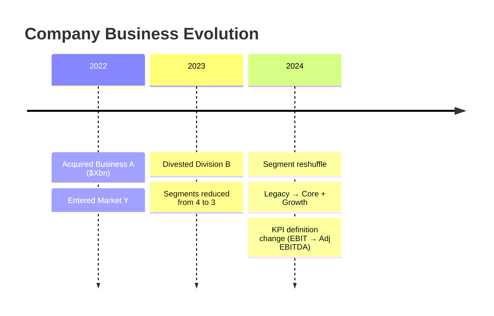

# Company History

> This is the English translation of [SKILL.md](./SKILL.md). The Chinese version is the source of truth.

Audit business evolution and disclosure comparability through M&A timelines, segment recasts, and KPI definition changes.

## Research Runtime Capsule

**MUST read the following files before executing this skill:**
- `_shared/research-runtime.md` §1 (Data Pipeline) §2 (Source Verification) §2.1 (Material Collection) §2.2 (Source Discipline) §2.5 (Image Download) §4 (Output Contract) §5 (Save Contract)

**Auto Hook Defense:** `pre_write_gate` (source/tables/mermaid/image) `source_contract` `table_render_integrity` `mermaid_syntax` `skill_structure_contract` `evidence_ledger_floor`

## Core Philosophy

`company-history` addresses the most error-prone link in the disclosure chain: how the business became what it is today, and whether the numbers can be directly compared.

Many investment research errors arise from treating recast segments as continuous history, treating structural changes from M&A as organic trends, and treating renamed KPIs as the same definition. This skill's task is to clearly explain these breakpoints: when they changed, what changed, and what impact they have on downstream driver-map / model / peer compare.

This skill does not write company introductions, does not decompose model drivers, and does not draw product value chains. It is the definitional upstream for `driver-map` and `peer-deep-dive` — ensuring data can be read continuously before driver mapping begins.

Example: a company acquired Business A in 2022, divested Division B in 2023, and reorganized 3 segments into 2 in 2024. If this is not mapped out, all downstream driver analysis is built on a wrong foundation — you think revenue is growing, but it was bolted on via M&A; you think margin is expanding, but low-margin divisions were carved out.

## Trigger Scenarios

### Mode A Triggers (Business Evolution Audit)

- "How has this company evolved into its current form over the past few years"
- "Which M&A / divestitures have changed the business structure"
- "Has this company's business boundary shifted"
- "Is the current business the same as it was a few years ago"
- "Which part of this company is core, and which is legacy / noise"

### Mode B Triggers (Disclosure Evolution Audit)

- "Have segment definitions changed"
- "Is this KPI comparable across periods"
- "Why did the disclosure definition break"
- "How to align after this company's rename / recast"
- "Sort out the historical segment / KPI definitions"

## Input Clarification Requirements

| Dimension | Meaning | Default Handling |
|---|---|---|
| **Subject** | ticker / company name / subsidiary / segment / KPI | Default to company level; user may specify a particular segment or KPI |
| **Research Purpose** | understand business evolution / align disclosure definitions / assess comparability / feed driver-map | Default to serving downstream driver-map and peer compare |
| **Time Range** | past 3–5 years / since listing / around a specific transaction / around a specific recast | Default to covering all material changes + disclosure events affecting comparability |
| **Disclosure Scope** | segment / KPI / geography / customer / product | Default to segment + KPI + material M&A / divestiture |
| **Source Status** | user-provided sources / need to find sources / conflicting sources | Each definition change must be tagged with source + as-of; mark `[来源待补]` when insufficient |
| **Save Requirement** | write to topic dated file | Default save to current topic |

If the user only provides a ticker, default to Business Evolution Audit first (material changes over the past 3–5 years), then proceed to Disclosure Evolution Audit as needed. If the user explicitly wants only disclosure definition alignment, go directly to Mode B.

## Mode A: Business Evolution Audit

The goal is to identify which historical changes alter the current understanding of the business.

Must cover:
- Material M&A, divestiture, spin-off, business exit, segment reshuffle.
- Which business bucket each change entered or exited.
- Whether the change altered business substance or was merely a disclosure presentation change.
- Which historical data cannot be directly compared year-over-year.

Historical events must be written as:
```text
[Event / Date / source] -> what business boundary changed -> impact on current research
```

## Mode B: Disclosure Evolution Audit

The goal is to clearly explain disclosure definition breakpoints and comparability, without directly substituting for `driver-map`.

Must output:
- Segment / KPI rename, recast, definition change, reporting unit change, discontinued ops.
- Source / as-of for each definition change.
- Comparability judgment: `comparable` / `partially comparable` / `not comparable` / `unknown`.
- Impact on downstream work: whether it blocks driver-map, peer compare, model, or thesis.

Comparability hard standards:
| Rating | Hard standard |
|---|---|
| `comparable` | Company explicitly states definition unchanged, or provides traceable recast data |
| `partially comparable` | Business scope broadly consistent, but definitions, segment allocation, or time periods have localized changes |
| `not comparable` | M&A, divestiture, discontinued ops, reporting unit change, or KPI definition changes alter core definitions |
| `unknown` | Insufficient source, cannot judge; must mark `[来源待补]` or `[需查证]` |

If a disclosure gap already affects revenue / margin / backlog / price-volume-mix driver judgments, stop inferring within the primer and output a `driver-map` handoff block.

## Output Structure

### Business Evolution Audit

```markdown
## Business Evolution Audit

**Conclusion First**
[The single business-evolution change most affecting current judgment]

[Insert Mermaid timeline — mark M&A/divestiture/segment changes by year, noting what business boundary changed. See example below.]

| Date / period | Event | What changed | Current research implication | Ev |
|---|---|---|---|---|---|

## Non-comparable History

- [...]

## Next Handoff

- [...]
```

> Mermaid timeline example (agent replaces the Mode A placeholder when outputting):



### Disclosure Evolution Audit

```markdown
## Disclosure Evolution Audit

**Conclusion First**
[Which segments / KPIs cannot be directly connected across periods]

| Period | Reported segment / KPI | Definition / scope | Change vs prior | Comparability | Ev |
|---|---|---|---|---|---|

## Source Reconciliation

- [Conflicting sources, provisional definition used, rationale]

## Impact on Downstream Work

- `driver-map`: [...]
- `peer-deep-dive`: [...]
- `3-statement-model / dcf-model / comps-analysis / model-update`: [...]
```

## Artifact / Save Strategy

Write to industry topic:
    industry/<industry>/companies/<ticker>/YYYY-MM-DD-<artifact>.md

If path is unclear → agent auto-creates per policy baseline §11.

## Source Contract

**Density Table**:

| Section | Mandatory Source Tag | Exemption |
|---|---|---|
| Revenue mix evolution timeline | Source (filing/IR) for each year's revenue mix % | Trend judgment |
| M&A / Pivot events | Amount + date + source for each transaction | — |
| Disclosure definition changes | Filing source + effective date for each change | — |
| Customer / product milestones | Date + customer name + source for each milestone | — |

**Completion Gate**: After writing the timeline → each year's figures have [S#] (filing) or [I#] (IR deck) → `[待查]` events ≤ 5 → Resources expanded.

## Anti-Pattern Checklist

### Chronicle-style
- ❌ "Founded in / headquartered in / experienced management team" appears without explaining how it changes the current business judgment.
- ❌ Chronologically listing all M&A, divestitures, and product launches instead of writing only material changes.
- ❌ Rewriting IR's "leading solutions provider" into natural language without translating into who pays, what they buy, and why.
- ❌ Using a 5-year revenue CAGR as a substitute for business evolution explanation.
- ❌ Writing a sell-side initiation company overview section.

### Source-class
- ❌ Products, customers, segments, KPIs, M&A, divestitures, or recasts without source / as-of.
- ❌ Mixing the company website's current business page with historical 10-K filings without marking timestamps.
- ❌ When multiple sources conflict on segment or KPI definitions, picking only the convenient one.
- ❌ Treating sell-side or news descriptions of the business as company-disclosed facts.
- ❌ Fabricating URLs, page numbers, transaction amounts, acquisition dates, or KPI definitions.
- ❌ Pasting sub-agent evidence cards directly as company primer conclusions without the main agent spot-checking URLs, unifying time definitions, and handling source conflicts.

### Logic-class
- ❌ Treating a segment rename as a business change, or treating a business change as a mere rename.
- ❌ Connecting data before and after discontinued ops, spin-offs, or divestitures into a continuous trend.
- ❌ Treating acquired revenue as organic growth.
- ❌ Treating reported segment names directly as business reality.

## Length Baseline

- Mode A (Business Evolution): 600–1,200 characters + 1 event table; exceeding 1,400 characters indicates non-material history has been included.
- Mode B (Disclosure Evolution): 700–1,400 characters + 1 definition table; exceeding 1,600 characters usually warrants splitting off to `driver-map`.

