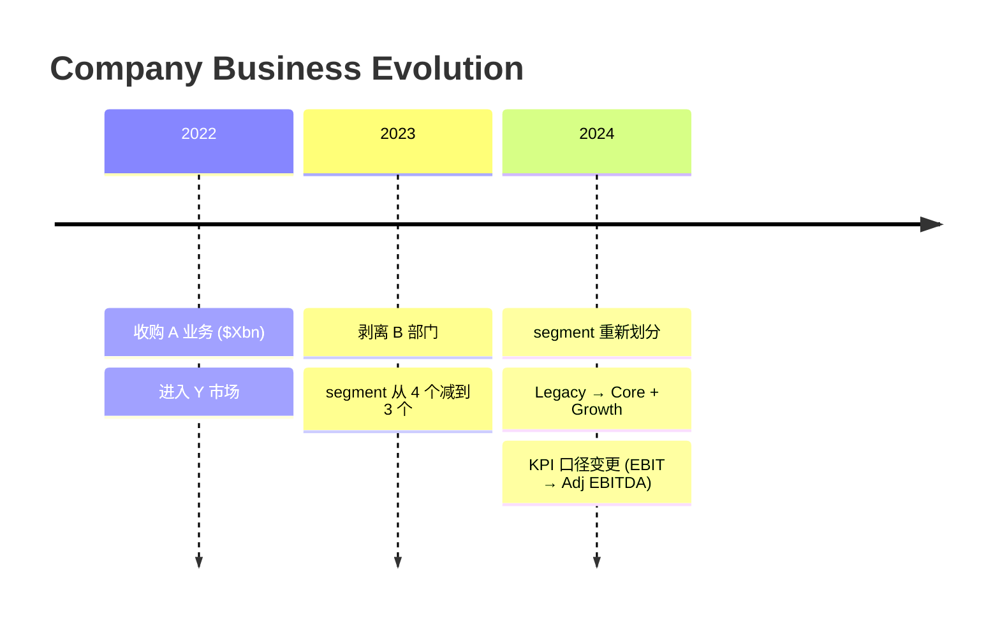

# Company History

Audit business evolution and disclosure comparability through M&A timelines, segment recasts, and KPI definition changes.

## Research Runtime Capsule

Follow `_shared/research-runtime.md` — 数据获取链、来源验证链、证据协议、产出合约、保存合约。
Hook-enforced: `pre_write_gate` (source/tables/mermaid), `source_contract`, `table_render_integrity`, `mermaid_syntax`, `skill_structure_contract`, `evidence_ledger_floor`.

## 心法

`company-history` 处理的是披露链条上最容易出错的一环：业务怎么变成今天这样，以及数字能不能直接比。

很多投研错误是因为把 recast 后的 segment 当成连续历史、把并购带来的结构变化当成 organic trend、把 renamed KPI 当成同一口径。本 skill 的任务是把这些断点讲清楚：什么时候变的、变了什么、对后续 driver-map / model / peer compare 有什么影响。

本 skill 不写公司介绍、不拆 model driver、不画产品价值链。它是 `driver-map` 和 `peer-deep-dive` 的口径上游——在 driver mapping 之前先确保数据能连着看。

举个例子：某公司 2022 年收购了 A 业务、2023 年剥离 B 部门、2024 年把 3 个 segment 重新划分成 2 个。如果不画出来，后面所有 driver 分析都建在错的基础上——你以为 revenue 在涨，其实是并购塞进来的；你以为 margin 在扩张，其实是低利润部门被剥离了。

## 触发场景

### Mode A 触发（Business Evolution Audit）

- "这家公司过去几年怎么变成现在这样"
- "哪些并购 / 剥离改变了业务结构"
- "这家公司业务边界变过吗"
- "现在的业务和几年前是不是一回事"
- "这家公司哪块业务是核心，哪块是遗留 / 噪音"

### Mode B 触发（Disclosure Evolution Audit）

- "segment 口径是不是变过"
- "这个 KPI 前后可比吗"
- "为什么披露口径断了"
- "这家公司 rename / recast 后怎么对齐"
- "把 segment / KPI 历史口径梳理一下"

## 输入澄清要求

| 维度 | 含义 | 默认处理 |
|---|---|---|
| **对象** | ticker / 公司名 / 子公司 / segment / KPI | 默认按公司；用户可指定具体 segment 或 KPI |
| **研究目的** | 搞清业务演变 / 对齐披露口径 / 判断可比性 / feed driver-map | 默认服务后续 driver-map 和 peer compare |
| **时间范围** | 过去 3-5 年 / 上市以来 / 某次交易前后 / 某次 recast 前后 | 默认覆盖所有 material 变化 + 影响可比性的披露事件 |
| **披露范围** | segment / KPI / geography / customer / product | 默认 segment + KPI + material M&A / divestiture |
| **source 状态** | 用户给 source / 需要自行找 source / source 冲突 | 每个口径变化必须标 source + as-of；不足时标 `[来源待补]` |
| **保存需求** | 写入 topic 日期文件 | 默认保存到当前 topic |

如果用户只给 ticker，默认先做 Business Evolution Audit（过去 3-5 年 material 变化），再按需进入 Disclosure Evolution Audit。如果用户明确只要披露口径对齐，直接进 Mode B。

## Mode A: Business Evolution Audit

目标是识别哪些历史变化会改变当前业务理解。

必须覆盖：
- material M&A、divestiture、spin-off、business exit、segment reshuffle。
- 每个变化进入或退出了哪个业务 bucket。
- 变化是改变了业务实质，还是只是披露呈现变化。
- 哪些历史数据不能直接同比。

历史事件的写法必须是：
```text
[事件 / 日期 / source] -> 改变了什么业务边界 -> 对当前研究有什么影响
```

## Mode B: Disclosure Evolution Audit

目标是把披露口径的断点和可比性讲清楚，不直接替代 `driver-map`。

必须输出：
- segment / KPI rename、recast、definition change、reporting unit change、discontinued ops。
- 每个口径变化的 source / as-of。
- 可比性判断：`comparable` / `partially comparable` / `not comparable` / `unknown`。
- 对后续工作的影响：是否阻塞 driver-map、peer compare、model 或 thesis。

可比性 hard standards：
| Rating | Hard standard |
|---|---|
| `comparable` | 公司明确说明口径未变，或提供可追溯 recast 数据 |
| `partially comparable` | 业务范围大体一致，但定义、segment allocation 或 time period 有局部变化 |
| `not comparable` | M&A、divestiture、discontinued ops、reporting unit change 或 KPI definition 改变核心口径 |
| `unknown` | source 不足，不能判断；必须标 `[来源待补]` 或 `[需查证]` |

如果 disclosure gap 已经影响 revenue / margin / backlog / price-volume-mix driver 判断，停止在 primer 内推断，输出 `driver-map` handoff block。

## 输出结构

### Business Evolution Audit

```markdown
## Business Evolution Audit

**结论先行**
[业务演变中最影响当前判断的 1 个变化]

[插入 Mermaid timeline — 按年标注 M&A/剥离/segment 变化，标注改变了什么业务边界。示例见下方。]

| Date / period | Event | What changed | Current research implication | Ev |
|---|---|---|---|---|

## Non-comparable History

- [...]

## Next Handoff

- [...]
```

> Mermaid timeline 示例（agent 输出时替换 Mode A 的 placeholder）：



### Disclosure Evolution Audit

```markdown
## Disclosure Evolution Audit

**结论先行**
[哪些 segment / KPI 不能直接连起来看]

| Period | Reported segment / KPI | Definition / scope | Change vs prior | Comparability | Ev |
|---|---|---|---|---|---|

## Source Reconciliation

- [冲突 source、暂用口径、原因]

## Impact on Downstream Work

- `driver-map`: [...]
- `peer-deep-dive`: [...]
- `3-statement-model / dcf-model / comps-analysis / model-update`: [...]
```

## Artifact / 保存策略

写入行业 topic：
    industry/<industry>/companies/<ticker>/YYYY-MM-DD-<artifact>.md

路径不明 → agent 按 policy baseline §11 自动创建。

## Source Contract

**密度表**：

| Section | 强制标 source | 豁免 |
|---|---|---|
| 收入结构演进 timeline | 每年 revenue mix % 的 source（filing/IR） | 趋势判断 |
| M&A/Pivot 事件 | 每笔交易的金额+时间+source | — |
| 披露口径变化 | 每次变化的 filing 出处+生效时间 | — |
| 客户/产品里程碑 | 每个 milestone 的时间+客户名+source | — |

**完成 Gate**：写完扫 timeline → 每年数字有 [S#]（filing）或 [I#]（IR deck） → `[待查]` 事件 ≤5 → Resources 展开。

## 反模式自查

### 流水账类
- ❌ 出现“成立于 / 总部位于 / 管理层经验丰富”，但没有解释它如何改变当前业务判断。
- ❌ 按时间顺序罗列所有并购、剥离、产品发布，而不是只写 material changes。
- ❌ 把 IR 里的“领先解决方案提供商”改写成中文，没有翻译成谁付钱、买什么、为什么买。
- ❌ 用 5 年收入 CAGR 代替业务演变解释。
- ❌ 写成 sell-side initiation 的公司介绍章节。

### Source 类
- ❌ 产品、客户、segment、KPI、并购、剥离或 recast 没有 source / as-of。
- ❌ 把公司官网当前业务页和历史 10-K 混用，却不标时间点。
- ❌ 多个 source 对 segment 或 KPI 口径冲突时只挑一个顺手的用。
- ❌ 把卖方或新闻对业务的描述当作公司披露事实。
- ❌ 编 URL、页码、交易金额、收购日期或 KPI 定义。
- ❌ 把 sub-agent evidence card 直接粘成 company primer 结论，而没有主 agent 抽查 URL、统一时间口径和处理 source conflict。

### Logic 类
- ❌ 把 segment rename 当成业务变化，或把业务变化当成单纯 rename。
- ❌ 把 discontinued ops、spin-off、divestiture 前后的数据连成连续趋势。
- ❌ 把 acquired revenue 当成 organic growth。
- ❌ 把 reported segment 名称直接当成 business reality。

## 篇幅基准

- Mode A (Business Evolution)：600-1200 字 + 1 张事件表；超过 1400 字说明把 non-material history 写进来了。
- Mode B (Disclosure Evolution)：700-1400 字 + 1 张口径表；超过 1600 字通常应拆给 `driver-map`。

