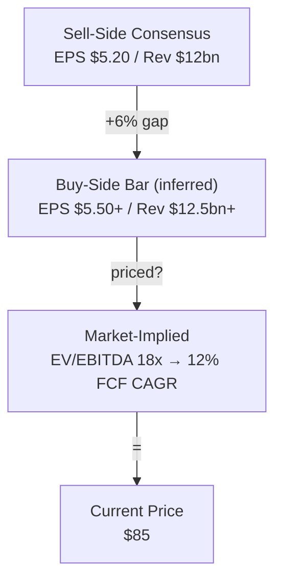

> This is the English translation of [SKILL.md](./SKILL.md). The Chinese version is the source of truth.

# Consensus Map

Map consensus buy-side bar priced-in assumptions revisions and variant-view gaps.

## Research Runtime Capsule

**MUST read the following files before executing this skill:**
- workspace `.references/runtime/research-runtime.en.md` §1 (Data Pipeline) §2 (Source Verification) §2.1 (Material Collection) §2.2 (Source Discipline) §2.5 (Image Download) §4 (Output Contract) §5 (Save Contract)

**Auto Hook Defense:** `pre_write_gate` (source/tables/mermaid/image) `source_contract` `table_render_integrity` `mermaid_syntax` `skill_structure_contract` `evidence_ledger_floor`

## Core Philosophy

The buy-side purpose of a consensus map is not to know "what everyone thinks" — it is to judge: is there still a mispricing that can make money? Is the gap in revenue, margin, KPI, cycle timing, multiple, terminal value, or narrative framing? Only by decomposing consensus into verifiable hypotheses can the subsequent `alpha-thesis` move beyond a gut-feel "variant view."

Consensus does not equal sell-side EPS. What truly affects positions are three layers: visible sell-side consensus, invisible but inferable buy-side bar, and the assumptions already embedded in price / valuation / positioning. When the three layers diverge, opportunity or risk usually sits in the seams.

This skill is the foundation layer. It does not replace the first-pass of `stock-quickread` / `industry-landscape`, does not replace the reverse DCF and detailed modeling of `3-statement-model / dcf-model / comps-analysis / model-update`, and does not replace the print-specific bar of `earnings-setup`. Its job is to break down "what consensus actually is" before thesis work begins.

## Trigger Scenarios

Use this skill when the user asks:
- "NVDA / ETN / GE — what exactly is the market pricing in right now?"
- "Where is consensus in this industry?"
- "What's the gap between buy-side bar and sell-side consensus?"
- "What is the market debating right now?"
- "How do I locate my variant versus consensus?"
- "Is this theme already crowded / priced in?"
- "Help me build a consensus map / expectations map / variant view setup"

Do not use for:
- Just a first-pass on an unfamiliar company: use `stock-quickread` first.
- Just a first-pass on an unfamiliar industry / theme: use `industry-landscape` first.
- Writing a full long / short thesis, catalyst, kill criteria: use `alpha-thesis`.
- Building a print bar, implied move, beat / miss setup around earnings: use `earnings-setup`.
- Quantifying reverse DCF, 3-statement, comps, scenario valuation: use `3-statement-model / dcf-model / comps-analysis / model-update`.
- Decomposing company / segment / disclosed KPI into revenue / margin drivers: use `driver-map`.

## Input Clarification Requirements

If the user has not provided complete information, first fill in default assumptions quickly; only ask follow-up questions when the object or time window is completely unclear.

| Dimension | Meaning | Default |
|---|---|---|
| Object | Single-name / peer set / industry / theme | As stated by user; ticker → single-name, industry term → industry/theme |
| Time Window | 3M / 6M / 12M / next print / 2-3Y | 12M, use 3M revision to observe marginal direction |
| Direction | Long / Short / Both | Both, preserve LS perspective |
| Data Source | VA / FactSet / Bloomberg / CapIQ / broker / filings / price data | Prefer topic `_cache/`, otherwise mark source need |
| Consensus Layer | sell-side numbers / buy-side bar / market-implied / narrative | Default: all three layers |
| Output Depth | quick map / standard map / thesis handoff | Default: standard map |

If the user provides an industry / theme, do not force-fabricate a single EPS consensus; use KPI consensus, basket / anchor names, peer valuation, revision breadth, and narrative debate to compose the map.

## Mode A: Single-Name Consensus Map

For a single company, single ticker, or a locked-in stock idea.

### Output Structure

> **Source contract**: All factual claims in this document (numbers, company names, industry judgments, competitive landscape descriptions) must carry a [S#](url) or [I#](url) short-link anchor at the end of the sentence. Interpretive sentences ("I think", "my judgment") are not mandatory. Three or more consecutive factual claims without an intermediate source → insufficient density.

```markdown
## Verdict

[2–4 sentences conclusion-first: where are current consensus / buy-side bar / market-implied assumptions; what is the largest variant slot; is it sufficient to proceed to alpha-thesis / model]

## 1. Scope / As-of / Source Quality

| Item | Current setting |
|---|---|
| Object | [ticker / company] |
| Time window | [3M / 6M / 12M / next print] |
| Consensus source | [provider + as-of / 需查证] |
| Market data source | [price / multiple / options / short interest source] |
| Confidence | High / Medium / Low |

**Takeaway**: [The most reliable and the weakest parts of this map]

## 2. Expectations Stack

[Insert Mermaid flowchart (use `flowchart TD` to simulate the expectations stack — Mermaid has no `waterfall` diagram type). Example below.]

### Sell-Side Consensus Numbers

| Metric | Current consensus | 3M / 6M revision | Dispersion | Ev | Why it matters |
|---|---|---|---|---|---|
| Revenue / EBITDA / EPS / FCF / KPI | [number] | [up/down/flat] | [range/stdev if available] | [S1](./_cache/sources/consensus-pack.md) | [investment implication] |

Example prose claim: `Consensus FY26 EBITDA has moved down 6% over three months, while dispersion widened from 8% to 14%. [S1](./_cache/sources/consensus-pack.md)`

**Takeaway**: [Which operating assumption market consensus numbers are ultimately concentrated on]

## 3. Buy-Side / Market-Implied Bar

| Bar layer | Inference | Evidence | Confidence |
|---|---|---|---|
| Price reaction | [e.g. stock rallies despite inline prints] | [events + source] | High/Medium/Low |
| Multiple / valuation | [current multiple implies X] | [Bloomberg / CapIQ / self-calculated] | [confidence] |
| Options / short interest / crowding | [implied move / SI / flow clue] | [I4](https://example.com/options-and-si) | [confidence] |
| Narrative | [what holders likely need to believe] | [broker / calls / media] | [confidence] |

**Discipline**: buy-side bar is inference, do not write it as fact.

## 4. Narrative And Debate Map

| Debate | Consensus side | Skeptic / variant side | Evidence needed | Who has burden of proof |
|---|---|---|---|---|
| [debate 1] | [what the market believes] | [what the other side says] | [KPI/source] | Bulls / Bears |

## 5. KPI / Driver Expectation Ladder

| Assumption ladder | What consensus needs | Observable KPI | Ev | Handoff if unclear |
|---|---|---|---|---|
| Revenue | [growth / orders / conversion] | [KPI] | [S1](./_cache/sources/consensus-pack.md) | `driver-map` if mapping unclear |
| Margin | [mix / pricing / utilization] | [KPI] | [S1](./_cache/sources/consensus-pack.md) | `driver-map` |

Example prose claim: `Market-implied expectations require backlog conversion to accelerate next year; if the observable KPI is unavailable, write [来源待补] rather than inventing it. [S1](./_cache/sources/consensus-pack.md)`
| Valuation | [multiple / terminal growth] | [multiple / FCF CAGR] | [I5](https://example.com/valuation-setup) | `3-statement-model / dcf-model / comps-analysis / model-update` |

## 6. Where Consensus Could Be Wrong

| Variant slot | Direction | Why it may be mispriced | Needed proof | Next source |
|---|---|---|---|---|
| [slot] | Long / Short | [reason] | [evidence] | [S3](./_cache/sources/variant-slot-note.md) / `` |

## 7. What Would Change Consensus

- [Catalyst / data point / competitor print / company disclosure that would force revisions]
- [What would change sell-side numbers]
- [What would change buy-side bar]
- [What would change market-implied assumptions]

## 8. Routing

| Finding | Next step |
|---|---|
| Variant gap is clear and driver support exists | `alpha-thesis` |
| Price-implied assumptions need quantification | `3-statement-model / dcf-model / comps-analysis / model-update` |
| Next print bar / implied move matters | `earnings-setup` |
| Revenue / margin / KPI mapping unclear | `driver-map` |
| Mechanism / value-capture premise unclear | `mechanism-insight` |
| Need field checks / channel work | `primary-research-plan` |

```

> Mermaid expectations waterfall example (placed outside the fence as reference; agent replaces the §2 placeholder when outputting):



## Mode B: Industry / Theme Consensus Map

For consensus mapping of an industry, theme, value chain, or demand pocket. Do not fabricate a single EPS consensus; use observable KPIs and anchor-name expectations instead.

### Output Structure

> **Source contract**: All factual claims in this document (numbers, company names, industry judgments, competitive landscape descriptions) must carry a [S#](url) or [I#](url) short-link anchor at the end of the sentence. Interpretive sentences ("I think", "my judgment") are not mandatory. Three or more consecutive factual claims without an intermediate source → insufficient density.

Make the following substitutions relative to the Standard structure:

| Single-name section | Industry/theme replacement |
|---|---|
| Sell-side numbers | KPI consensus / demand forecast / capacity / pricing / order trend / policy expectation |
| Buy-side bar | Theme crowding, basket performance, anchor multiple expansion, revision breadth, fundamental debate |
| KPI ladder | Demand / supply / pricing / margin pressure ladder |
| Variant slots | Which value-chain stage or anchor group's expectations are most likely wrong |

Must include 3–5 anchor names, but only for locating consensus — do not do a full individual stock quickread.

```markdown
## Anchor Expectation Table

| Anchor | Role in theme | What market seems to price | Key KPI | Ev |
|---|---|---|---|---|
| [name] | [stage] | [growth / margin / scarcity / policy] | [KPI] | [S1](./_cache/sources/consensus-pack.md) or GAP |

```

## Mode C: Tight Expectations Check

For when the user only asks "is this priced in?" or "is the bar high?"

Output compressed to:
- Verdict
- 3 layers of expectations: sell-side / buy-side inferred / market-implied
- 2–3 core debates
- 3 data points that would change consensus
- Next-step routing

600–900 words; below 600 words typically cannot simultaneously cover source, bar, and routing.

## Artifact / Save Strategy

Write to industry topic:
    industry/<industry>/companies/<ticker>/YYYY-MM-DD-<artifact>.md

Path unclear → agent auto-creates per policy baseline §11.

## Implied Growth Check

Current PE × ROE × payout → reverse-engineer implied perpetual growth. Compare against consensus 3Y revenue CAGR:

- Implied growth > consensus → market is pricing something more optimistic than consensus — figure out what the extra is
- Consensus > implied growth → safety margin exists
- If consensus 3Y growth is far below implied growth → multiple re-rate risk

## Anti-Pattern Self-Check

After writing, must self-check. If hit, rewrite:

- Only aggregated broker ratings / target prices, without decomposing assumptions.
- Treated sell-side EPS as the full market consensus, with no buy-side bar or market-implied layer.
- Consensus numbers lack provider, as-of, or metric definition.
- Wrote "priced in / not priced in" without valuation, price reaction, revision, options, short interest, crowding, or `[需查证]`.
- Buy-side bar inference not labeled as inference.
- Industry / theme mode fabricated a unified consensus number instead of using KPI / anchor / basket / debate.
- Did not distinguish long consensus from short / skeptic view.
- Debate map is a generic SWOT, not the KPI / event / assumption the market is actually debating right now.
- Wrote straight into a full `alpha-thesis`, including position sizing, kill criteria, or scenario returns.
- Print-specific bar is clearly the core issue but did not route to `earnings-setup`.
- Reverse DCF / implied CAGR requires a model but was forced into a precise conclusion; should handoff to `3-statement-model / dcf-model / comps-analysis / model-update`.
- Revenue / margin / backlog / KPI to model driver is unclear, but did not handoff to `driver-map`.
- Tables lack takeaway, or takeaway merely repeats the table.
- Next-step questions are vague and cannot be answered by a specific source / dataset / filing.

## Length Benchmarks

| Mode | Word Count |
|---|---|
| Tight Check | 600–900 |
| Single-Name | 1,200–1,800 |
| Industry/Theme | 1,300–2,000 |

Below the lower bound usually means source / bar / debate are insufficient; above the upper bound usually means the output has crossed into `alpha-thesis` or modeling skills.


