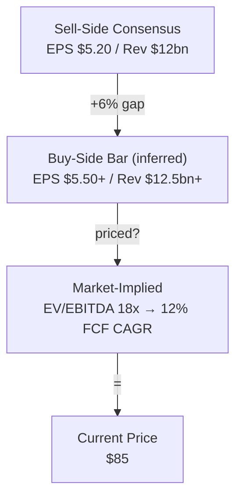

# Consensus Map

Map consensus buy-side bar priced-in assumptions revisions and variant-view gaps.

## Research Runtime Capsule

- Hook-enforced rules (source boundary, structure floor, table render) live in workspace hooks.
- Shared runtime baseline: `references/policy/research-policy-baseline.md` + workspace `CLAUDE.md`.
- **数据管道**：调用 `/financial-data --lite <ticker>` 获取三表 + 市场快照。信任其结果，直接从 `actuals-resolved.json` 取数。
- **数据验证**：Claim Fill Pipeline — Tier 0(actuals)→1(WebFetch)→2(Playwright)→3(curl)→4([需查证])。见  §3.2。
- **Actuals-only**: reverse-engineered implied growth, implied margin, and reverse DCF use actuals-resolved.json historical data as anchor. Consensus/forward estimates are the object of analysis, not inputs to ratio computation.
- Sub-agent outputs: evidence_cards_only; main agent synthesizes, deduplicates, scores, tiers, and ranks.


- Use this skill for analysis method, sequencing, and routing judgment; unresolved facts stay as gap, hypothesis, or follow-up.


## 心法

买方做 consensus map 不是为了知道"大家怎么想"，而是为了判断：还有没有可以赚钱的误差？误差在 revenue、margin、KPI、cycle timing、multiple、terminal value、还是 narrative framing？只有把共识拆成可验证假设，后面的 `alpha-thesis` 才不是凭感觉喊 variant view。

Consensus 不等于 sell-side EPS。真正会影响仓位的是三层东西：可见的 sell-side consensus、不可见但可推断的 buy-side bar、以及价格 / 估值 / 仓位已经隐含的 assumptions。三者不一致时，机会或风险通常就在缝里。

本 skill 是 foundation layer。它不替代 `stock-quickread` / `industry-landscape` 的 first-pass，不替代 `3-statement-model / dcf-model / comps-analysis / model-update` 的 reverse DCF 和详细建模，也不替代 `earnings-setup` 的 print-specific bar。它负责在 thesis 之前把"共识到底是什么"拆清楚。

## 触发场景

使用本 skill 当用户问：
- "NVDA / ETN / GE 现在市场到底 priced in 什么？"
- "这个行业 consensus 在哪里？"
- "buy-side bar 和 sell-side consensus 差在哪？"
- "市场现在在 debate 什么？"
- "我和 consensus 的差异怎么定位？"
- "这条主题是不是已经 crowded / priced in？"
- "帮我做一个 consensus map / expectations map / variant view setup"

不要用于：
- 只是陌生公司 first-pass：先用 `stock-quickread`。
- 只是陌生行业 / 主题 first-pass：先用 `industry-landscape`。
- 要写完整 long / short thesis、catalyst、kill criteria：用 `alpha-thesis`。
- 要做财报前后 print bar、implied move、beat / miss setup：用 `earnings-setup`。
- 要量化 reverse DCF、三表、comps、scenario valuation：用 `3-statement-model / dcf-model / comps-analysis / model-update`。
- 要拆公司 / segment / disclosed KPI 到 revenue / margin driver：用 `driver-map`。

## 输入澄清要求

如果用户没有给完整信息，先快速补齐默认假设；只有对象或时间窗完全不清时才追问。

| 维度 | 含义 | 默认假设 |
|---|---|---|
| 对象 | 单股 / peer set / 行业 / 主题 | 按用户原词；ticker 优先单股，行业词优先 industry/theme |
| 时间窗 | 3M / 6M / 12M / next print / 2-3Y | 12M，用 3M revision 观察边际 |
| 方向 | Long / Short / Both | Both，保留 LS 视角 |
| 数据源 | VA / FactSet / Bloomberg / CapIQ / broker / filings / price data | 优先 topic `_cache/`，否则标 source need |
| 共识层级 | sell-side numbers / buy-side bar / market-implied / narrative | 默认三层都拆 |
| 输出深度 | quick map / standard map / thesis handoff | 默认 standard map |

若用户给的是行业 / 主题，不要强行制造 EPS consensus；用 KPI consensus、basket / anchor names、peer valuation、revision breadth 和 narrative debate 组成 map。

## Mode A: Single-Name Consensus Map

用于单家公司、单个 ticker 或已锁定的 stock idea。

### 输出结构

> **Source contract**：本文所有事实 claim（数字、公司名、行业判断、竞争格局描述）句尾必须带 [S#](url) 或 [I#](url) 短链锚。解读性句子（"我觉得""我的判断"）不强制。连续 3 句以上事实 claim 中间无 source → 密度不够。

```markdown
## Verdict

[2-4 句结论先行：当前 consensus / buy-side bar / market-implied 假设在哪里；最大的 variant slot 是什么；是否足够进入 alpha-thesis / model]

## 1. Scope / As-of / Source Quality

| Item | Current setting |
|---|---|
| Object | [ticker / company] |
| Time window | [3M / 6M / 12M / next print] |
| Consensus source | [provider + as-of / 需查证] |
| Market data source | [price / multiple / options / short interest source] |
| Confidence | High / Medium / Low |

**Takeaway**: [本 map 最可靠和最薄弱的地方]

## 2. 预期堆叠

[插入 Mermaid waterfall — 三层预期怎么叠成当前价格。示例见下方。]

### Sell-Side Consensus Numbers

| Metric | Current consensus | 3M / 6M revision | Dispersion | Ev | Why it matters |
|---|---|---|---|---|---|
| Revenue / EBITDA / EPS / FCF / KPI | [number] | [up/down/flat] | [range/stdev if available] | [S1](./_cache/sources/consensus-pack.md) | [投资含义] |

正文 claim 示例：`Consensus FY26 EBITDA has moved down 6% over three months, while dispersion widened from 8% to 14%. [S1](./_cache/sources/consensus-pack.md)`

**Takeaway**: [市场数字共识到底集中在哪个 operating assumption]

## 3. Buy-Side / Market-Implied Bar

| Bar layer | Inference | Evidence | Confidence |
|---|---|---|---|
| Price reaction | [e.g. stock rallies despite inline prints] | [events + source] | High/Medium/Low |
| Multiple / valuation | [current multiple implies X] | [Bloomberg / CapIQ / 自算] | [confidence] |
| Options / short interest / crowding | [implied move / SI / flow clue] | [I4](https://example.com/options-and-si) | [confidence] |
| Narrative | [what holders likely need to believe] | [broker / calls / media] | [confidence] |

**Discipline**: buy-side bar 是推断，不要写成事实。

## 4. Narrative And Debate Map

| Debate | Consensus side | Skeptic / variant side | Evidence needed | Who has burden of proof |
|---|---|---|---|---|
| [debate 1] | [市场相信什么] | [反方说什么] | [KPI/source] | Bulls / Bears |

## 5. KPI / Driver Expectation Ladder

| Assumption ladder | What consensus needs | Observable KPI | Ev | Handoff if unclear |
|---|---|---|---|---|
| Revenue | [growth / orders / conversion] | [KPI] | [S1](./_cache/sources/consensus-pack.md) | `driver-map` if mapping unclear |
| Margin | [mix / pricing / utilization] | [KPI] | [S1](./_cache/sources/consensus-pack.md) | `driver-map` |

正文 claim 示例：`Market-implied expectations require backlog conversion to accelerate next year; if the observable KPI is unavailable, write [来源待补] rather than inventing it. [S1](./_cache/sources/consensus-pack.md)`
| Valuation | [multiple / terminal growth] | [multiple / FCF CAGR] | [I5](https://example.com/valuation-setup) | `3-statement-model / dcf-model / comps-analysis / model-update` |

## 6. Where Consensus Could Be Wrong

| Variant slot | Direction | Why it may be mispriced | Needed proof | Next source |
|---|---|---|---|---|
| [slot] | Long / Short | [reason] | [evidence] | [S3](./_cache/sources/variant-slot-note.md) / `next-step` |

## 7. What Would Change Consensus

- [Catalyst / data point / competitor print / company disclosure that would force revisions]
- [What would change sell-side numbers]
- [What would change buy-side bar]
- [What would change market-implied assumptions]

## 8. Routing

| Finding | Next step |
|---|---|
| Variant gap is clear and driver support exists | `alpha-thesis` |
| Price-implied assumptions need quantification | `3-statement-model / dcf-model / comps-analysis / model-update` |
| Next print bar / implied move matters | `earnings-setup` |
| Revenue / margin / KPI mapping unclear | `driver-map` |
| Mechanism / value-capture premise unclear | `mechanism-insight` |
| Need field checks / channel work | `primary-research-plan` |


```

> Mermaid 预期瀑布图示例（放在 fence 外做参考，agent 输出时替换 §2 的 placeholder）：



## Mode B: Industry / Theme Consensus Map

用于行业、主题、value chain 或 demand pocket 的共识地图。不要伪造单一 EPS consensus；用可观察 KPI 和 anchor-name expectation 来替代。

### 输出结构

> **Source contract**：本文所有事实 claim（数字、公司名、行业判断、竞争格局描述）句尾必须带 [S#](url) 或 [I#](url) 短链锚。解读性句子（"我觉得""我的判断"）不强制。连续 3 句以上事实 claim 中间无 source → 密度不够。差异

在 Standard 结构基础上做以下替换：

| Single-name section | Industry/theme 替换 |
|---|---|
| Sell-side numbers | KPI consensus / demand forecast / capacity / pricing / order trend / policy expectation |
| Buy-side bar | Theme crowding、basket performance、anchor multiple expansion、revision breadth、fundamental debate |
| KPI ladder | Demand / supply / pricing / margin pressure ladder |
| Variant slots | 哪个 value-chain stage 或 anchor group 的预期最可能错 |

必须包含 3-5 个 anchor names，但只用于定位 consensus，不做完整个股 quickread。

```markdown
## Anchor Expectation Table

| Anchor | Role in theme | What market seems to price | Key KPI | Ev |
|---|---|---|---|---|
| [name] | [stage] | [growth / margin / scarcity / policy] | [KPI] | [S1](./_cache/sources/consensus-pack.md) 或 GAP |

```

## Mode C: Tight Expectations Check

用于用户只问"是不是 priced in"或"bar 高不高"。

输出压缩为：
- Verdict
- 3 层 expectations：sell-side / buy-side inferred / market-implied
- 2-3 个核心 debate
- 3 个会改变 consensus 的数据点
- 下一步 routing

600-900 字；低于 600 字通常不能同时覆盖 source、bar 和 routing。


## Artifact / 保存策略

写入行业 topic：
    industry/<industry>/companies/<ticker>/YYYY-MM-DD-<artifact>.md

路径不明 → new-session 解析行业。

## Implied Growth Check

当前 PE × ROE × payout → 反推隐含永续 growth。对比 consensus 3Y revenue CAGR：

- Implied growth > consensus → 市场在 price 比共识更乐观——搞清楚多出来的是什么
- Consensus > implied growth → safety margin 存在
- 如果 consensus 3Y growth 远低于 implied growth → multiple re-rate risk

## 反模式自查

写完必须自查，命中就重写：

- 只汇总 broker ratings / target prices，没有拆 assumptions。
- 把 sell-side EPS 当成完整 market consensus，没有 buy-side bar 或 market-implied layer。
- Consensus 数字没有 provider、as-of 或 metric definition。
- 写 "priced in / not priced in" 但没有 valuation、price reaction、revision、options、short interest、crowding 或 `[需查证]`。
- buy-side bar 推断没有标为推断。
- 行业 / 主题模式伪造统一 consensus number，而不是用 KPI / anchor / basket / debate。
- 没有区分 long consensus 和 short / skeptic view。
- Debate map 是通用 SWOT，不是当前市场实际争论的 KPI / event / assumption。
- 直接写成完整 `alpha-thesis`，包含 position sizing、kill criteria 或 scenario returns。
- print-specific bar 明显是核心问题却不路由 `earnings-setup`。
- reverse DCF / implied CAGR 需要模型却硬算成精确结论；应 handoff `3-statement-model / dcf-model / comps-analysis / model-update`。
- revenue / margin / backlog / KPI 到 model driver 不清，却不 handoff `driver-map`。
- 表格没有 takeaway，或 takeaway 复述表格。
- 下一步问题空泛，不能被具体 source / dataset / filing 回答。

## 篇幅基准

| Mode | 字数 |
|---|---|
| Tight Check | 600-900 |
| Single-Name | 1200-1800 |
| Industry/Theme | 1300-2000 |

低于下限通常 source / bar / debate 不足；超过上限通常已越界到 `alpha-thesis` 或 modeling skills。


## Appendix: actuals-resolved.json

完整字段清单 -> `references/actuals-data-catalog.md`。

结构：`meta` / `market_data` (15 field) / `statements.income_statement` (13 field) / `statements.balance_sheet` (10 field) / `statements.cash_flow` (4 field) / `segments` / `supplementary` / `source_map`。

消费规则：先读 actuals -> source_map 取 [S#]/[I#] 标签（不写 [actuals]）-> ratio 只用 actuals 真实值（不用 forward estimate）。
