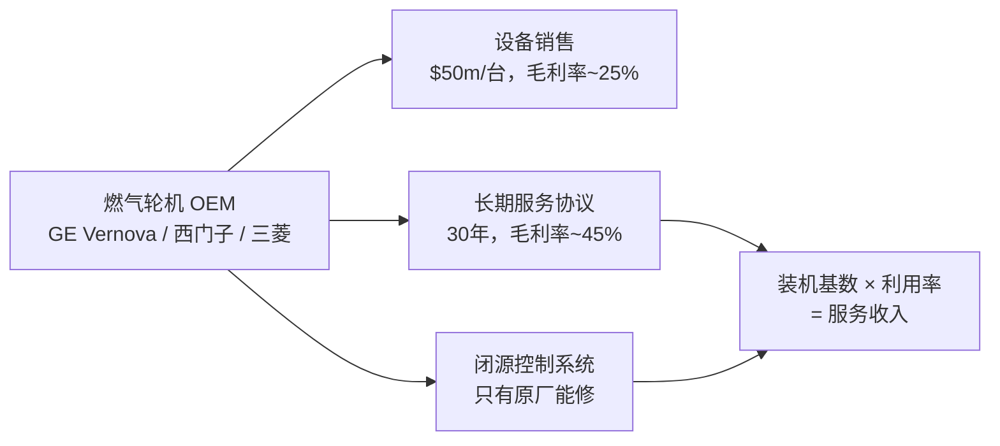

# Mechanism Map

Explain industry mechanisms, engineering principles, equipment chains, and process flows — then map them to research implications.

## Research Runtime Capsule

- Hook-enforced legality, source boundary, structure floor, and table rendering rules live in workspace hooks and are not restated here.
- Shared runtime/source baseline lives in `skills/_shared/research-policy-baseline.md` and the installed workspace `CLAUDE.md`.
- Use this skill for mechanism decomposition, value-capture mapping, and driver-map bridging; unresolved facts stay as gap, hypothesis, or follow-up.

把行业机制、工程原理、设备链条和关键术语翻译成投研含义。**核心价值不是写科普**，而是防止研究员和 AI 在没搞懂"东西怎么运作"的情况下直接跳到 driver、model、thesis 或 peer compare。

如果输出只是百科解释，或者讲完以后不能说明它会改变什么研究判断，本 skill 就失败了。

## 心法

研究工业、能源、航天、先进制造的公司，真正卡住你的不是"没听过这个词"——而是你不知道这玩意怎么赚钱。

举个例子：燃气轮机。卖一台设备是 $50m 的一次性收入，但后面 30 年的 service agreement 才是真正的钱——零部件、检修、性能升级，利润率是设备的 2-3 倍。更关键的是 controls 系统是闭源的，只有原厂能修。所以你看 GE Vernova 的财报，equipment 和 services 是两个完全不同的 economics。

`mechanism-map` 就是帮你把这种链条画出来、讲清楚、标出钱卡在谁手里。它是 `driver-map` 的上游——先搞懂"东西怎么运作、谁赚钱"，再去拆"这些收入怎么进模型"。不要在 mechanism-map 里做 DCF、comps 或 thesis。

## 触发场景

- "这个行业术语到底是什么意思"
- "这个设备链条是怎么连接的 / 为什么这样设计"
- "这个工艺流程怎么运作"
- "瓶颈 / control point 在哪里"
- "这个机制对哪些公司有价值"
- "这个工程约束会怎么影响 revenue driver"
- "这个 know-how gap 会不会影响 thesis"
- "这个机制能不能解释 peer 估值差"
- "这个业务 bucket 背后的机制是什么，为什么这么拆"
- "先讲清楚这个机制，再告诉我哪些公司类型可能受益"

**不应触发**：
- 公司收入 driver → `driver-map`
- 搭 model / DCF / comps → `3-statement-model / dcf-model / comps-analysis / model-update`
- 验证某公司是否进客户供应链 → `information-impact`
- 下一步怎么研究 → `next-step`
- 写 long / short thesis → `alpha-thesis`

## 输入澄清要求

| 维度 | 含义 | 默认假设 |
|---|---|---|
| **对象** | 术语 / 设备 / 工艺 / 系统 / value chain | 用户给具体名词时按单一机制；给主题时先缩到最关键机制 |
| **研究目的** | 理解机制 / feed driver-map / feed model / feed thesis / peer compare | 默认服务后续 driver-map 和 thesis |
| **技术深度** | 直觉解释 / 工程链条 / 商业约束 | 默认用研究员能建模和问问题的深度，不写教材 |
| **行业范围** | 用户指定的行业 / 设备链 / 工艺链 | 按用户覆盖行业，不扩展到无关行业 |
| **source 要求** | 是否需要 web/source-backed deep dive | 默认关键事实和数字必须 source；纯机制解释可标 `[需查证]` |

如果用户只给一个很泛的主题，先把机制范围缩成 1-2 个最可能有投研价值的系统链条，不要展开成行业百科。

## 输出结构（严格按这个走）

每一节都有篇幅上限。不到位可以更短，**绝不允许超长**。

```markdown
## Mechanism Map: [机制名]

**结论先行**
[一句话说明这个机制最重要的投研含义]

## 1. Mechanism in One Sentence

[这个机制是什么 + 在系统里做什么 + 影响哪个投研变量]

## 2. 关键术语

| Term / part | Plain meaning | Boundary / not this | Why it matters | Ev |
|---|---|---|---|---|
| [term] | [一句话解释] | [容易混淆对象] | [投研意义] | [S1](url) 或 GAP |

> 5-8 个术语。不是词典——是聊天时怎么讲。

## 3. 怎么运作

[插入 Mermaid flowchart — 4-6 节点，标注设备链/工艺流程主干。用真实设备和公司名，不要写"上游→制造→下游"这类空壳。示例结构见下方。]

[3-6 步解释，每步 1-2 句大白话。不要写教材，像跟同事解释一样。]

#### 长这样

|  |
|---|
| *<设备/工艺名> — <功能（≤15字）>* |

> ① 公司官网 Media Kit → ② web search "<设备关键词> product photo" → ③ 找不到用行业代表性设备图 → ④ 实在没有标 [缺图]。下载到 `_cache/images/<slug>-<equipment>.png`。

## 4. 瓶颈 & Control Point

系统里哪里最卡脖子？只填有实际约束的维度，没约束的跳过。

| 维度 | 判断 | 为什么重要（举例） | Ev |
|---|---|---|---|
| 产能/吞吐量 | [判断] | [比如：GT 产能只有 GE Vernova、西门子、三菱三家，全球年产能 ~50 台/年] | [S1](url) |
| 可靠性/开工率 | [判断] | [比如：停机一天损失 $2m 电费，客户愿付溢价买可靠性] | [...] |
| 效率 | [判断] | [比如：燃机效率差 1pp = 30 年燃料成本差 $50m+] | [...] |
| 资本开支强度 | [判断] | [比如：新建一条 turbine 产线 $3bn+，但维护只需要一台服务车] | [...] |
| 服务/维护粘性 | [判断] | [比如：controls 闭源，第三方修不了 → 原厂服务垄断] | [...] |
| 监管/安全壁垒 | [判断] | [比如：核电需要 NRC 许可，新进入者 ~10 年周期] | [...] |

**Takeaway**: [不是复述表格；写哪个 bottleneck 对投资判断最重要]

## 5. Value Capture — 钱被谁赚了

| 谁赚钱 | 怎么收钱 | 利润率特征 | 证据质量 | 投研含义 |
|---|---|---|---|---|
| [设备商/服务商/系统集成商/零部件商] | [一次性设备/长期服务合同/耗材/软件订阅/EPC 项目] | [比如：设备毛利率 25%、服务毛利率 45%] | High / Medium / Low | [这个环节被市场低估/高估了吗？] |

## 6. Mechanism → Driver Bridge

| Mechanism implication | Driver-map link | Model / thesis implication | Confidence |
|---|---|---|---|
| [机制含义] | [revenue / margin / backlog / price-volume-mix] | [后续怎么研究] | High / Medium / Low |

Rating hard standards:

| Rating | Hard standard |
|---|---|
| **High** | 有一手或权威 source 支持机制、商业关系和关键数据，且可直接映射到 driver |
| **Medium** | 机制和商业关系合理，但公司层面披露不完整，需要 peer / industry proxy |
| **Low** | 主要是研究员推断或主题关联，必须标 [来源待补] / [需查证] |

## 7. Driver-Map Handoff

机制解释完后，必须明确交给 driver-map 验证什么。不要只说"这个机制可能影响收入"；要指出收入或 margin 假设需要哪类披露、proxy 或后续验证。

| Mechanism conclusion | Possible revenue/margin driver | What driver-map must verify | Evidence status |
|---|---|---|---|
| [机制结论] | [可能进入的 revenue / margin / backlog driver] | [下一步必须验证的公司披露 / KPI / proxy] | disclosed / implied / proxy / unknown |

## 8. What NOT to Infer

列出不能从该机制外推的东西：

- [不能外推的结论]

尤其区分：
- product can be used vs customer adopted
- equipment exposure vs recurring service exposure
- industry bottleneck vs company-specific revenue driver
- technical importance vs pricing power

## 9. 下一步 3 个具体问题

1. [具体到某个 KPI / source / 公司披露能回答]
2. [具体到某个 driver-map 变量需要验证]
3. [具体到某个 peer 或 cross-check 能验证]
```

> Mermaid 示例——燃气轮机设备+服务链条（放在 fence 外做参考，agent 输出时用真实行业替换）：



## Artifact / 保存策略

默认输出到对话。同时写入当前日期化保存路径：

```text
topics/[topic-namespace]/[topic-slug]/[YYYY-MM-DD]-mechanism-map-<qualifier>.md
```

本 skill 的 `artifact_policy.naming_mode = required_qualifier`。保存时默认应由 `new-session` 解析成带 qualifier 的文件名，例如围绕具体机制点、设备链条、工艺步骤或 value-capture 问题命名，而不是 `mechanism-map-2/-3`。

如果当前没有 dated result path，先 handoff 到 `new-session` 创建 / 解析路径，不要自行创建一堆目录。

## Workflow 联动

| 场景 | 下一步 |
|---|---|
| 机制已经讲清，需要拆收入 / margin / backlog driver | `driver-map` |
| 机制影响 operating model、DCF、comps 或 workbook update | `3-statement-model / dcf-model / comps-analysis / model-update` |
| 机制暴露高价值疑点但还不知道怎么问 | `next-step` |
| 机制解释了 peer 差异或 KPI 不可比 | `peer-deep-dive` |
| 两家公司是否受同一机制驱动 | `pair-trade` |
| 技术 / 客户 / 供应链 claim 需要先验真 | `information-impact` |
| 已经研究清楚，值得沉淀 | `research-journal` |
| 机制形成 long / short variant view | `alpha-thesis` |

## 反模式自查

### Source 类
- ❌ 产能、成本、效率、订单、价格、客户、装机量或项目时间表没有 source / as-of。
- ❌ 用社媒、论坛、聊天截图或卖方转述证明客户采用。
- ❌ 把行业常识写成公司披露事实。
- ❌ 多个 source 对工艺、设备或项目口径冲突但不标冲突。

### Logic 类
- ❌ 只写百科解释，没有 value capture 或 research read-through。
- ❌ 把 `product can be used` 写成 `customer adopted`。
- ❌ 把技术重要性直接外推成 pricing power。
- ❌ 没画 Mermaid 流程图 / 链条图，导致系统关系不清。
- ❌ 解释了设备功能，但没说瓶颈、control point 或 service intensity。
- ❌ 解释完机制，但没有指出 `driver-map` 下一步必须验证什么。
- ❌ 遇到 BKR IET、LNG Train、燃机-压缩机这类机制型问题，却直接跳到 driver 或 thesis。

### Workflow 类
- ❌ 用户只是问机制，却输出 DCF / comps / price target。
- ❌ 机制已经解释清楚，却没有 handoff 到 `driver-map` 或 modeling skills。
- ❌ 机制仍是 Low confidence，却被后续 thesis 当作核心事实。
- ❌ 形成清楚认知后没有建议 `research-journal` 沉淀。

## 篇幅基准

- 标准 mechanism-map：1000-1500 字 + 1-2 张 Mermaid 图 + 3-5 张表。
- 低于 800 字通常机制没拆透或漏了 value capture / driver bridge；超过 1500 字说明塞了多个机制，应拆成独立 artifact。

## 与相邻 skill 的边界

| Skill | 边界 |
|---|---|
| `driver-map` | 处理 Business Reality → Model Driver；本 skill 处理机制、设备链条、术语和 know-how。 |
| `industry-quickread` | 做行业 triage、regime 判断、anchor names；本 skill 深挖单个机制或设备链。 |
| `3-statement-model / dcf-model / comps-analysis / model-update` | 做 operating model、DCF、comps、reverse DCF；本 skill 只提供机制到模型变量的桥。 |
| `information-impact` | 验证 claim 真假；本 skill 解释 claim 若成立会如何进入技术链条或商业机制。 |
| `next-step` | 提出下一步研究问题；本 skill 可以给具体问题，但不生成完整研究任务清单。 |
| `peer-deep-dive` | 横向比较多家公司；本 skill 只解释机制层面的 peer 差异来源。 |
| `research-journal` | 沉淀已研究清楚的机制认知。 |
