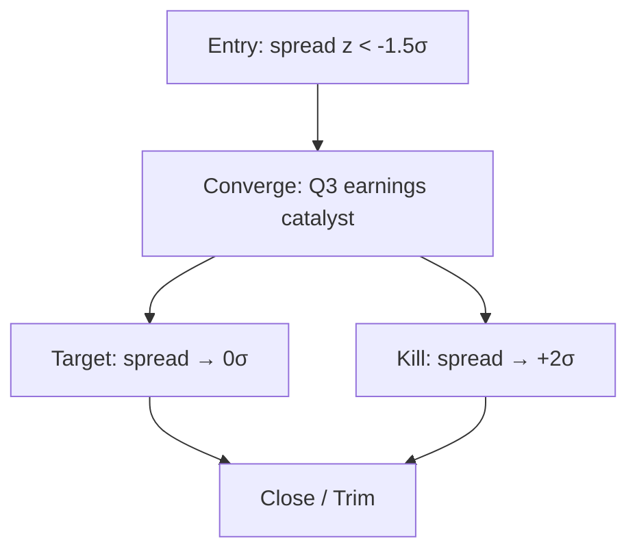

# Pair Trade

Evaluate a long short pair trade hedge candidate spread logic and key risks.

> This is the English translation of [SKILL.md](./SKILL.md). The Chinese version is the source of truth.

## Research Runtime Capsule

**MUST read the following files before executing this skill:**
- workspace `.references/runtime/research-runtime.en.md` §1 (Data Pipeline) §2 (Source Verification) §2.1 (Material Collection) §2.2 (Source Discipline) §2.5 (Image Download) §4 (Output Contract) §5 (Save Contract)

**Auto Hook Defense:** `pre_write_gate` (source/tables/mermaid/image) `source_contract` `table_render_integrity` `mermaid_syntax` `skill_structure_contract` `evidence_ledger_floor`

## Core Principles

The real value of a pair trade is not "looking at both sides" — it is **using structure to isolate common macro risk and concentrate P/L on idiosyncratic alpha**.

The key questions to judge whether a pair is a true pair:
- **If both legs drop 20% together, your P/L should be near 0** (hedged away) — that is a pair.
- If both legs drop together and P/L also drops a lot → it is actually a directional bet + decorative short.

Three iron rules:

1. **The Long leg thesis and Short leg thesis must each independently be sound**. Relative arguments only ("X is better than Y") are not allowed. If only relative arguments exist, a macro shock can easily kill both.
2. **Spread convergence / divergence must have a specific mechanism**. Not "the market will eventually realize," but specific events, quarters, data points.
3. **P/L must primarily come from idiosyncratic factor differences, not common macro**. If historically 90% of P/L comes from common factors, you are not doing a pair.

If all three rules are satisfied, proceed. Otherwise, either swap the pair or just do a single-name trade.

---

## Mode A: Builder (Build a new pair)

### A.1 Triggers

- "What do you think about Long X / Short Y"
- "Can these two be paired"
- "Help me set up a pair trade"
- "What should I hedge X with"
- "Find a hedge candidate for company X"
- "I like a company but worry about macro, how to pair"

### A.2 Output Method

Default: save to the current dated-result-path as `pair-note.md`, while also presenting core conclusions in the conversation.

This skill's `artifact_policy.naming_mode = plain`. Default: continue using `YYYY-MM-DD-<artifact>.md`; `pair-note.md` is the complete pair deliverable — do not use qualifiers as default names.

If there is no clear dated result path:
- The agent auto-creates the directory per policy baseline §11, e.g. `industry/<industry>/companies/<ticker>/[YYYY-MM-DD]-pair-note.md`.
- Confirm topic / slug with the user before saving.
- Do not fall back to v2's `pairs/[LONG]-[SHORT]/spread-log.md`.

Saved content may include an optional tracking snapshot, but it is only a research record template, not a trading-status interface.

### A.3 Pair Snapshot (default save template)

By default, place a snapshot at the top of `pair-note.md` for future post-mortem review. Do not treat it as a state database that must be maintained.

```yaml
schema_version: 1
document_type: pair_note
pair_id: "[LONG]-[SHORT]"
long_ticker: "[X]"
short_ticker: "[Y]"
long_market: NYSE / HKEX / SSE etc.
short_market: NYSE / HKEX / SSE etc.
created_at: YYYY-MM-DD
direction: spread_converge / spread_diverge
conviction: 1-5
time_horizon: 6M / 12M / 18M
entry_spread: "[z-score / percentile / valuation spread, source + as-of]"
target_spread: "[target level]"
kill_spread: "[invalidating spread level]"
sizing_method: dollar_neutral / beta_neutral / vol_neutral
long_weight: 1.0
short_weight: -1.0
benchmark: SPX / sector_etf
status: research / monitor / broken / closed
updated_at: YYYY-MM-DD
next_catalyst: "YYYY-MM-DD - [event description]"
```

### A.4 Builder Required Sections

#### 1. Pair One-Liner (one sentence + overview table)

One sentence: long X / short Y, core convergence thesis, target spread / time window.

Example: "Long ASML / Short AMAT, spread convergence thesis: ASML EUV monopoly margin continuing to expand vs AMAT 60% revenue exposure to memory cycle downturn; target spread regression from -2σ to 0σ within 12 months."

Followed by a setup table:

| | Long | Short |
|---|---|---|
| Ticker | ASML.NA | AMAT |
| Business positioning | EUV/DUV monopoly | Diversified WFE |
| Current valuation (NTM EV/EBITDA) | 22x | 18x |
| 5Y valuation mean | 18x | 16x |
| Beta to semiconductor equipment ETF | 1.05 | 1.10 |
| Liquidity (avg daily volume) | $2B | $1.5B |
| Borrow rate (annual) | n/a | 0.5% |
| Ev | [S1](./_cache/sources/long-leg-thesis.md) | [S2](./_cache/sources/short-leg-thesis.md) |


[Insert Mermaid flowchart — pair spread logic: entry spread → converge mechanism → target/exit/kill. Example below.]

#### 2. Why Are These Two Comparable

**Key judgment**: Correlation must be high enough (same industry / overlapping customers / similar macro exposure), otherwise the spread is not comparable. But they cannot be 100% homogeneous (otherwise no differentiation) — structural divergence points are needed.

Compare by dimension; each line must give specific % or facts. Empty statements like "both are in semiconductor equipment" are not allowed:

| Dimension | Long X | Short Y | Ev |
|---|---|---|---|
| End-market overlap | 45% logic / 35% memory / 20% packaging | 30% logic / 60% memory / 10% packaging | [S1](./_cache/sources/peer-overlap-map.md) |

| Customer overlap (top 10) | TSMC / Samsung / Intel / SK Hynix | TSMC / Samsung / Intel / Micron | [S1](./_cache/sources/investor-day-deck.md) |
| Product substitution | EUV irreplaceable | DUV / etch / deposition — different substitutability | [S2](./_cache/sources/industry-substitution-note.md) |
| Common macro exposure | Semiconductor capex cycle, tech export controls, interest rates | Same as left | [I1](https://example.com/industry-capex-tracker) |
| Idiosyncratic differences | EUV pricing power, monopoly | High memory cycle exposure, etch share | [S3](./_cache/sources/industry-share-data.md) |

**Bottom-line judgment**: End-market overlap ≥ 60% + customer overlap ≥ 50% + common macro factors ≥ 2 → considered correlated. Otherwise not a true pair.

#### 3. Valuation Spread History

### Spread & Correlation Formulas

| # | Calculation | Formula | Input Source |
|---|---|---|---|
| 1 | Z-Score | (current spread - mean) ÷ std dev | MKT — must state lookback window |
| 2 | Spread Percentile | rank(current spread) ÷ N | MKT |
| 3 | Beta | Cov(stock, index) ÷ Var(index) | MKT — must state reference index + lookback window |
| 4 | Ratio Spread | ln(Price_Long ÷ Price_Short) | MKT |

Must have specific percentile / sigma. Vague statements like "spread deviates from history" are not allowed.

| Metric | Long X current | Short Y current | Spread current | 5Y mean | 5Y std | Current z-score | Ev |
|---|---|---|---|---|---|---|---|
| EV/EBITDA NTM | 22x | 18x | +4x | +2x | 1.5x | +1.3σ | [S1](https://example.com/pair-valuation) |

| P/E NTM | 30x | 24x | +6x | +3x | 2x | +1.5σ | [I7](https://example.com/ntm-pe-comps) |
| EV/Sales | 9x | 5x | +4x | +2x | 1x | +2.0σ | [I8](https://example.com/ev-sales-comps) |
| FCF yield | 3.5% | 5.0% | -1.5% | -0.5% | 0.8% | -1.25σ | [I9](https://example.com/fcf-yield-pair) |

Spread convergence thesis strength judgment:
- z-score > +1.5σ or < -1.5σ: spread is significantly deviated; mean-reversion thesis has a foundation.
- z-score within ±0.5σ: spread near mean; entry is not attractive; wait for a better point.
- z-score > +3σ or < -3σ: extreme deviation; be cautious of regime change; spread may not revert.

#### 4. Beta / Correlation / Macro Sensitivity

| Metric | Value | Interpretation | Ev |
|---|---|---|---|
| 180D return correlation (X vs Y) | 0.85 | High correlation is a necessary condition for a pair; < 0.7 is a warning sign, may not be a true pair | [S1](https://example.com/pair-correlation) |

| 180D beta (X vs Y) | 1.05 | Used for sizing: dollar-neutral or beta-neutral | [I2](https://example.com/beta-series) |
| Common macro factor | Semiconductor equipment ETF beta, USD/JPY, 10Y yield | List the most significant common factors; these cannot be hedged | [I10](https://example.com/macro-factor-pack) |
| Unique idiosyncratic factor | X: EUV bookings; Y: DRAM capex / etch share | This is the pair alpha source | [S11](./_cache/sources/idiosyncratic-factor-note.md) |
| Historical max drawdown of pair | -8% | Pairs are not risk-free | [self-computed historical pnl / source] |

**Key judgment**: Pair historical P/L attribution should primarily come from idiosyncratic factors, not common macro. A rough test: on historical macro shock days, was pair P/L isolated? If pair P/L also dropped sharply on macro shock days, the structure did not hedge properly.

#### 5. Pair Thesis (core section — must be independently sound)

**This is the soul of a pair trade: must be written as two independent theses + one Spread converge mechanism**. Writing only "X is better than Y" is not allowed.

##### 5.1 Long leg thesis (why X should outperform)

Use the simplified `alpha-thesis` logic:
- **Variant view vs long consensus**: On what specific numbers are you more bullish than those who are already long X.
- **Why this gap exists**: Why this view is not yet priced in.
- **Catalyst**: Specific event / timing that will make the market recognize it.
- **Key assumptions**: 1-3 core assumptions the thesis depends on, each with a source.

Example (Long ASML):
> Variant view: 2026 EUV bookings $20B+ (consensus $17B), driven by High-NA EUV unit price +20% upgrade cycle [I3](https://example.com/asml-investor-day) + lithography domestic-substitution failure leaving incremental demand [S4](./_cache/sources/lithography-substitution-note.md). Catalyst: Q3 earnings EUV bookings data + 2027 capacity guidance. Key assumptions: (1) High-NA customer willingness to pay [S5](./_cache/sources/high-na-demand-check.md); (2) Intel / TSMC advanced-node capex not slowing [I4](https://example.com/foundry-capex); (3) Substitute mass production failure [S6](./_cache/sources/substitution-failure-check.md).

##### 5.2 Short leg thesis (why Y should underperform)

Similarly use the simplified `alpha-thesis` logic:
- **Variant view vs short consensus**: On what specific numbers are you more bearish than those who are already short Y.
- **Why this gap exists**
- **Catalyst (downside)**
- **Key assumptions**

Example (Short AMAT):
> Variant view: 2026 revenue -8% (consensus -3%), core driver being memory customer capex cut deeper than sell-side models [I5](https://example.com/samsung-capex-guidance) + etch share already peaked [S7](./_cache/sources/lam-cross-check.md). Catalyst: Q4 earnings if memory revenue YoY < -20%. Key assumptions: (1) Memory price recovery does not drive capex [S8](./_cache/sources/memory-capex-check.md); (2) etch share gains cannot offset memory weakness [S9](./_cache/sources/etch-share-check.md); (3) service revenue growth decelerating [S10](./_cache/sources/service-revenue-check.md).

##### 5.3 Spread converge mechanism

**Key: What specific events / data points will make the spread converge?** Do not write "the market will eventually realize." Be specific to events, quarters, data points.

Example:
> After Q3 earnings: if ASML EUV bookings > $5B and simultaneously AMAT memory revenue -25% YoY, spread should converge 8-12%. Basis is historical spread vs sub-segment performance regression: each 1% memory revenue spread corresponds to roughly 1.5x EV/EBITDA spread [I6](https://example.com/spread-regression).

#### 6. Entry Trigger Conditions

Specific entry triggers required. "Build the position now" is not allowed:

- **Current spread position**: z-score or percentile (from §3).
- **Required entry spread level**: typically z < -1σ or percentile < 20%.
- **Entry pacing**: single entry vs averaging in. Recommended default: three tranches — 1/3 immediately + 1/3 one week later + 1/3 before earnings.
- **Timing preference**: pre-earnings, post-earnings, during earnings season; explain why.
- **Liquidity requirements**: single order < 5% of avg daily volume; bid-ask spread < 5bps; total trade size < single-stock 10D ADV.
- **Borrow check**: short leg borrow availability + rate; < 100bps annualized is generally acceptable.

#### 7. Exit Trigger Conditions

At least 4 types of exit triggers, all must be concrete:

| Exit type | Specific trigger | Research action |
|---|---|---|
| **Thesis played out** | Spread converged to target_spread | Research recommendation to close / trim; final decision left to user |
| **Thesis invalidated (Long leg)** | Long leg thesis breached on specific number, e.g. EUV bookings < $3B | Close / re-underwrite |
| **Thesis invalidated (Short leg)** | Short leg thesis breached, e.g. memory revenue YoY turns positive | Close / re-underwrite |
| **Stop-loss spread** | Spread hits kill_spread in the opposite direction | Close / diagnose failure |
| **Single-name event** | Either leg: acquisition / restructuring / CEO departure / major regulatory action | Immediately re-assess whether the pair still holds |
| **Time decay** | Held > time_horizon with no convergence signal | Review, decide to continue / unwind pair |
| **Borrow recall** | Short leg borrow recalled or rate > 5% annualized | Mandatory re-assessment; cost may erode returns |

#### 8. Risks / Pair Failure Modes (Pre-mortem)

Explicitly list classic pair failure modes + mitigations:

| Failure mode | Historical case / analogy | Probability | Mitigation |
|---|---|---|---|
| **Macro shock double-kill** | Systemic risk-off, long/short both -20% | 10-15% in 12M | Position sizing not exceeding 5% of portfolio |
| **Industry re-rating** | Entire industry -40%, spread widens instead | 15-20% | Beta-neutral sizing; prepare to unwind pair in tranches |
| **Single-name company event** | Long acquired at low valuation causing spread to blow out | 5-10% per leg | Single-name event trigger → immediate re-assessment |
| **Correlation breakdown** | Company repositions from original industry to new theme | 10-20% over 12M | Quarterly correlation re-test |
| **Borrow availability shock** | Short leg borrow tight / recalled | low for large-cap, higher for small-cap | Only short sufficiently liquid names; monitor borrow rate |
| **Carry cost accumulation** | Borrow + funding eats 12M expected return | Cumulative effect | Calculate net expected return after carry at entry |

Each line must give a probability estimate + concrete mitigation. Mark `[需查证]` when probability is uncertain; do not feign precision.

### A.5 Sizing in Detail

Pair sizing is not just "equal numbers on both sides." Three sizing methods:

#### Dollar-neutral
- Long $X = Short $Y
- Pros: simple, most direct liquidity constraint.
- Cons: does not hedge beta differences; if long beta 1.0 / short beta 1.5, a 10% market drop causes ~5% pair loss.

#### Beta-neutral (recommended default)
- Long weight 1.0 / Short weight = beta(L) / beta(S)
- Pros: hedges common macro factors.
- Cons: requires periodic rebalancing; if short weight > 1.0, liquidity / borrow cost rises.

#### Vol-neutral
- Weight inversely by volatility (more volatile leg gets less allocation).
- Suitable for pairs with significant vol differences, e.g. small-cap vs large-cap.

**Pair total sizing principle**: Single pair not exceeding 5% of portfolio gross; new pair default starts at 2-3% averaging in.


### A.6 Tracking Table (default research record)

Record a tracking snapshot in `pair-note.md`. It is not an auto-maintained status log; subsequent Monitor depends on this baseline, otherwise **No baseline, no monitor**.

| Field | Value |
|---|---|
| date / as_of | YYYY-MM-DD HH:MM TZ |
| note | ENTRY / REVIEW / CLOSE STUDY |
| long_price | [source + as-of] |
| short_price | [source + as-of] |
| long_weight | 1.0 |
| short_weight | -1.05 |
| spread_value | [definition] |
| spread_zscore | [window + source] |
| beta_180d | [I11](https://example.com/beta-series) |
| correlation_180d | [I12](https://example.com/correlation-series) |
| pnl_since_entry_pct | [if applicable] |
| borrow_rate_annual | [source + as-of] |
| thesis_health | active / watch / impaired / broken |
| research_action | monitor / re-underwrite / close study / convert to single-name |

> Mermaid spread logic diagram example (placed here as reference; agent replaces the §1 placeholder during output):

> Mermaid spread logic diagram example (placed here as reference; agent replaces the §1 placeholder during output):



### A.7 Builder Output Length

1200-2000 words. Below 1200 words the thesis is likely not specific enough; above 2000 words it starts to bloat.

---

## Mode B: Monitor (Monitor an existing pair)

### B.1 Triggers

- "How is my X-Y pair doing now"
- "Is X-Y still valid"
- "Should I unwind the pair"
- "Review all my pairs"
- "How does this spread look now"

### B.2 Workflow

**No baseline, no monitor.** Mode B must read a prior pair note provided by the user, research-journal summary, historical output, or the original baseline from current conversation context. Without a baseline, monitoring cannot be performed.

Minimum baseline must include:
- long / short ticker
- entry date / as-of
- entry spread definition + entry value
- sizing method / weights
- original long thesis
- original short thesis
- target spread / kill spread
- time horizon
- key catalysts
- borrow / carry assumptions (if relevant)

Workflow:

1. First check whether the baseline is complete.
2. If the baseline is incomplete, do not output Spread status, P/L attribution, Thesis health, or Action recommendations; only output the `Missing Baseline Checklist`, suggesting the user first generate a baseline using Builder or complete `pair-note.md`.
3. If the baseline is complete, pull or request current spread data + as-of timestamp.
4. Output 4 sections: Spread Status, P/L Source Attribution, Thesis Health, Research Action.
5. Default: append / update this review to the current dated-result-path `pair-note.md`; if there is no clear dated result path, the agent auto-creates the directory per policy baseline §11.

#### Missing Baseline Checklist

```markdown
**No baseline, no monitor**

Cannot enter Monitor because the original pair baseline is missing. Please complete the following first:

- Long / short ticker:
- Entry date / as-of:
- Entry spread definition + entry value:
- Sizing method / weights:
- Original long thesis:
- Original short thesis:
- Target spread / kill spread:
- Time horizon:
- Key catalysts:
- Borrow / carry assumptions:

Recommendation: first use Mode A Builder to generate `pair-note.md`, then proceed to Monitor.
```

### B.3 Monitor Output Format

#### 1. Spread Status

| | Entry / Prior | Target | Kill | Current | Distance to Target | Distance to Kill |
|---|---|---|---|---|---|---|
| Spread (z-score) | -2.0σ | 0σ | +1σ | -1.2σ | 1.2σ to go | 2.2σ buffer |
| Pair P/L since entry | - | - | - | +6.5% | - | - |

**Trend**: Direction + velocity of spread movement over the last 5 / 20 trading days.

#### 2. P/L Source Attribution (core — distinguish alpha vs beta)

| Source | P/L Contribution | Interpretation |
|---|---|---|
| Long leg P/L (absolute) | +8% | Whether long thesis has played out |
| Short leg P/L (short perspective) | +3% (short down -3%) | Whether short thesis has played out |
| Spread converge | +5% | Whether spread converged as expected |
| Carry cost (borrow + funding) | -1.5% | Holding cost accumulation |
| Net Pair P/L | +6.5% | Dollar-neutral simplified sum |

**Key judgment**:
- If P/L primarily comes from one leg rather than spread convergence → the pair is effectively a single-name trade; should re-evaluate, possibly unwind pair and convert to single-name.
- Example: "Long +8%, Short +3% (profitable on the short side), but spread actually only converged 1% — P/L mostly from long leg fundamentals, not the pair convergence thesis."

#### 3. Thesis Health

Evaluate the long thesis and short thesis from §A.4.5 separately:

| | Status | Key Changes | Ev |
|---|---|---|---|
| Long thesis (§5.1 assumptions) | still valid / weakened / invalidated | List which assumption changed | [S1](./_cache/sources/long-leg-thesis.md) |

| Short thesis (§5.2 assumptions) | still valid / weakened / invalidated | Same as above | [S12](./_cache/sources/short-leg-thesis.md) |
| Macro / correlation regime | stable / shifting / broken | Whether common factors have changed | [I13](https://example.com/macro-regime-check) |

#### 4. Action Recommendations

`close / trim / add / monitor` are all research actions, not trading orders. Final trading decisions rest with the user.

| Scenario | Research action | Follow-up / sink |
|---|---|---|
| Spread reached target + both leg theses played out | **close study / trim study** | Recommend logging to `research-journal` |
| Spread near target but one leg thesis still valid | **trim study**, retain partial exposure as research recommendation | User decides whether to act |
| Spread moved opposite but not at kill + both theses still valid | **monitor / re-underwrite add case** | Trigger `next-step` |
| Spread hit kill / one leg thesis invalidated | **close study / re-underwrite** | Trigger `bear-pre-mortem` |
| Spread unchanged but carry cost > 30% of expected return | **review expected return after carry** | Update `pair-note.md` |
| Single-name event triggered on one leg | **close immediately as research recommendation** | Trigger `bear-pre-mortem` or `earnings-setup` |

### B.4 Monitor Output Length

400-700 words. Monitor is a periodic check tool, not deep analysis. When deeper digging is needed, trigger `next-step` or `bear-pre-mortem`.

---

## Artifact / Save Policy

Write to industry topic:
    industry/<industry>/companies/<ticker>/YYYY-MM-DD-<artifact>.md

Path unclear → agent auto-creates per policy baseline §11.

## Anti-Pattern Self-Check

After writing a Builder, must self-check:

**Long/Short thesis independence**
- ❌ Short leg thesis written as "X is better than Y" — no independent short thesis; it is a decorative short.
- ❌ Long leg thesis entirely = "better relative to short" → no absolute thesis.
- ❌ Pair thesis is "X valuation low, Y valuation high" — this is not a thesis, it is a spread observation.
- ❌ Spread converge mechanism is "the market will eventually realize" → hope is not a catalyst.

**Business comparability**
- ❌ "Both are in semiconductor equipment" → customer overlap / end-market overlap not quantified.
- ❌ Correlation < 0.7 yet still called a pair → not a true pair.
- ❌ Businesses are completely identical → no structural divergence point to generate spread.
- ❌ Two legs seem to share a theme but engineering mechanism / equipment chain differs → first use `mechanism-insight` to check whether value-capture shares the same source.
- ❌ Two legs' revenue / margin drivers not broken down clearly, only "same industry" → first use `driver-map` to check whether drivers share the same source or diverge.

**Spread quantification**
- ❌ "Valuation gap exists" → z-score / percentile not provided.
- ❌ Spread near mean (z < ±0.5σ) yet still recommended to build → entry not attractive.

## Length Benchmarks

- **Builder full thesis**: 1200-2000 words + 5 tables.
- **Monitor output**: 400-700 words.


