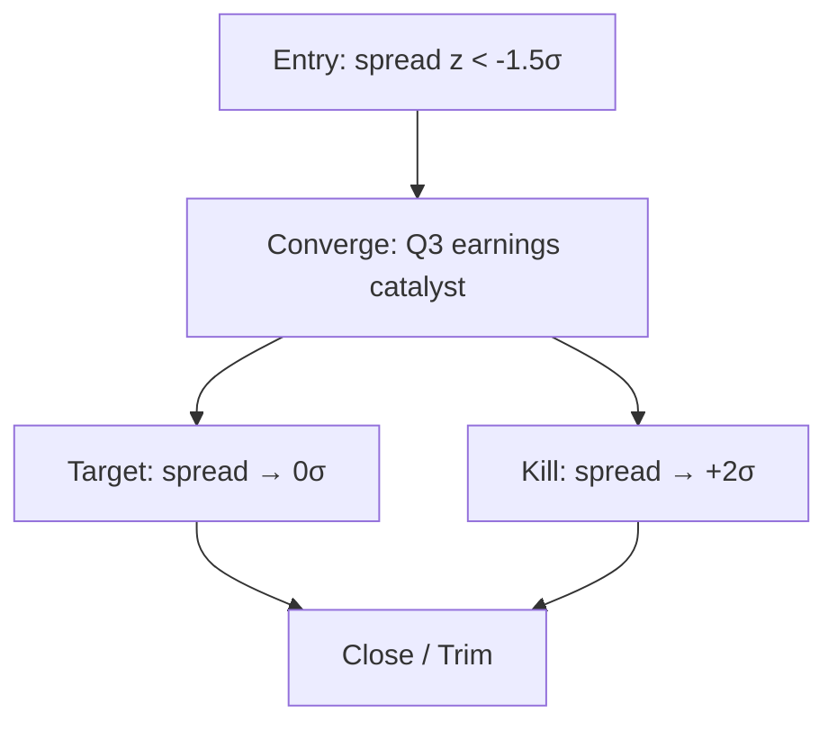

# Pair Trade

Evaluate a long short pair trade hedge candidate spread logic and key risks.

## Research Runtime Capsule

Follow `_shared/research-runtime.md` — 数据获取链、来源验证链、证据协议、产出合约、保存合约。
Hook-enforced: `pre_write_gate` (source/tables/mermaid), `source_contract`, `table_render_integrity`, `mermaid_syntax`, `skill_structure_contract`, `evidence_ledger_floor`.
→ 写入 _cache/financial-data/internal/actuals-resolved.json

## 心法

Pair trade 真正的价值不是"两边都看一下"，是**用结构隔离共同 macro 风险，把 P/L 集中到 idiosyncratic alpha**。

所以判断一个 pair 是不是真 pair 的关键问题：
- **如果两腿一起跌 20%，你的 P/L 应该接近 0**（被 hedge 掉）——这才是 pair。
- 如果两腿一起跌，P/L 也跌很多 → 实际是单边赌注 + 装饰性 short。

三条铁律：

1. **Long leg thesis 和 Short leg thesis 必须各自独立 sound**。不允许只有相对论点（"X 比 Y 好"）。如果只有相对论点，macro shock 时容易双杀。
2. **Spread 收敛 / 扩散必须有具体 mechanism**。不是"市场迟早会认识到"，而是具体到事件、季度、数据点。
3. **P/L 主要来自 idiosyncratic factor 差异，不是共同 macro**。如果历史 P/L 90% 来自共同 factor，你做的不是 pair。

如果以上三条都满足，再继续。否则要么换组合，要么干脆做单边 trade。

---

## Mode A: Builder（构建新 pair）

### A.1 触发

- "Long X / Short Y 怎么看"
- "这两个能不能 pair"
- "帮我搭一下 pair trade"
- "X 用什么对冲"
- "某公司找一个 hedge candidate"
- "我看好某公司但担心 macro，怎么 pair"

### A.2 输出方式

默认保存到当前日期化保存路径的 `pair-note.md`，同时在对话中给出核心结论。

本 skill 的 `artifact_policy.naming_mode = plain`。默认继续使用 `YYYY-MM-DD-<artifact>.md`；`pair-note.md` 是完整 pair deliverable，不把 qualifier 当默认命名。

如果当前没有明确 dated result path：
- agent 按 policy baseline §11 自动创建目录，例如 `industry/<industry>/companies/<ticker>/[YYYY-MM-DD]-pair-note.md`。
- 让用户确认 topic / slug 后再保存。
- 不要回退到 v2 的 `pairs/[LONG]-[SHORT]/spread-log.md`。

保存内容可以包含可选 tracking snapshot，但它只是研究记录模板，不是交易状态接口。

### A.3 Pair Snapshot（默认保存模板）

默认在 `pair-note.md` 顶部放一段 snapshot，便于以后复盘。不要把它当成必须维护的状态库。

```yaml
schema_version: 1
document_type: pair_note
pair_id: "[LONG]-[SHORT]"
long_ticker: "[X]"
short_ticker: "[Y]"
long_market: NYSE / HKEX / SSE etc.
short_market: NYSE / HKEX / SSE etc.
created_at: YYYY-MM-DD
direction: spread_converge / spread_diverge
conviction: 1-5
time_horizon: 6M / 12M / 18M
entry_spread: "[z-score / percentile / valuation spread, source + as-of]"
target_spread: "[target level]"
kill_spread: "[invalidating spread level]"
sizing_method: dollar_neutral / beta_neutral / vol_neutral
long_weight: 1.0
short_weight: -1.0
benchmark: SPX / sector_etf
status: research / monitor / broken / closed
updated_at: YYYY-MM-DD
next_catalyst: "YYYY-MM-DD - [event description]"
```

### A.4 Builder 必填章节

#### 1. Pair One-Liner（一句话 + table 概览）

一句话讲清楚：long X / short Y、收敛 thesis 核心、目标 spread / 时间窗口。

例："Long ASML / Short AMAT，spread 收敛 thesis：ASML EUV monopoly margin 持续扩张 vs AMAT 60% 收入暴露 memory 周期下行；目标 12 个月内 spread 从 -2σ 回归 0σ。"

紧跟一张 setup 表：

| | Long | Short |
|---|---|---|
| Logo |  |  |
| Ticker | ASML.NA | AMAT |
| 业务定位 | EUV/DUV monopoly | Diversified WFE |
| 当前估值（NTM EV/EBITDA） | 22x | 18x |
| 5Y 估值 mean | 18x | 16x |
| Beta to 半导体设备 ETF | 1.05 | 1.10 |
| 流动性（日均成交量） | $2B | $1.5B |
| Borrow rate (annual) | n/a | 0.5% |
| Ev | [S1](./_cache/sources/long-leg-thesis.md) | [S2](./_cache/sources/short-leg-thesis.md) |

> Logo 下载：读 `_scripts/download-image.py`，设 `{{SELECTOR}}` 为 `.logo img` 或公司首页 logo 选择器，调用当前 session 的 Playwright MCP `browser_run_code_unsafe`，下载到 `_cache/images/<ticker>-logo.<ext>`。`<ext>` 使用脚本返回的 `extension`。详见 `stock-quickread` SKILL.md §1。

[插入 Mermaid flowchart — pair spread 逻辑：entry spread → converge mechanism → target/exit/kill。示例见下方。]

#### 2. 为什么这两家可比（Why are these two correlated）

**关键判断**：相关性必须 high enough（同一行业 / 重叠客户 / 类似 macro 暴露），否则 spread 不可比。但不能 100% 同质化（否则没差异），需要有结构性差异点。

按维度对比，每条要给具体 % 或事实，不允许 "两家都做半导体设备"这种空话：

| 维度 | Long X | Short Y | Ev |
|---|---|---|---|
| 终端市场重叠 | 45% logic / 35% memory / 20% packaging | 30% logic / 60% memory / 10% packaging | [S1](./_cache/sources/peer-overlap-map.md) |

| 客户重叠（top 10） | TSMC / Samsung / Intel / SK Hynix | TSMC / Samsung / Intel / Micron | [S1](./_cache/sources/investor-day-deck.md) |
| 产品 substitution | EUV 不可替代 | DUV / etch / deposition 可替代性不同 | [S2](./_cache/sources/industry-substitution-note.md) |
| 共同 macro 暴露 | 半导体 capex cycle、科技出口管制、利率 | 同上 | [I1](https://example.com/industry-capex-tracker) |
| Idiosyncratic 差异 | EUV pricing power、monopoly | Memory cycle 高暴露、etch share | [S3](./_cache/sources/industry-share-data.md) |

**底线判断**：终端市场重叠 ≥ 60% + 客户重叠 ≥ 50% + 共同 macro 因子 ≥ 2 个 → 才算相关。否则不是真 pair。

#### 3. 估值 Spread 历史

### 价差与相关性公式

| # | 计算 | 公式 | 输入来源 |
|---|---|---|---|
| 1 | Z-Score | (当前价差 - 均值) ÷ 标准差 | MKT — 须标回溯窗口 |
| 2 | 价差百分位 | rank(当前价差) ÷ N | MKT |
| 3 | Beta | Cov(stock, index) ÷ Var(index) | MKT — 须标参照指数+回溯窗口 |
| 4 | 比率价差 | ln(Price_Long ÷ Price_Short) | MKT |

必须有具体 percentile / sigma，不允许 "spread 偏离历史"这种含糊判断。

| Metric | Long X 当前 | Short Y 当前 | Spread 当前 | 5Y mean | 5Y std | 当前 z-score | Ev |
|---|---|---|---|---|---|---|---|
| EV/EBITDA NTM | 22x | 18x | +4x | +2x | 1.5x | +1.3σ | [S1](https://example.com/pair-valuation) |

| P/E NTM | 30x | 24x | +6x | +3x | 2x | +1.5σ | [I7](https://example.com/ntm-pe-comps) |
| EV/Sales | 9x | 5x | +4x | +2x | 1x | +2.0σ | [I8](https://example.com/ev-sales-comps) |
| FCF yield | 3.5% | 5.0% | -1.5% | -0.5% | 0.8% | -1.25σ | [I9](https://example.com/fcf-yield-pair) |

Spread converge 论点的强度判断：
- z-score > +1.5σ 或 < -1.5σ：spread 显著偏离，mean-reversion 论点有基础。
- z-score 在 ±0.5σ 内：spread 在 mean 附近，entry 不 attractive，等更好时点。
- z-score > +3σ 或 < -3σ：极端偏离，要小心是不是 regime change，spread 可能不会回归。

#### 4. Beta / Correlation / 宏观敏感度

| Metric | 数值 | 解读 | Ev |
|---|---|---|---|
| 180D return correlation (X vs Y) | 0.85 | 高 correlation 是 pair 必要条件；< 0.7 警惕，可能不是真 pair | [S1](https://example.com/pair-correlation) |

| 180D beta (X vs Y) | 1.05 | 用于 sizing：dollar-neutral 还是 beta-neutral | [I2](https://example.com/beta-series) |
| 共同 macro factor | 半导体设备 ETF beta、USD/JPY、10Y 利率 | 列出最显著的共同因子；这些 hedge 不掉 | [I10](https://example.com/macro-factor-pack) |
| 独有 idiosyncratic factor | X: EUV bookings；Y: DRAM capex / etch share | 这才是 pair alpha source | [S11](./_cache/sources/idiosyncratic-factor-note.md) |
| 历史 max drawdown of pair | -8% | Pair 不是无风险 | [自算 historical pnl / source] |

**关键判断**：Pair 历史 P/L attribution 应主要来自 idiosyncratic，而非共同 macro。粗略测试：在历史 macro shock 日，pair P/L 是否被 isolation。如果 macro shock 日 pair P/L 也大跌，说明结构没 hedge 住。

#### 5. Pair 论点（核心节，必须独立 sound）

**这是 pair-trade 的灵魂：必须写成两个独立 thesis + 一个 Spread converge mechanism**，不允许只写 "X 比 Y 好"。

##### 5.1 Long leg thesis（why X should outperform）

按 `alpha-thesis` 简化逻辑：
- **Variant view vs long consensus**：你比看多 X 的人还要看多在什么具体数字上。
- **Why this gap exists**：为什么这个 view 还没被 priced in。
- **Catalyst**：让市场认识到的具体事件 / 时间。
- **关键假设**：thesis 依赖的 1-3 个核心假设，每个给 source。

例（Long ASML）：
> Variant view: 2026 EUV bookings $20B+（consensus $17B），来自高 NA EUV 单价 +20% upgrade 周期 [I3](https://example.com/asml-investor-day) + lithography 国产替代失败留出 incremental 需求 [S4](./_cache/sources/lithography-substitution-note.md)。Catalyst: Q3 财报 EUV bookings 数据 + 2027 capacity guidance。关键假设：(1) 高 NA 客户付费意愿 [S5](./_cache/sources/high-na-demand-check.md)；(2) Intel / TSMC 先进制程 capex 不放缓 [I4](https://example.com/foundry-capex)；(3) 替代品量产失败 [S6](./_cache/sources/substitution-failure-check.md)。

##### 5.2 Short leg thesis（why Y should underperform）

同样按 `alpha-thesis` 简化逻辑：
- **Variant view vs short consensus**：你比看空 Y 的人还要看空在什么具体数字上。
- **Why this gap exists**
- **Catalyst（下行）**
- **关键假设**

例（Short AMAT）：
> Variant view: 2026 收入 -8%（consensus -3%），核心是 memory 客户 capex cut 比 sell-side 模型多 [I5](https://example.com/samsung-capex-guidance) + etch share 已到顶 [S7](./_cache/sources/lam-cross-check.md)。Catalyst: Q4 财报若 memory 收入 YoY < -20%。关键假设：(1) Memory 价格回升不带动 capex [S8](./_cache/sources/memory-capex-check.md)；(2) etch share gain 不能 offset memory weakness [S9](./_cache/sources/etch-share-check.md)；(3) 服务收入增速放缓 [S10](./_cache/sources/service-revenue-check.md)。

##### 5.3 Spread converge mechanism

**关键：什么具体事件 / 数据点会让 spread 收敛？**不能写"市场迟早会认识到"。要具体到事件、季度、数据点。

例：
> Q3 财报后：ASML EUV bookings 若 > $5B，同时 AMAT memory 收入 -25% YoY，spread 应收敛 8-12%。依据是历史 spread vs sub-segment performance regression：每 1% memory revenue spread 对应约 1.5x EV/EBITDA spread [I6](https://example.com/spread-regression)。

#### 6. 入场触发条件

具体 entry trigger，不允许"现在就建仓"：

- **Spread 当前位置**：z-score 或 percentile（来自 §3）。
- **入场要求的 spread level**：典型 z < -1σ 或 percentile < 20%。
- **建仓节奏**：一次入场 vs 分批 averaging in。建议默认三批：1/3 立即 + 1/3 一周后 + 1/3 财报前。
- **Timing 偏好**：财报前、财报后、财报中；说明为什么。
- **流动性要求**：单笔订单 < 日均成交量 5%；bid-ask spread < 5bps；total trade size < 单股 10D ADV。
- **Borrow check**：short leg borrow availability + rate；< 100bps annualized 通常可接受。

#### 7. 退出触发条件

至少 4 类退出 trigger，必须全部具体化：

| 退出类型 | 具体 trigger | Research action |
|---|---|---|
| **Thesis played out** | Spread 收敛到 target_spread | Close / trim 的研究建议，交给用户最终决定 |
| **Thesis 失效（Long leg）** | Long leg 论点击穿具体数字，如 EUV bookings < $3B | Close / re-underwrite |
| **Thesis 失效（Short leg）** | Short leg 论点击穿，如 memory 收入 YoY 转正 | Close / re-underwrite |
| **Stop-loss spread** | Spread 反向到 kill_spread | Close / diagnose failure |
| **Single-name 事件** | 任一边被收购 / 重组 / CEO 离职 / 重大监管 | 立即重审 pair 是否还成立 |
| **Time decay** | 持有 > time_horizon 仍无 converge 信号 | Review，决定继续 / 解 pair |
| **Borrow recall** | Short leg borrow 被 recall 或 rate > 5% annualized | 强制重审，成本可能侵蚀回报 |

#### 8. 风险 / Pair 失效模式（Pre-mortem）

明确列出 pair 经典失败 mode + 应对：

| 失败 mode | 历史案例 / 类比 | 概率 | Mitigation |
|---|---|---|---|
| **Macro shock 双杀** | systemic risk-off，long/short 都 -20% | 10-15% in 12M | Position sizing 不超过 portfolio 5% |
| **行业 re-rating** | 行业整体 -40%，spread 反而扩大 | 15-20% | Beta-neutral sizing；准备分批解 pair |
| **单边公司事件** | Long 被低估值收购导致 spread 暴扩 | 5-10% per leg | 单股事件 trigger 立即重审 |
| **Correlation 失效** | 公司从原行业重新定位到新主题 | 10-20% over 12M | Quarterly correlation re-test |
| **Borrow availability shock** | short leg borrow 紧张 / 被 recall | large-cap 低，小票高 | 只做流动性足够的 short；监控 borrow rate |
| **Carry cost 累积** | borrow + funding 吞掉 12M 预期收益 | 累积 effect | 入场时计算 net expected return after carry |

每条都要给概率估计 + 具体 mitigation。概率不确定时标 `[需查证]`，不要假装精确。

### A.5 Sizing 详细考量

Pair sizing 不只是"两边数字相同"。三种 sizing method：

#### Dollar-neutral
- Long $X = Short $Y
- 优点：简单、流动性约束最直接。
- 缺点：未 hedge beta 差异；如果 long beta 1.0 / short beta 1.5，市场跌 10% 时 pair 损失约 5%。

#### Beta-neutral（推荐 default）
- Long weight 1.0 / Short weight = beta(L) / beta(S)
- 优点：hedge 共同 macro 因子。
- 缺点：需要定期 rebalance；short 权重 > 1.0 时流动性 / borrow 成本上升。

#### Vol-neutral
- 按 volatility 反向加权（vol 大的腿少配）。
- 适用于 vol 差异显著的 pair，例如 small-cap vs large-cap。

**Pair 总 sizing 原则**：单 pair 不超过 portfolio 5% gross，新建 pair 默认从 2-3% 开始 averaging in。

> 两腿 logo 下载到当前 topic 的 ——找不到标 [缺 logo]。

### A.6 Tracking Table（默认研究记录）

在 `pair-note.md` 里记录一条 tracking snapshot。它不是自动维护的状态日志；后续 Monitor 依赖这条 baseline，否则 **No baseline, no monitor**。

| Field | Value |
|---|---|
| date / as_of | YYYY-MM-DD HH:MM TZ |
| note | ENTRY / REVIEW / CLOSE STUDY |
| long_price | [source + as-of] |
| short_price | [source + as-of] |
| long_weight | 1.0 |
| short_weight | -1.05 |
| spread_value | [definition] |
| spread_zscore | [window + source] |
| beta_180d | [I11](https://example.com/beta-series) |
| correlation_180d | [I12](https://example.com/correlation-series) |
| pnl_since_entry_pct | [if applicable] |
| borrow_rate_annual | [source + as-of] |
| thesis_health | active / watch / impaired / broken |
| research_action | monitor / re-underwrite / close study / convert to single-name |

> Mermaid spread 逻辑图示例（放在这里做参考，agent 输出时替换 §1 的 placeholder）：

> Mermaid spread 逻辑图示例（放在这里做参考，agent 输出时替换 §1 的 placeholder）：



### A.7 Builder 输出篇幅

1200-2000 字。低于 1200 字大概率论点不够具体；超过 2000 字开始水。

---

## Mode B: Monitor（监控现有 pair）

### B.1 触发

- "我的 X-Y pair 现在怎么样"
- "X-Y 还成立吗"
- "pair 该解了吗"
- "review 一下所有 pair"
- "这个 spread 现在怎么看"

### B.2 工作流

**No baseline, no monitor.** Mode B 必须读取用户提供的 prior pair note、research-journal 摘要、历史输出或当前对话上下文中的原始 baseline。没有 baseline 就不能假装 monitor。

最低 baseline 必须包含：
- long / short ticker
- entry date / as-of
- entry spread definition + entry value
- sizing method / weights
- original long thesis
- original short thesis
- target spread / kill spread
- time horizon
- key catalysts
- borrow / carry assumptions（如 relevant）

工作流：

1. 先检查 baseline 是否完整。
2. 如果 baseline 不完整，不输出 Spread 状态、P/L attribution、Thesis health 或 Action 建议；只输出 `Missing Baseline Checklist`，建议先用 Builder 生成或补齐 `pair-note.md`。
3. 如果 baseline 完整，拉取或要求补充当前 spread 数据 + as-of 时间戳。
4. 输出 4 部分：Spread 状态、P/L 来源拆解、Thesis 健康度、Research action。
5. 默认把本次 review 追加 / 更新到当前日期化保存路径的 `pair-note.md`；如果当前没有明确 dated result path，agent 按 policy baseline §11 自动创建目录。

#### Missing Baseline Checklist

```markdown
**No baseline, no monitor**

当前不能进入 Monitor，因为缺少原始 pair baseline。请先补齐：

- Long / short ticker:
- Entry date / as-of:
- Entry spread definition + entry value:
- Sizing method / weights:
- Original long thesis:
- Original short thesis:
- Target spread / kill spread:
- Time horizon:
- Key catalysts:
- Borrow / carry assumptions:

建议：先用 Mode A Builder 生成 `pair-note.md`，再做后续 Monitor。
```

### B.3 Monitor 输出格式

#### 1. Spread 状态

| | Entry / Prior | Target | Kill | 当前 | 距 Target | 距 Kill |
|---|---|---|---|---|---|---|
| Spread (z-score) | -2.0σ | 0σ | +1σ | -1.2σ | 1.2σ to go | 2.2σ buffer |
| Pair P/L since entry | - | - | - | +6.5% | - | - |

**趋势**：最近 5 / 20 个交易日 spread 移动方向 + 速率。

#### 2. P/L 来源拆解（核心，区分 alpha vs beta）

| 来源 | P/L 贡献 | 解读 |
|---|---|---|
| Long leg P/L (absolute) | +8% | Long thesis 是否 played out |
| Short leg P/L（空头视角） | +3%（short 跌 -3%） | Short thesis 是否 played out |
| Spread converge | +5% | Spread 是否如预期收敛 |
| Carry cost (borrow + funding) | -1.5% | 持有成本累积 |
| Net Pair P/L | +6.5% | dollar-neutral 简化加总 |

**关键判断**：
- 如果 P/L 主要来自单边而非 spread converge → pair 实际是单边 trade，应重新评估，可能解 pair 转单边。
- 例："Long +8%，Short +3%（空头赚），但 spread 实际只收敛 1%——P/L 大部分来自 long leg fundamental，不是 pair converge thesis。"

#### 3. Thesis 健康度

按 §A.4.5 的 long thesis 和 short thesis 分别评估：

| | Status | 关键变化 | Ev |
|---|---|---|---|
| Long thesis (§5.1 假设) | still valid / weakened / invalidated | 列出哪条 assumption 变化 | [S1](./_cache/sources/long-leg-thesis.md) |

| Short thesis (§5.2 假设) | still valid / weakened / invalidated | 同上 | [S12](./_cache/sources/short-leg-thesis.md) |
| Macro / correlation regime | stable / shifting / broken | 共同因子是否变化 | [I13](https://example.com/macro-regime-check) |

#### 4. Action 建议

`close / trim / add / monitor` 都是 research action，不是交易指令。最终交易动作由用户决定。

| 情景 | Research action | Follow-up / sink |
|---|---|---|
| Spread 已到 target + 两边 thesis played out | **close study / trim study** | 建议沉淀到 `research-journal` |
| Spread 接近 target 但有一边 thesis 仍 valid | **trim study**，保留部分 exposure 的研究建议 | 用户决定是否行动 |
| Spread 反向但未触 kill + 两边 thesis 仍 valid | **monitor / re-underwrite add case** | 触发 `next-step` |
| Spread 反向到 kill / 一边 thesis invalidated | **close study / re-underwrite** | 触发 `bear-pre-mortem` |
| Spread 不动但 carry cost > 30% 预期收益 | **review expected return after carry** | 更新 `pair-note.md` |
| 单边 single-name 事件触发 | **close immediately as research recommendation** | 触发 `bear-pre-mortem` 或 `earnings-setup` |

### B.4 Monitor 输出篇幅

400-700 字。Monitor 是定期检查工具，不是 deep analysis。需要深挖时触发 `next-step` 或 `bear-pre-mortem`。

---

## Artifact / 保存策略

写入行业 topic：
    industry/<industry>/companies/<ticker>/YYYY-MM-DD-<artifact>.md

路径不明 → agent 按 policy baseline §11 自动创建。

## 反模式自查

写完 Builder 必须自检：

**Long/Short thesis 独立性**
- ❌ Short leg thesis 写成"X 比 Y 好"——没有独立 short thesis，是装饰性 short。
- ❌ Long leg thesis 全部论点 = "和 short 比相对好" → 没有 absolute thesis。
- ❌ Pair 论点是"X 估值低，Y 估值高"——这不是论点，是 spread observation。
- ❌ Spread converge mechanism 是"市场迟早会认识到" → hope 不是 catalyst。

**业务相关性**
- ❌ "两家都做半导体设备" → 没量化客户重叠 / 终端市场重叠。
- ❌ Correlation < 0.7 但仍叫 pair → 不是真 pair。
- ❌ 业务完全相同 → 没有结构性差异点产生 spread。
- ❌ 两腿看似同主题但工程机制 / 设备链条不同 → 先用 `mechanism-insight` 检查 value-capture 是否同源。
- ❌ 两腿 revenue / margin driver 没拆清楚，只说"同业" → 先用 `driver-map` 检查 driver 是否同源或分化。

**Spread 量化**
- ❌ "估值有差距" → 没给 z-score / percentile。
- ❌ Spread 在 mean 附近（z < ±0.5σ）仍建议建仓 → entry 不 attractive。

## 篇幅基准

- **Builder 完整 thesis**：1200-2000 字 + 5 张表。
- **Monitor 输出**：400-700 字。

## Appendix: Financial Data

python _scripts/financial-data/actuals-to-appendix.py --tickers <TICKER_1>,<TICKER_2>,...

将输出嵌入 artifact 的 `## Appendix: Financial Data` 节（位于 `## Resources` 之前）。**必须在写 artifact 正文之前执行**——禁止留占位符。
