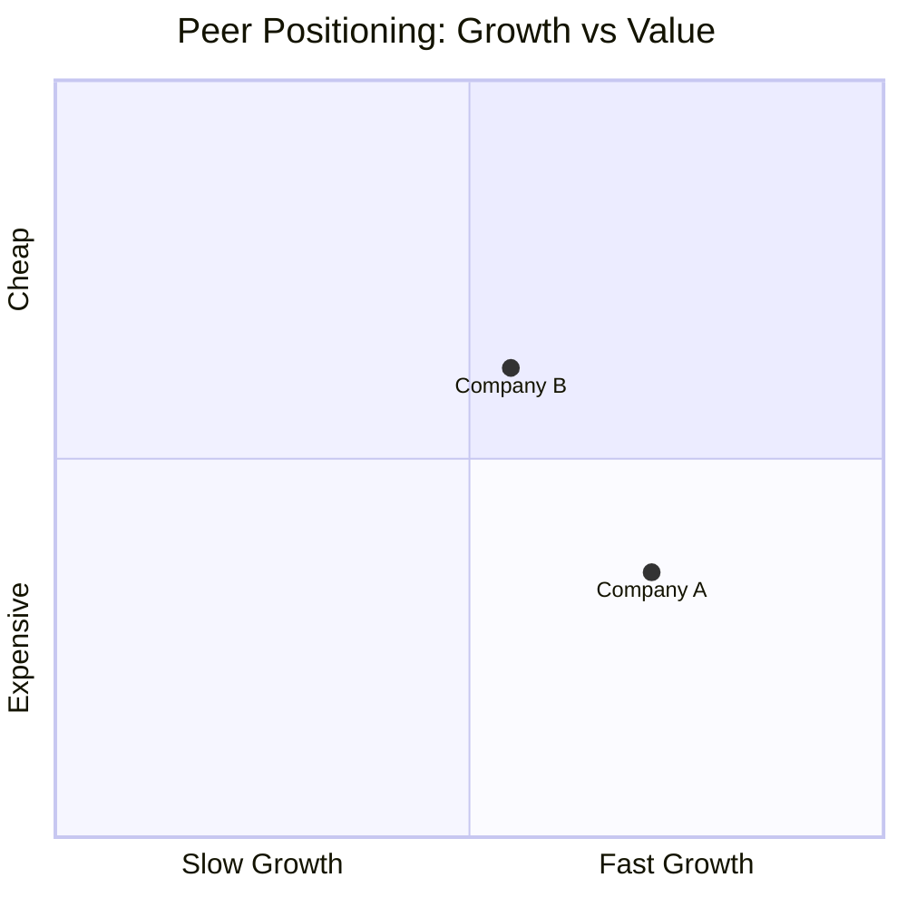

# Peer Deep Dive

Compare companies in one industry with sourced KPI matrices and research ranking.

## Research Runtime Capsule

- Hook-enforced rules (source boundary, structure floor, table render) live in workspace hooks.
- Shared runtime baseline: `skills/_shared/research-policy-baseline.md` + workspace `CLAUDE.md`.
- **数据管道**：调用 `/financial-data --lite <ticker>` 获取三表 + 市场快照（trust-based fill，Bridge → yfinance → WebSearch → Google Finance）。信任其结果，直接从 `actuals-resolved.json` 取数。
- Sub-agent outputs: evidence_cards_only; main agent synthesizes, deduplicates, scores, tiers, and ranks.

- Use this skill for analysis method, sequencing, and routing judgment; unresolved facts stay as gap, hypothesis, or follow-up.

## 心法

横向研究真正的价值，是**纵向研究做不到**的事：
- 抽出 N 家共享的行业坐标系，避免重复劳动
- 发现 N 家管理层 commentary 互相打脸的地方（矛盾 = alpha 起点）
- 看清估值 spread 和基本面 spread 是否匹配（错配 = 机会或陷阱）
- 排序：先研究谁、给多少深度、哪些适合配对看

如果做完只输出"以下是这几家公司的并排对比"，等于没做横向研究——你只是节约了打字时间。

**核心检验**：把"行业 lens"和"cross-cut insight"两节抽掉，剩下的内容是不是 N 份精简 quickread？如果是，重写。

## 输出结构

### §0 任务定义 & Preflight

研究员先明确：
- **公司列表**：3-8 家（超过 8 家先自由对话预筛，或按子行业 / business model 分子组）
- **研究目的**：建核心仓 / 找 hedge / 找 pair trade / 主题暴露 / 其他
- **时间预算**：用于 §7 排序的资源分配

横向比较之前先确认这些公司真的能放进同一张机制 / driver / KPI 坐标系：

| 检查项 | 通过标准 | 不通过时动作 |
|---|---|---|
| Mechanism / value-capture 可比 | N 家公司处在同一机制链条，或已明确各自在哪个环节捕获价值 | 先 handoff 到 `mechanism-insight` 统一机制理解 |
| KPI 定义可比 | 核心 KPI 定义一致，或差异能 footnote / normalize | 先 handoff 到 `driver-map` 拆 KPI / disclosure 口径 |
| Driver 口径可比 | revenue、margin、backlog、price-volume-mix 能映射到可比 driver | 先 handoff 到 `driver-map` |
| Peer group 合理 | business model、商业化阶段、周期性和政策暴露没有大到让 cross-cut 失真 | 先重分组 |

若任一项不通过，不要硬做 ranking / matrix。先输出最小 handoff block。

### §1 结论先行（~200-400 字）

**这是给 PM 看的**——这个板块必须足够完整，让读者不需要翻后面的 §2-§7 就能做出方向性判断。

必含：
- **一句话总判断**：这批公司作为一个 group，当前阶段的整体方向性判断
- **优先级排名（微型表）**：公司 / 方向 / 一句话理由
- **一眼定位**：插入 Mermaid scatter chart——N 家公司在增长 vs 估值（PE TTM）坐标系的位置
- **2-3 个最核心的 cross-cut 发现**（从 §6 提前提取的最关键 insight）
- **第一优先行动**

### §2 行业 Lens（~300-400 字）

N 家公司共享的行业坐标系，只写一次。

必含：
- **当前 regime**：今年市场在 trade 这个行业的什么变量？
- **Capital cycle 整体阶段**：行业层面是重投资 / 维持 / 收割？
- **行业层面实证驱动因素**：股价主要跟着哪些外部变量动？
- **行业 base rate**：这种估值/周期位置历史上演变路径是什么？

反模式：
- 行业入门/监管科普/历史发展（这是百科，不是 lens）
- 罗列行业有多少玩家/市占率前五（这是数据，不产生 insight）

### §3 行业结构性变量

当行业面临结构性范式变化时，按从最受益到最受损排列每家公司。

当行业面临结构性范式变化（电动化/CPO/基因疗法等），按从最受益到最受损排列每家公司。

| 公司 | 范式前主力业务 | 范式后位置 | 转型进展 | 净影响 |
|---|---|---|---|---|
| AEHR | 晶圆 Burn-in 小市场 | CPO 创造全新品类 | 量产 | 最正面 |
| ficonTEC | 耦合整线 | 耦合需求暴涨 | CPO 量产验证 | 最正面 |
| 猎奇 | 中端固晶出货量大 | 精度跟不上 CPO | 无公开进展 | 负面 |

**净影响标签**：最正面 / 正面 / 中性 / 负面

**通用规则**：
- 范式变化由 researcher 或 AI 定义——必须是行业当前最大的结构性变量
- 每家公司必须填转型进展（量产/送样/在研/无公开进展）
- 净影响必须给方向，不能写"有待观察"

### §4 横向矩阵

#### §4.1 通用维度（所有行业都列）

| 公司 | 市场 | 货币 | 市值(LC) | 市值(USD) | FX rate / as-of | 会计基准 | 收入(LTM) | 收入 YoY | EBITDA margin | ROIC（除现金）| 净负债/EBITDA | Capex/D&A | FCF yield | **PE TTM** | **PE NTM** | PB | EV/EBITDA | EV/Sales | 资本返还/FCF | Ev |

**跨市场规则**：如果同表包含 ≥2 个市场 → 市场/货币/市值(USD)/FX rate/会计基准这 5 列必填。单市场表可省略。此规则在反模式自查中强制检查。

每行 Ev 标注主要数据来源；文末 ## Resources 统一展开。

#### §4.2 行业特定 KPI

**先查现成模板**：`references/industries/` 目录下有 crystallized KPI 模板的行业直接使用（aerospace-defense / oil-gas / renewable-energy / nuclear / advanced-manufacturing / software-ai-applications 等）。

**没有现成模板时，按 5 步推导**：
1. 定位 4 个维度：商业模式（commodity / capital equipment / project / SaaS / platform / pre-commercial）+ 周期性 + 政策依赖 + 商业化阶段
2. 填空 5 个问题：收入来源 / unit economics / capital cycle / 风险结构 / 商业化进度
3. 加入行业特有 KPI（不确定时主动问研究员——AI 不应假装领域专家）
4. 精炼到 5-10 个 KPI
5. 告知思路 + 请校准

**口径一致性**：每个 KPI 必须确认 N 家定义一致。EBITDA 调整项、ROIC invested capital 算法、Capex 含不含 acquisition——有差异必须在表下脚注明确，不能假装可比。

#### §4.3 竞争力拆解

每家公司的主力业务单独拆一行，比较核心竞争力指标。

| 公司 | 主力业务 | 市占率（台数）| 市占率（金额）| 竞争力指标 | 最新进展 | 核心客户 | 护城河 | 最大软肋 |
|---|---|---|---|---|---|---|---|

**通用规则**：
- 竞争力指标：设备行业用精度段（如 1m），汽车用续航/自动驾驶级别，消费品用价格带/定位，半导体用制程节点
- 台数份额  金额份额时必须在表下标注（如猎奇 21% 台数但按金额只是 Top 5）
- 核心客户只列公开可确认的，未公开的标 `[未具名]`
- 护城河与软肋必须来自可验证的差异，不能写通用描述

**可比性提示**：每个指标必须确认 N 家口径一致。常见陷阱：市占率台数 vs 金额混用、精度段定义不同（机器精度 vs 贴装精度）、客户名字未公开却写成确认关系。

#### §4.4 产业链站位矩阵

当比较对象处于同一产业链时，按分段站位对比每家公司在哪一站赚钱。

**格式**：行 = 公司，列 = 产业链分段。单元格 = 暴露度标签 + 排名/份额 + 一句话定位。

**暴露度标签**（纯文字，不用特殊符号）：

| 标签 | 含义 |
|---|---|
| **绝对主业** | 公司绝大部分收入和利润来自这一站 |
| **核心** | 重要板块，但非绝对主业 |
| **主力** | 有业务，贡献明确但不是利润引擎 |
| — | 不碰这一站 |

**示例（光模块设备链）**：

| 公司 | 固晶 | 耦合 | Burn-in | 终测 | 晶圆测试 | 整线 |
|---|---|---|---|---|---|---|
| MRSI | 绝对主业 | 核心 | — | — | — | — |
| ficonTEC | 主力 | 绝对主业 | — | 主力 | — | 核心 |
| Keysight | — | — | 绝对主业 | 绝对主业 | 主力 | — |

**通用规则**：
- 列头 = 那条产业链的分段名（由 researcher 或 AI 根据行业定义）
- 每个单元格必须填暴露度标签 + 在该段的排名或份额 + 一句话核心竞争力
- 如果某段的数据缺失，标 `[缺]`，不要留空
- 排名必须区分台数/金额/产能口径——不能混用

#### §4.5 技术路线与代际进度

当行业有清晰的代际迭代路径时，对比每家在每一代的位置。

**格式**：行 = 代际里程碑，列 = 公司，单元格 = 进度标签

| 代际 | MRSI | ficonTEC | Besi | 猎奇 |
|---|---|---|---|---|
| 800G | 量产 | 量产 | 量产 | 量产 |
| 1.6T | 量产 | 量产 | 量产 | 送样 |
| CPO | 在研 | 量产 | 量产 | — |

**进度标签**：量产（已批量交付）/ 送样（客户验证中）/ 在研（有产品未送样）/ —（没有这个代际）

**通用规则**：
- 代际里程碑由 researcher 或 AI 根据行业定义
- 进度必须有 source——年报/产品发布/客户公告/行业峰会
- 如果某家公司跳过某代（如从 800G 直接到 CPO），标注并解释

#### §4.6 客户-供应商关系图

当比较对象的客户集中度是核心投资变量时，对比每家在关键客户处的绑定深度。

**格式**：行 = 公司，列 = 下游核心客户。单元格 = 绑定程度

| 公司 | Broadcom | NVIDIA | 中际旭创 | Google | Meta |
|---|---|---|---|---|---|
| ficonTEC | 独家 | 核心 | — | — | — |
| MRSI | — | — | 送样 | — | — |
| 猎奇 | — | — | 核心 | — | — |

**绑定程度标签**：

| 标签 | 含义 |
|---|---|
| **独家** | 该客户只用这一家供应商 |
| **核心** | 主要供应商之一，关系稳固 |
| **在供** | 有供货但非主力供应商 |
| **送样** | 产品在客户处验证中 |
| — | 无供货关系或无法确认 |

**通用规则**：
- 客户名必须是公开可确认的（年报披露/产品发布/行业峰会/客户官网）
- 未公开的客户标 `[未具名]`，不要编造
- 投资含义：客户越集中 = 单客户风险越高；绑定越深 = 替换成本越高 = 护城河越深

> N  5 时，考虑用一张超大总览表替代 §4.3-§4.6 的分表。Markdown 控制在 12 列以内；完整 20 列版用 research-viz 输出 HTML table。

### §5 各公司 Differential（每公司 ~150 字）

**这不是 mini stock-quickread**——只写和同业的差异。每家公司只用以下格式：

#### [公司名]

|  |
|---|

**一句话定位**（在同业里的位置，10-15 字）

**关键 differential**（2-3 条，每条必须有数字 + Source）
- 例：EBITDA margin 32% vs 同业 24%，来自 X 区块成本优势

**方向判断**：多 / 空 / 中性 / 不感兴趣 + 一句话理由

> 竞争力指标、核心客户、护城河等已经在 §4.3 表里，这里不重复。每公司配 logo（下载到 _cache/images/<ticker>-logo.png），找不到标 [缺 logo]。

### §6 Cross-Cut Insight

**做不好这一节就失败了**。如果 cross-cut 真的找不到任何东西，必须明确写"未发现 X / Y / Z"并解释为什么，不能假装有内容。

#### §6.1 管理层信号交叉

**矛盾信号**：N 家管理层 commentary 哪里互相打脸？这是 alpha 最丰沃的土壤——因为一定有一边错了。

格式：
> **[矛盾点]**：X 公司 [具体引语] [S#]；Y 公司同期说 [对立引语] [S#]。
> **背景**：两家终端市场重叠 X% / 都属于上游 Permian / 都做某细分应用
> **解读**：可能解释（一边 sandbagging？区域差异？时点错位？）+ 哪边的位置更可信 + 怎么验证

如果完全没有矛盾信号，明确说"未发现明显矛盾——N 家在 [核心 narrative] 上保持高度一致"。

**共识信号**：N 家都在强调什么？用来校准对行业 lens 的理解，识别哪家还没认账。

#### §6.2 估值 Spread vs 基本面 Spread

回看 §4 矩阵：估值 spread 和基本面 spread 匹配吗？

格式：
> **错配点**：X PE 28x TTM，Y PE 18x TTM——X 增长 25% / Y 增长 22%
> **预期 spread**：增速差 ~14%，PE 正常 spread 应 ~20-30%
> **实际 spread**：PE gap 55%（X 比 Y 贵 55%）
> **解读**：市场可能给了 X 过高的 CPO 溢价，或 Y 有未 price in 的风险。EV/EBITDA（X 35x vs Y 22x）同样指向这个 gap

至少给 2-3 个最显眼的 spread 错配。

#### §6.3 极端值的故事

§4 矩阵里每个维度的 max / min 是谁？极端值是研究起点不是结论。

格式：
> **[维度] 极端值**：max 是 X（具体数 + Source），min 是 Y（具体数 + Source）
> **驱动**：X 这么高是因为 [基本面理由 + 是否 sustainable]
> **判断**：是机会（市场没认识到）还是陷阱（基本面真的差，估值已合理）

挑 3-5 个最有信息量的极端值，不是把每个维度的 max/min 都念一遍。

### §7 研究排序 & 下一步

| 公司 | 优先级 | 研究深度建议 | 时间分配 | 排序理由 |
|---|---|---|---|---|
| X | 1 | 全套：stock-quickread  alpha-thesis | 2 天 | 信息密度最高 / 临近财报 |
| Y | 2 | 简化：stock-quickread | 1 天 | hedge 候选 |
| ... | ... | ... | ... | ... |

排序维度：信息密度（cross-cut 命中越多优先级越高）、时间敏感度、现有覆盖深度、估值 setup

**下一步**：
- 第一优先看哪家（具体名字 + 为什么）？
- Pair / cluster 建议——哪几家公司适合放在一起继续跟？
- 什么时候需要重做 peer-deep-dive（如财报集中期后、行业数据节点、政策事件后）？
- 如果暴露行业机制/工程原理/术语不清楚，先 handoff 到 `mechanism-insight`

> Mermaid 散点图示例——agent 输出时替换为真实数据：

## 篇幅基准

- 3-5 家：~3000 字 / 6-8 家：~5000 字 / >8 家：先按子行业/business model 分组
- 超过上限通常是落入了"N 份 quickread 拼贴"陷阱——回头删 §5 differential 里复述的内容

## Artifact / 保存策略

写入行业 topic：
    industry/<industry>/companies/<ticker>/YYYY-MM-DD-<artifact>.md

路径不明 → new-session 解析行业。

## 反模式自查

**通用**
- 抽掉"行业 lens"和"cross-cut"两节后，剩下的是 N 份精简 quickread → 失败，重写
- 任何一节出现"成立于/总部位于/管理层经验丰富" → 删
- 结论埋在文档后半部 → §1 结论先行节没写或写得像"预览目录"

**§2（行业 lens）**
- 描述行业有多少玩家/市占率结构（不是 lens 是数据）
- "受益于 X"这种万能空话
- 没说当前 regime 在 trade 什么变量

**§4（矩阵）**
- 表格无 Ev 列或文末无 ## Resources → 加上

**§5（differential）**
- 复述业务模式/收入构成（quickread 的事）
- "管理层经验丰富/团队稳定"（不是 differential）
- 方向判断写"有待观察"——必须给方向

**§6（cross-cut）**
- 找不到 insight 却硬写——必须说"未发现 X，"并解释原因
- 估值比较只说"偏贵/便宜"不做反向工程
